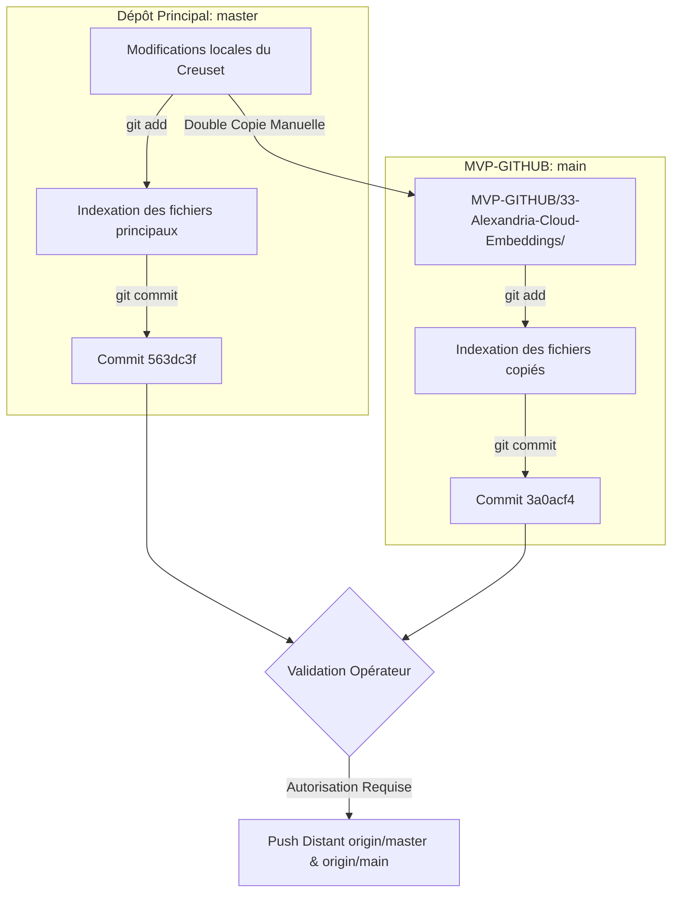
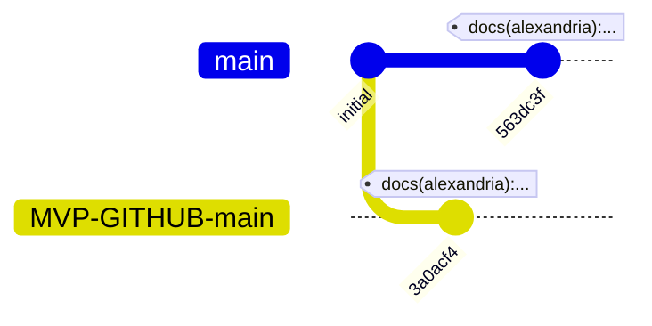

# Rapport de Synchronisation Git/GitHub
## Unification Alexandria V2 Sémantique & Llama.cpp

*   **Auteur** : `tesla-github-manager`
*   **Écosystème** : `@lordmahonheim-bot`
*   **Date de Synchronisation** : 2026-07-16T02:57:00+01:00
*   **Statut** : Double commit local effectué. **En attente d'autorisation de Push distant.**

---

## 1. Objectif du Sync
Sécuriser et consigner les modifications locales associées à l'unification d'Alexandria V2 (version de schéma 4.0 et mise à jour des chemins de base de données par défaut) et à llama.cpp sur :
1.  Le dépôt principal local `/home/lord-mahonheim/bifrost/tesla` (branche `master`).
2.  Le dépôt public `/home/lord-mahonheim/bifrost/tesla/MVP-GITHUB` (branche `main`) conformément à la **Règle 12 (Double copie et Double Commit)**.

---

## 2. Processus de Synchronisation Appliqué (Règle 12)

Le diagramme ci-dessous illustre le flux opérationnel appliqué pour la double copie et le double commit local sans push distant :

---

## 3. Détails des Fichiers et Actions

### A. Double Copie Manuelle (Règle 12)
Les fichiers suivants ont été transférés du Creuset vers le sous-dossier correspondant dans `MVP-GITHUB/33-Alexandria-Cloud-Embeddings/` :

| Fichier Source (Principal) | Fichier Destination (MVP-GITHUB) | Action | Statut |
| :--- | :--- | :--- | :--- |
| `indexer_hybrid.py` | `33-Alexandria-Cloud-Embeddings/indexer_hybrid.py` | Copie & Indexation | ✔ OK |
| `core/search_router.py` | `33-Alexandria-Cloud-Embeddings/core/search_router.py` | Copie & Indexation | ✔ OK |
| `core/embeddings.py` | `33-Alexandria-Cloud-Embeddings/core/embeddings.py` | Copie (Identique) | ✔ Non modifié |
| `core/database_manager.py` | `33-Alexandria-Cloud-Embeddings/core/database_manager.py` | Copie (Identique) | ✔ Non modifié |
| `core/security.py` | `33-Alexandria-Cloud-Embeddings/core/security.py` | Copie (Identique) | ✔ Non modifié |
| `tools/llama_quantize_pack.py` | `33-Alexandria-Cloud-Embeddings/tools/llama_quantize_pack.py` | Copie (Identique) | ✔ Non modifié |

### B. Indexation et Commits Locaux

#### 1. Dépôt Principal (`/home/lord-mahonheim/bifrost/tesla`)
*   **Branche** : `master`
*   **Fichiers Indexés** :
    *   `indexer_hybrid.py`
    *   `core/search_router.py` (Ajouté de force via `-f` car ignoré par `.git/info/exclude`)
    *   `justfile`
    *   `memory/PROJECT_STATE.md`
    *   `memory/SESSION_LOG.md`
    *   `memory/db_init.py`
    *   `memory/liste_projets_antigravity_BASE.md`
*   **Message de Commit** : `docs(alexandria): unify schema version 4.0 and update default db paths`
*   **Signature de Validation TGG v1.0** : `req-68871221`
*   **Hash du Commit** : `563dc3febea119415d3fcf09653828f13135de40` (`563dc3f`)

#### 2. Dépôt Public (`/home/lord-mahonheim/bifrost/tesla/MVP-GITHUB`)
*   **Branche** : `main`
*   **Fichiers Indexés** :
    *   `33-Alexandria-Cloud-Embeddings/indexer_hybrid.py`
    *   `33-Alexandria-Cloud-Embeddings/core/search_router.py`
*   **Message de Commit** : `docs(alexandria): unify schema version 4.0 and update default db paths`
*   **Hash du Commit** : `3a0acf4ab66b293afaac0fd5e3f4aa105c2a3b0c` (`3a0acf4`)

---

## 4. État des Logs Git Locaux

### Git Graph Local Virtuel

---

## 5. Prochaines Étapes
> [!IMPORTANT]
> Les modifications sont sécurisées en local. **Aucun push distant n'a été effectué** conformément aux consignes de sécurité du Vigilum Codex.
> 
> L'opérateur Lord Mahonheim doit valider et exécuter le push distant vers `origin/master` (Dépôt Principal) et `origin/main` (MVP-GITHUB).
