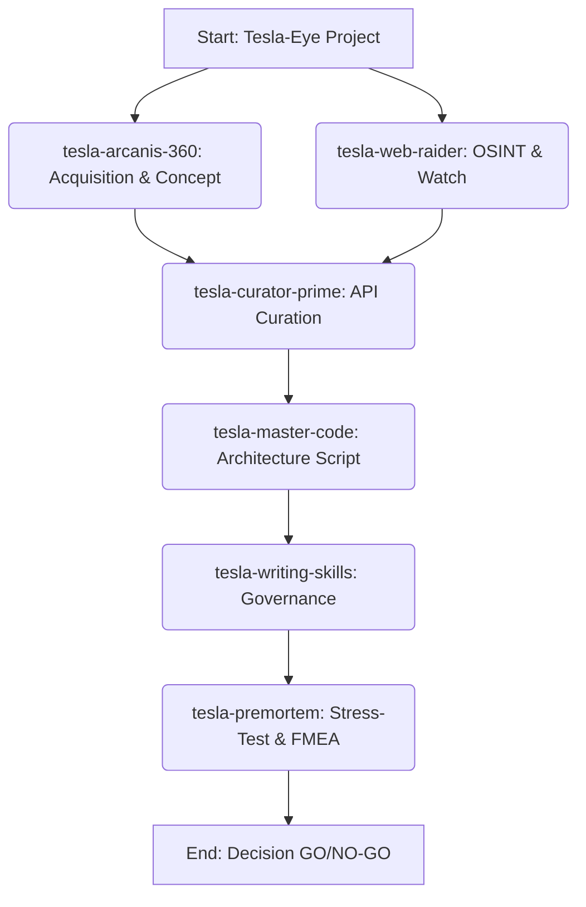

   

# Intervention Plan: Project Tesla-Eye

## Objective
Promote Tesla-Eye: Automatic detection and handling of screenshots in Lord Mahonheim's environment (Linux/X11 or Wayland).

## Mission Graph (DAG)

## Deployment of Elite Agents

1. **Tesla-Arcanis-360**: Identify target screenshot folders (e.g., `~/Pictures/Screenshots`) and system events (inotify, dbus).
2. **Tesla-Web-Raider**: Research best practices for lightweight monitoring on Linux (X11/Wayland).
3. **Tesla-Curator-Prime**: Synthesize documentation on `inotifywait` or `systemd path units`.
4. **Tesla-Master-Code**: Design the daemon (bash or python script with inotify/watchdog) to process the image.
5. **Tesla-Writing-Skills**: Draft the instructions for the Meta-Skill associated with Tesla-Eye.
6. **Tesla-PREMORTEM**: Analyze risks (CPU runaway, infinite loops detecting the same image, memory leaks) and mitigation measures.

## Feasibility Study (Preamble)
The system can rely on native Linux utilities (`inotify-tools`) for passive listening with zero CPU overhead. Triggering a script upon PNG file creation in the destination folder is technically viable and robust.
