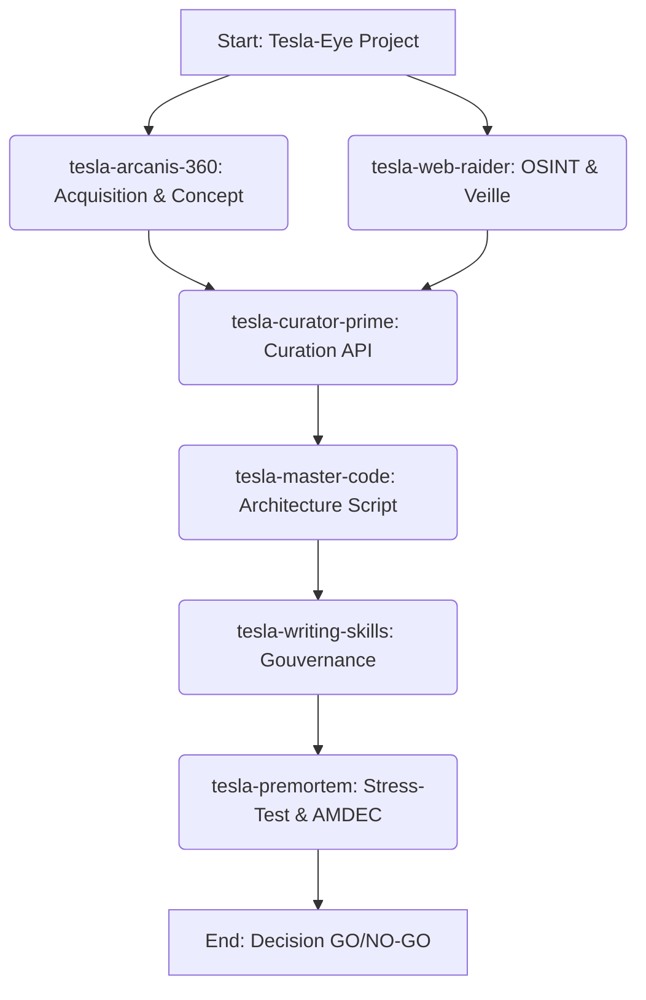

# Plan d'Intervention : Projet Tesla-Eye

## Objectif
Promouvoir Tesla-Eye : Détection et prise en charge automatique des captures d'écran sur l'environnement de Lord Mahonheim (Linux/X11 ou Wayland).

## Mission Graph (DAG)

## Déploiement des Agents d'Élite

1. **Tesla-Arcanis-360** : Identifier les dossiers cibles des screenshots (ex: `~/Pictures/Screenshots`) et les événements système (inotify, dbus).
2. **Tesla-Web-Raider** : Recherche des meilleures pratiques de monitoring léger sous Linux (X11/Wayland).
3. **Tesla-Curator-Prime** : Synthèse de la documentation sur `inotifywait` ou `systemd path units`.
4. **Tesla-Master-Code** : Conception du daemon (script bash ou python avec inotify/watchdog) pour traiter l'image.
5. **Tesla-Writing-Skills** : Rédaction des instructions du Méta-Skill associé à Tesla-Eye.
6. **Tesla-PREMORTEM** : Analyse des risques (emballement CPU, détection en boucle de la même image, fuites mémoire) et mesures d'atténuation.

## Étude de Faisabilité (Préambule)
Le système peut s'appuyer sur des utilitaires natifs Linux (`inotify-tools`) pour une écoute passive et sans surcoût CPU. Le déclenchement d'un script à la création d'un fichier PNG dans le dossier de destination est techniquement viable et robuste.
