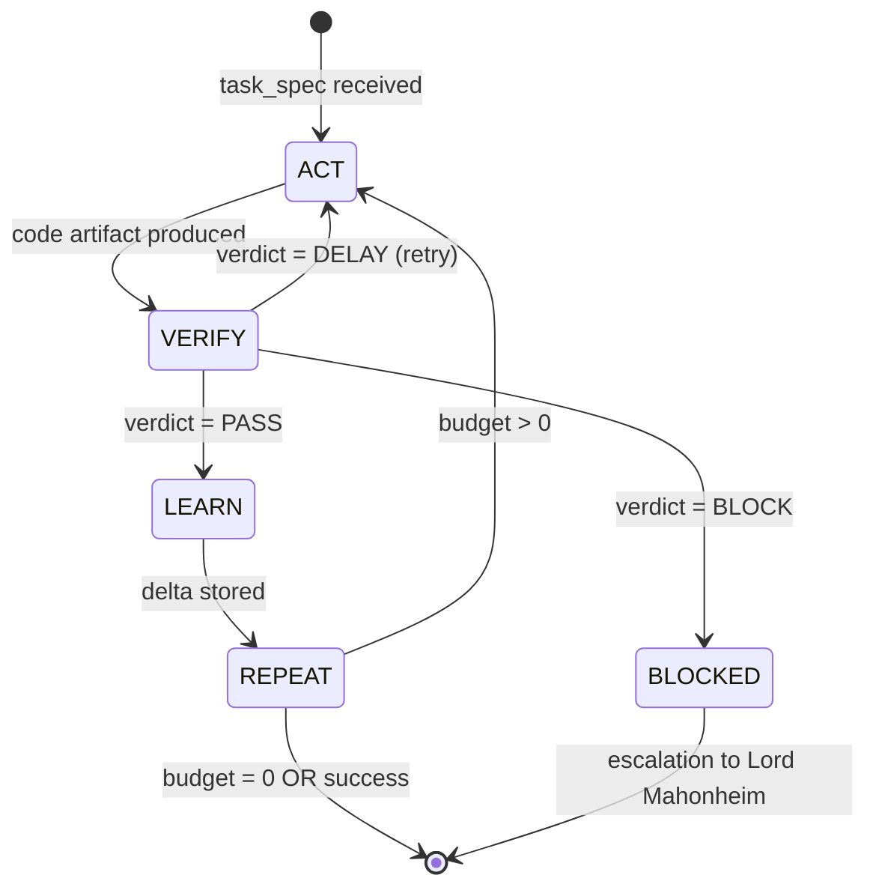
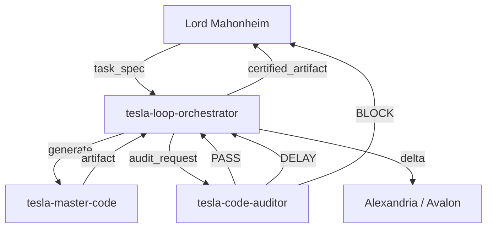

# 🔄 MVP 28 — Loop Engineering

> **Tesla Antigravity CLI · @lordmahonheim-bot**
> Chantier Loop Engineering — Autonomous Iterative Code Generation with Multi-Rung Validation

---

## 🎯 Overview

**Loop Engineering** is the autonomous iterative production engine of the Tesla/Antigravity ecosystem. It implements a **closed-loop Act/Verify/Learn/Repeat** cycle that combines elite code generation (`tesla-master-code`) with multi-rung validation (`tesla-code-auditor`) under the orchestration of `tesla-loop-orchestrator`.

The goal: produce **certified, production-ready code** without human intervention, with each loop iteration measured, logged, and improved.

> **Premortem Score: 92% / 100** — Certification: ✅ `RECOMMENDED`
> Delivered by `tesla-premortem` · 2026-07-10

---

## 🏗️ Architecture

The Loop Engineering pipeline operates as a three-agent relay:

```
tesla-master-code
      │
      ▼  (code artifact)
tesla-loop-orchestrator  ──► State Machine: ACT → VERIFY → LEARN → REPEAT
      │
      ▼  (validation request)
tesla-code-auditor
      │
      ▼  (verdict: PASS / DELAY / BLOCK)
      └──► PASS  → delivery + learning delta
           DELAY → retry with patch
           BLOCK → escalation to Lord Mahonheim
```

---

## 🔁 Loop Cycle — State Machine



### Transition Table

| From | To | Trigger | Action |
|---|---|---|---|
| `ACT` | `VERIFY` | artifact produced | submit to tesla-code-auditor |
| `VERIFY` | `LEARN` | all rungs PASS | certify + log delta |
| `VERIFY` | `ACT` | rung DELAY | apply patch + retry |
| `VERIFY` | `BLOCKED` | rung BLOCK | escalate + halt loop |
| `LEARN` | `REPEAT` | delta persisted | check iteration budget |
| `REPEAT` | `ACT` | budget remaining | next iteration |
| `REPEAT` | `[*]` | budget = 0 | final delivery |

---

## 📦 Delivered Components

### `skills/tesla-loop-orchestrator/`

| File | Role |
|---|---|
| `SKILL.md` | Orchestrator doctrine and FSM specification |
| `scripts/tesla_loop_orchestrator.py` | State machine engine: loop lifecycle, budget control, delta logging |
| `templates/loop_code_generation.yaml` | Task template — code generation loop |
| `templates/loop_doc_writing.yaml` | Task template — documentation writing loop |

### `skills/tesla-code-auditor/`

| File | Role |
|---|---|
| `SKILL.md` | Auditor doctrine and multi-rung validation specification |
| `scripts/code_auditor.py` | Main audit orchestrator — chains all rungs |
| `scripts/semgrep_audit.py` | Rung 1 — Static analysis (Semgrep + custom rules) |
| `scripts/pyright_audit.py` | Rung 2 — Type checking (Pyright strict) |
| `scripts/smoke_test_runner.py` | Rung 3 — Dynamic smoke tests |
| `scripts/policy_engine.py` | Rung 4 — Policy & secret scanning |
| `rules/tesla_custom_rules.yaml` | Tesla custom Semgrep rules (zero-secret, pattern guards) |

### `docs/`

| File | Content |
|---|---|
| `plan_intervention_loop_engineering_v1.0_2026-07-10.md` | Full implementation plan for the chantier |
| `rapport_premortem_loop_engineering_v1.0_2026-07-10.md` | Premortem failure analysis (score 92/100) |

---

## ✅ Validation & Certification

- **- [x]** Premortem completed — score `92/100` — verdict `RECOMMENDED`
- **- [x]** Loop orchestrator FSM designed and implemented
- **- [x]** 4-rung audit pipeline operational (Semgrep → Pyright → Smoke → Policy)
- **- [x]** Zero-secret policy enforced at Rung 4
- **- [x]** Templates validated for code generation and documentation
- **- [x]** Docs archived in `/OUTPUTS/` (SGC rule compliant)

---

## 🔗 Ecosystem Integration



---

## 🚀 Quick Start

```python
from skills.tesla_loop_orchestrator import LoopOrchestrator

orchestrator = LoopOrchestrator(
    task_spec="generate REST API endpoint with auth middleware",
    max_iterations=5,
    template="loop_code_generation"
)
result = orchestrator.run()
# result.verdict: PASS | DELAY | BLOCK
# result.artifact: certified code
# result.delta: learning log
```

---

## 📋 Metadata

| Field | Value |
|---|---|
| MVP Number | 28 |
| Chantier | Loop Engineering |
| Date | 2026-07-10 |
| Author | @lordmahonheim-bot |
| Status | ✅ ACTIVE |
| Premortem Score | 92/100 |
| Certification | RECOMMENDED |
| Depends On | MVP 16 (tesla-master-code), MVP 20 (tesla-premortem) |

---

*Part of the [Tesla Antigravity CLI](https://github.com/lordmahonheim-bot/Tesla-Antigravity-CLI) ecosystem — Vigilum Codex doctrine.*
