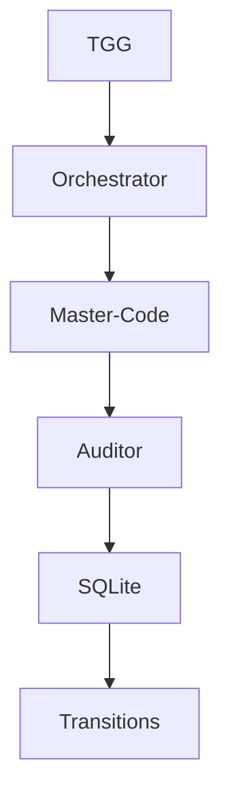

   

# MVP 28 - Loop Engineering

## Architecture

```mermaid
flowchart TD
    TGG[TGG] --> Orch[Orchestrator]
    Orch --> MC[Master-Code]
    MC --> Aud[Auditor]
    Aud --> SQ[SQLite]
    SQ --> Trans[Transitions]
```

## Loop Contract
The Loop Contract specifies the obligations and expected results for a loop phase. It is structured in YAML format and ensures consistency across operations.
```yaml
loop_contract:
  phase: "validation"
  timeout_seconds: 3600
  strict_mode: true
  expected_state:
    - code_verified
    - tests_passed
  fallback_action: rollback
```

## Validation Chain
The validation process consists of 4 levels to ensure maximal stability:
1. **Syntax Check**: Ensuring code is free of syntax errors (e.g., using LSP self-healing loops).
2. **Unit Tests**: Running localized tests against independent modules to ensure correctness.
3. **Integration Tests**: Verifying that the interacting components and external dependencies function properly together.
4. **Security & Performance Audit**: Final review for vulnerabilities and resource inefficiencies before deployment.

## Transitions
Loop transitions follow strict criteria based on validation states:
- **PASS**: All 4 levels of validation are successful. The execution loop proceeds to the next state without interruption.
- **DELAY**: Non-critical warnings detected, requiring manual review or waiting on pending background tasks to resolve.
- **BLOCK**: Critical error, failed test, or security violation identified. Execution halts immediately and triggers rollback protocols.

## Rollback
In the event of a `BLOCK` transition, the system reliably triggers a rollback mechanism:
- **Git Mechanisms**: Employs `git reset --hard` to revert to the last known good commit and `git clean -fd` to remove untracked artifacts.
- **Shutil Mechanisms**: For unversioned assets or persistent storage, securely copies known good configurations from a defined backup directory using `shutil`.

## Persistence
A relational database schema (SQLite) is designed to persist the state of the loop and maintain audit trails across sessions:
```sql
CREATE TABLE loop_runs (
    run_id INTEGER PRIMARY KEY AUTOINCREMENT,
    phase TEXT NOT NULL,
    status TEXT NOT NULL,
    timestamp DATETIME DEFAULT CURRENT_TIMESTAMP
);

CREATE TABLE audit_logs (
    log_id INTEGER PRIMARY KEY AUTOINCREMENT,
    run_id INTEGER,
    level TEXT,
    message TEXT,
    FOREIGN KEY(run_id) REFERENCES loop_runs(run_id)
);
```

## Governance
Governance is strictly maintained and overseen via:
- **Vigilum Codex**: The master rulebook dictating security policies, ethical bounds, and authorization levels for all operations.
- **TGG (Tesla Global Gateway)**: The root node authorizing all loops and verifying absolute compliance before any agent instantiation.
