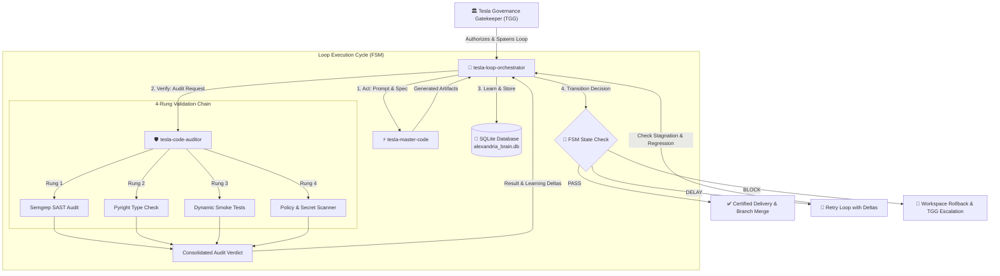
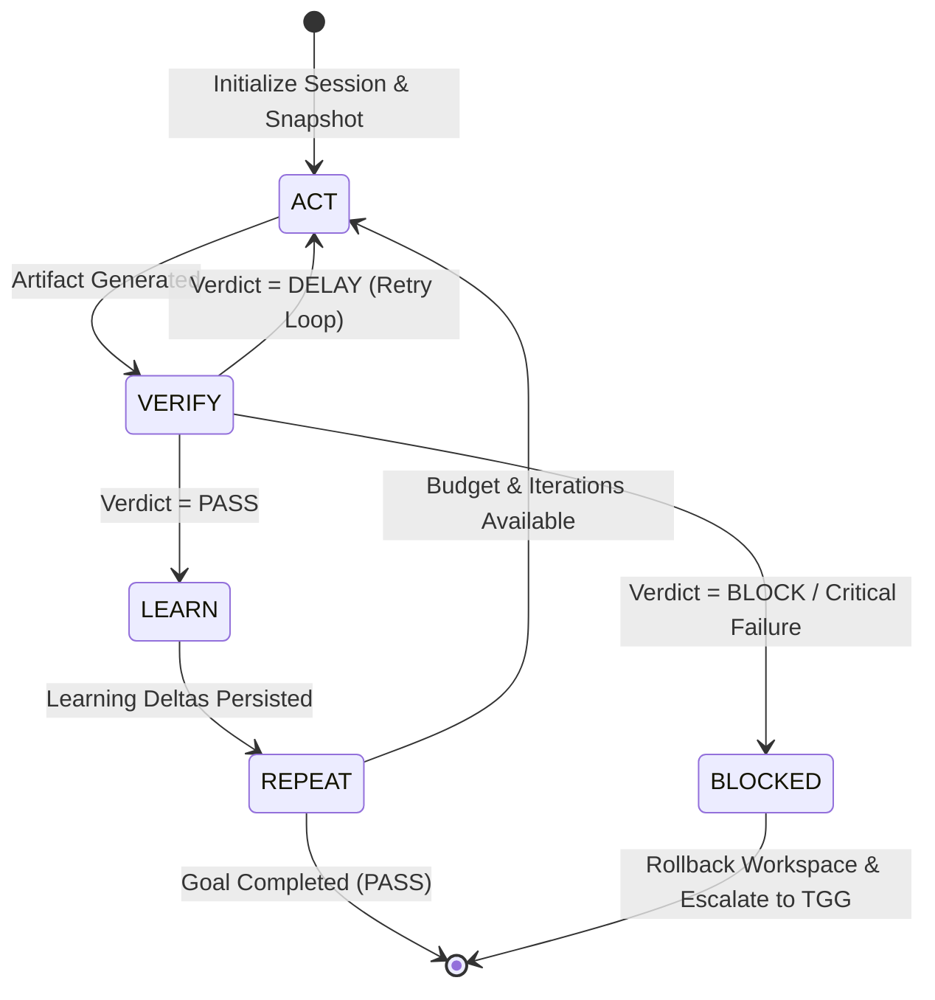

# 🔄 MVP 28 — Loop Engineering

   

> **Tesla Antigravity CLI · @lordmahonheim-bot**  
> **Authoritative Documentation — Autonomous Iterative Code Generation Engine**

---

## 🎯 Overview & Mission

**Loop Engineering** (MVP 28) is the autonomous iterative production and verification engine of the **Tesla Antigravity CLI** ecosystem. It establishes a closed-loop **Act → Verify → Learn → Repeat** framework that combines high-precision code generation (`tesla-master-code`) with multi-rung automated auditing (`tesla-code-auditor`) under the supervision of `tesla-loop-orchestrator`.

The primary mission of Loop Engineering is to produce **certified, zero-defect, production-ready code artifacts** with zero human intervention. Every loop iteration is governed by strict contract budgets, evaluated against multi-level static and dynamic checks, logged to persistent SQLite memory, and protected by automated rollback mechanisms.

### Key Capabilities
- **Deterministic FSM Engine**: Manages state transitions across `ACT`, `VERIFY`, `LEARN`, and `REPEAT` cycles.
- **Declarative Contracts**: Defines execution limits, goal specifications, target files, validation rungs, and rollback policies in YAML.
- **4-Rung Validation Chain**: Executes static code analysis, strict type checking, dynamic smoke testing, and policy/secret enforcement.
- **Automated Workspace Rollback**: Guarantees clean state restoration using isolated Git branch branching or filesystem-level `shutil` snapshots upon execution failure.
- **Cognitive Anti-Stagnation & Regression Guards**: Detects infinite retry loops and code quality degradations using deterministic error hashing.
- **Persistent Telemetry**: Stores all execution states, iteration deltas, token budgets, and financial metrics in `alexandria_brain.db`.

---

## 🏗️ Architecture & Component Flow

The Loop Engineering pipeline operates as a tightly integrated agent relay overseen by the **Tesla Governance Gatekeeper (TGG)**:


```mermaid
flowchart TD
    TGG["🏛️ Tesla Governance Gatekeeper (TGG)"] -->|Authorizes & Spawns Loop| TLO["🔄 tesla-loop-orchestrator"]
    
    subgraph Execution Loop ["Loop Execution Cycle (FSM)"]
        TLO -->|1. Act: Prompt & Spec| TMC["⚡ tesla-master-code"]
        TMC -->|Generated Artifacts| TLO
        TLO -->|2. Verify: Audit Request| TCA["🛡️ tesla-code-auditor"]
        
        subgraph Audit Chain ["4-Rung Validation Chain"]
            TCA -->|Rung 1| SAST["Semgrep SAST Audit"]
            TCA -->|Rung 2| TYPE["Pyright Type Check"]
            TCA -->|Rung 3| SMOKE["Dynamic Smoke Tests"]
            TCA -->|Rung 4| POLICY["Policy & Secret Scanner"]
        end
        
        SAST --> AuditVerdict["Consolidated Audit Verdict"]
        TYPE --> AuditVerdict
        SMOKE --> AuditVerdict
        POLICY --> AuditVerdict
        AuditVerdict -->|Result & Learning Deltas| TLO
        
        TLO -->|3. Learn & Store| SQL[("💾 SQLite Database\nalexandria_brain.db")]
        TLO -->|4. Transition Decision| TR{"🔀 FSM State Check"}
    end

    TR -->|PASS| SUCCESS["✅ Certified Delivery & Branch Merge"]
    TR -->|DELAY| RETRY["🔁 Retry Loop with Deltas"]
    RETRY -->|Check Stagnation & Regression| TLO
    TR -->|BLOCK| ROLLBACK["🚨 Workspace Rollback & TGG Escalation"]
```

---

## 📜 Loop Contract Specification

Execution cycles are governed by declarative YAML contracts validated against an explicit `jsonschema`. The contract defines execution limits, target files, goal statements, auditor configurations, and failure rollback strategies.

### Contract Schema Structure (`loop_contract.yaml`)

```yaml
meta:
  name: "code_generation_loop"
  version: "1.0.0"
  project: "tesla-antigravity"
  description: "Autonomous iterative code generation and validation loop"

execution_limits:
  max_iterations: 5
  financial_budget_usd: 2.50
  token_budget: 150000
  timeout_seconds: 300

target:
  files:
    - "skills/tesla-loop-orchestrator/scripts/tesla_loop_orchestrator.py"
  directory: "/home/lord-mahonheim/bifrost/tesla"

goal: "Implement multi-rung validation loop with SQLite persistence and automated rollback strategies."

verify:
  rungs:
    - "style"
    - "types"
    - "tests"
    - "referee"
  strict: true
  custom_rules_path: "skills/tesla-code-auditor/rules/tesla_custom_rules.yaml"

referee_config:
  model: "gemini-2.5-pro"
  temperature: 0.1

rollback_policy:
  strategy: "git" # Options: "git" | "shutil"
  auto_rollback: true
```

### Contract Fields Breakdown

| Section | Parameter | Type | Required | Description |
|---|---|---|---|---|
| `meta` | `name` | String | Yes | Name identifier of the contract |
| `meta` | `project` | String | Yes | Target project scope |
| `meta` | `version` | String | Yes | Contract specification version |
| `execution_limits` | `max_iterations` | Integer (1..10) | Yes | Maximum allowed retry iterations |
| `execution_limits` | `financial_budget_usd` | Float ($0.10..$5.00) | Yes | Hard financial spend limit in USD |
| `execution_limits` | `token_budget` | Integer (>=1000) | Yes | Maximum cumulative token usage |
| `target` | `files` | Array[String] | Yes | File paths subjected to modification & audit |
| `target` | `directory` | String | No | Root working directory for execution |
| `goal` | `goal` | String | Yes | Natural language goal statement for Actuator |
| `verify` | `rungs` | Array[String] | Yes | Active validation rungs (`style`, `types`, `tests`, `referee`) |
| `rollback_policy` | `strategy` | String (`git`\|`shutil`)| Yes | Isolation & restore mechanism |

---

## 🛡️ Multi-Rung Validation Chain

The `tesla-code-auditor` engine executes a sequential, 4-tier audit chain against all generated code artifacts. Each rung tests distinct software quality and security dimensions:

```
┌─────────────────────────────────────────────────────────┐
│ Rung 1: Semgrep SAST Audit                              │
│ • Custom AST pattern matching (tesla_custom_rules.yaml) │
│ • Prohibited function calls (eval, exec, shell=True)    │
└────────────────────────────┬────────────────────────────┘
                             │
                             ▼
┌─────────────────────────────────────────────────────────┐
│ Rung 2: Pyright Strict Type Audit                       │
│ • Strict static type verification                       │
│ • Unannotated functions & implicit Any detection        │
└────────────────────────────┬────────────────────────────┘
                             │
                             ▼
┌─────────────────────────────────────────────────────────┐
│ Rung 3: Dynamic Smoke Test Runner                       │
│ • Automated test suite execution & bytecode compilation │
│ • Runtime sanity verification                           │
└────────────────────────────┬────────────────────────────┘
                             │
                             ▼
┌─────────────────────────────────────────────────────────┐
│ Rung 4: Policy Engine & Secret Scanner                  │
│ • Zero-Secret Policy enforcement (API keys, tokens)     │
│ • Filesystem sandbox compliance & authorization scope   │
└─────────────────────────────────────────────────────────┘
```

1. **Rung 1 — SAST Audit (`semgrep_audit.py`)**: Runs Semgrep with custom Tesla rules (`skills/tesla-code-auditor/rules/tesla_custom_rules.yaml`). Detects dangerous primitives (`eval`, `exec`, `os.system`, `subprocess(shell=True)`), unhandled file modes, and improper exception swallows.
2. **Rung 2 — Type Check (`pyright_audit.py`)**: Runs Pyright type verification in strict mode to ensure absolute type safety across functions, parameters, and return types.
3. **Rung 3 — Dynamic Smoke Runner (`smoke_test_runner.py`)**: Executes targeted unit and smoke tests against modified files to confirm operational runtime integrity.
4. **Rung 4 — Policy Engine (`policy_engine.py`)**: Enforces zero-secret policy compliance, verifies filesystem path boundaries, and checks adherence to Vigilum Codex governance rules.

---

## 🔀 FSM State Machine & Transitions

The orchestrator enforces a formal Finite State Machine (FSM). Transition decisions are derived directly from the consolidated audit verdict and historical error signatures.

### State Diagram


```mermaid
stateDiagram-v2
    [*] --> ACT : Initialize Session & Snapshot
    ACT --> VERIFY : Artifact Generated
    VERIFY --> LEARN : Verdict = PASS
    VERIFY --> ACT : Verdict = DELAY (Retry Loop)
    VERIFY --> BLOCKED : Verdict = BLOCK / Critical Failure
    LEARN --> REPEAT : Learning Deltas Persisted
    REPEAT --> ACT : Budget & Iterations Available
    REPEAT --> [*] : Goal Completed (PASS)
    BLOCKED --> [*] : Rollback Workspace & Escalate to TGG
```

### Transition Criteria & Action Rules

| Current State | Next State | Trigger / Condition | Orchestrator Action |
|---|---|---|---|
| `IDLE` | `ACT` | Contract loaded & validated | Create workspace snapshot (`git` / `shutil`), register execution ID in DB |
| `ACT` | `VERIFY` | Code artifact produced | Submit modified target files to `tesla-code-auditor` |
| `VERIFY` | `LEARN` | All 4 rungs return `PASS` | Certify code artifact, write learning summary, transition to `REPEAT` |
| `VERIFY` | `ACT` (Retry) | Audit returns `DELAY` | Inject failure deltas into Actuator prompt, increment iteration counter |
| `VERIFY` | `BLOCKED` | Audit returns `BLOCK` | Halt loop, invoke rollback handler, notify TGG |
| `VERIFY` | `BLOCKED` | **Cognitive Stagnation**: Identical error hash 2x consecutively | Intercept infinite loop, set reason `COGNITIVE_STAGNATION`, rollback workspace |
| `VERIFY` | `BLOCKED` | **Regression**: Error count increases OR failed rung index degrades | Intercept degradation, set reason `REGRESSION_DETECTED`, rollback workspace |
| `REPEAT` | `ACT` | `iteration < max_iterations` AND budget remaining | Trigger next iteration |
| `REPEAT` | `[*]` | All goals satisfied | Finalize DB status as `PASS`, commit changes |

---

## ↺ Rollback Mechanisms

Loop Engineering mandates total workspace safety. If an execution cycle fails or triggers a `BLOCK` verdict, the orchestrator restores the workspace to its exact pre-execution state.

### 1. Git Rollback Handler (`GitRollbackHandler`)
- **Isolation**: On session start, stashes pending uncommitted workspace changes and creates an isolated temporary git branch (`temp-loop-{execution_id}`).
- **On `PASS`**: Checks out the main branch, merges the temporary branch cleanly, and purges the temporary branch.
- **On `BLOCK` / Failure**: Executes `git reset --hard <start_commit>`, checks out the original branch, and deletes `temp-loop-{execution_id}`.

### 2. Shutil Rollback Handler (`ShutilRollbackHandler`)
- **Snapshot**: On session start, creates path-preserved copies of target files under `.runtime/backups/{execution_id}/`.
- **On `PASS`**: Removes the temporary backup directory.
- **On `BLOCK` / Failure**: Overwrites target files with original backed-up versions, deletes newly created files, and purges the backup directory.

---

## 💾 Persistence Architecture & SQLite Schema

All execution metadata, iteration logs, and telemetry are persisted in the centralized SQLite database:
`/home/lord-mahonheim/bifrost/tesla/Avalon/03-Resources/alexandria_brain.db`

The database connection employs **Write-Ahead Logging (`WAL` mode)**, foreign key constraints (`PRAGMA foreign_keys = ON;`), and an exponential backoff decorator (`@with_sqlite_retry`) to handle lock contention seamlessly.

```sql
-- Main Loop Executions Registry Table
CREATE TABLE IF NOT EXISTS loop_executions (
    id TEXT PRIMARY KEY,
    project TEXT NOT NULL,
    contract_version TEXT NOT NULL,
    goal TEXT NOT NULL,
    start_time TEXT NOT NULL,
    end_time TEXT,
    status TEXT NOT NULL, -- 'RUNNING', 'PASS', 'BLOCK', 'DELAY'
    total_iterations INTEGER DEFAULT 0,
    total_tokens INTEGER DEFAULT 0,
    total_cost_usd REAL DEFAULT 0.0,
    max_iterations INTEGER NOT NULL,
    token_budget INTEGER NOT NULL,
    financial_budget_usd REAL NOT NULL
);

-- Individual Loop Iterations Log Table
CREATE TABLE IF NOT EXISTS loop_iterations (
    id INTEGER PRIMARY KEY AUTOINCREMENT,
    execution_id TEXT NOT NULL,
    iteration_number INTEGER NOT NULL,
    timestamp TEXT NOT NULL,
    action_taken TEXT NOT NULL,
    verdict TEXT NOT NULL, -- 'PASS', 'DELAY', 'BLOCK'
    learning_deltas TEXT, -- JSON serialized violation/advice details
    tokens_used INTEGER DEFAULT 0,
    cost_usd REAL DEFAULT 0.0,
    report_path TEXT,
    FOREIGN KEY(execution_id) REFERENCES loop_executions(id) ON DELETE CASCADE
);
```

---

## 🏛️ Governance & Vigilum Codex Compliance

Loop Engineering enforces the governance principles of the **Vigilum Codex**:

1. **Zero-Secret Policy**: Strict mandatory check at Rung 4 prohibiting API keys, private credentials, or hardcoded tokens in any generated artifact.
2. **Financial Ceiling**: Hard cutoff cap of `$5.00` cumulative cost per execution session, overriding contract limits if exceeded.
3. **Immutability of Audit Records**: Every audit pass outputs immutable JSON logs and Markdown reports to `.runtime/reports/`.
4. **TGG Escalation Protocol**: Any `BLOCK` event (security breach, cognitive stagnation, regression) immediately sends an alert signal to the Tesla Governance Gatekeeper.

---

## 📦 Component File Registry

```
28-Loop-Engineering/
├── README.md                                   # Authoritative MVP 28 documentation
├── docs/
│   ├── plan_intervention_loop_engineering_v1.0_2026-07-10.md   # Implementation plan
│   └── rapport_premortem_loop_engineering_v1.0_2026-07-10.md    # Premortem analysis (Score: 92/100)
└── skills/
    ├── tesla-loop-orchestrator/
    │   ├── SKILL.md                            # Orchestrator agent doctrine & CLI manual
    │   ├── scripts/
    │   │   └── tesla_loop_orchestrator.py      # Core FSM, SQLite manager & rollback engine
    │   └── templates/
    │       ├── loop_code_generation.yaml       # Standard code generation contract template
    │       └── loop_doc_writing.yaml           # Standard documentation contract template
    └── tesla-code-auditor/
        ├── SKILL.md                            # Auditor agent doctrine & rung specifications
        ├── rules/
        │   └── tesla_custom_rules.yaml         # Tesla custom Semgrep rules
        └── scripts/
            ├── code_auditor.py                 # Master auditor orchestrator
            ├── semgrep_audit.py                # Rung 1: SAST audit runner
            ├── pyright_audit.py                # Rung 2: Pyright type checker
            ├── smoke_test_runner.py            # Rung 3: Dynamic smoke tester
            └── policy_engine.py                # Rung 4: Policy & zero-secret engine
```

---

## 🚀 Quick Start & CLI Usage

### 1. Execute Loop Orchestrator with a Contract

```bash
python3 skills/tesla-loop-orchestrator/scripts/tesla_loop_orchestrator.py \
  --contract skills/tesla-loop-orchestrator/templates/loop_code_generation.yaml \
  --action-agent tesla-master-code \
  --validator tesla-code-auditor \
  --verbose
```

### 2. Run Dry-Run Simulation

```bash
python3 skills/tesla-loop-orchestrator/scripts/tesla_loop_orchestrator.py \
  --contract skills/tesla-loop-orchestrator/templates/loop_code_generation.yaml \
  --dry-run
```

### 3. Run Standalone Code Auditor

```bash
python3 skills/tesla-code-auditor/scripts/code_auditor.py \
  --files skills/tesla-loop-orchestrator/scripts/tesla_loop_orchestrator.py \
  --output-json .runtime/audit_output.json \
  --output-md .runtime/audit_output.md
```

### 4. Python Programmatic API Usage

```python
from skills.tesla_loop_orchestrator import LoopContract, DatabaseManager, LoopOrchestrator

# Load contract and database manager
contract = LoopContract("skills/tesla-loop-orchestrator/templates/loop_code_generation.yaml")
db_mgr = DatabaseManager("/home/lord-mahonheim/bifrost/tesla/Avalon/03-Resources/alexandria_brain.db")

# Instantiate orchestrator
orchestrator = LoopOrchestrator(
    contract=contract,
    db_mgr=db_mgr,
    action_agent="tesla-master-code",
    validator="tesla-code-auditor",
    output_dir=".runtime/reports",
    verbose=True
)

# Run autonomous loop session
verdict = orchestrator.run()
print(f"Final Loop Execution Verdict: {verdict}")
```

---

## 📋 MVP 28 Metadata

| Parameter | Value |
|---|---|
| **MVP ID** | MVP 28 |
| **Chantier** | Loop Engineering |
| **Date** | 2026-07-10 |
| **Author** | `@lordmahonheim-bot` |
| **Status** | ✅ `MVP COMPLETE` |
| **Premortem Score** | `92 / 100` — `RECOMMENDED` |
| **Ecosystem** | Tesla Antigravity CLI |
| **Dependencies** | MVP 16 (`tesla-master-code`), MVP 20 (`tesla-premortem`) |

---

*Part of the [Tesla Antigravity CLI](https://github.com/lordmahonheim-bot/Tesla-Antigravity-CLI) ecosystem — Vigilum Codex doctrine.*
