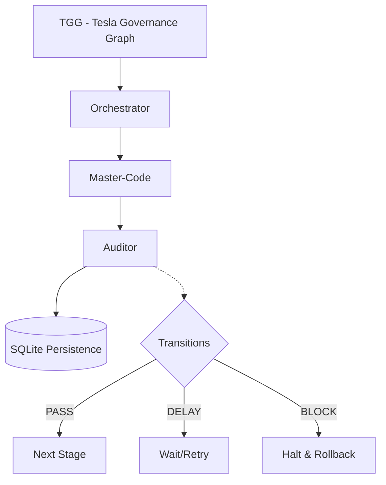

# MVP 28: Loop Engineering

   

## Architecture


```mermaid
graph TD
    A[TGG - Tesla Governance Graph] --> B[Orchestrator]
    B --> C[Master-Code]
    C --> D[Auditor]
    D --> E[(SQLite Persistence)]
    D -.-> F{Transitions}
    F -->|PASS| G[Next Stage]
    F -->|DELAY| H[Wait/Retry]
    F -->|BLOCK| I[Halt & Rollback]
```

## Loop Contract

The execution of loops is governed by strict YAML contracts.

```yaml
# Example Loop Contract
version: 1.0
contract_id: loop_eng_01
status: ACTIVE
criteria:
  - id: check_1
    type: linter
    threshold: pass
validation:
  level: L4
```

## Validation Chain

The validation chain consists of 4 levels:
1. **L1 - Syntax & Structure**: Verifies valid syntax and correct formats.
2. **L2 - Contract Alignment**: Checks if the outputs meet the YAML contract definitions.
3. **L3 - Auditor Clearance**: Rigorous auditing by the dedicated Auditor module.
4. **L4 - TGG Governance Approval**: Final sign-off through the Tesla Governance Graph.

## Transitions

- **PASS**: All validation levels clear successfully. Proceed to next node.
- **DELAY**: Minor discrepancies found. Retry after automatic adjustments.
- **BLOCK**: Critical failure or security breach. Immediate halt.

## Rollback

In the event of a BLOCK transition, the system triggers a rollback:
- **Git Mechanism**: Restores the repository to the last secure commit via `git reset --hard` and `git clean`.
- **Shutil Mechanism**: Employs `shutil.rmtree` and `shutil.copytree` to physically revert non-versioned artifacts and active scratch spaces.

## Persistence

```sql
-- SQLite Schema
CREATE TABLE loops (
    id TEXT PRIMARY KEY,
    status TEXT NOT NULL,
    timestamp DATETIME DEFAULT CURRENT_TIMESTAMP
);

CREATE TABLE transitions (
    loop_id TEXT,
    state TEXT,
    reason TEXT,
    FOREIGN KEY(loop_id) REFERENCES loops(id)
);
```

## Governance

- **Vigilum Codex**: The supreme set of rules governing operations.
- **TGG (Tesla Governance Graph)**: Ensures every loop transition aligns with the broader ecosystem directives and security constraints.
