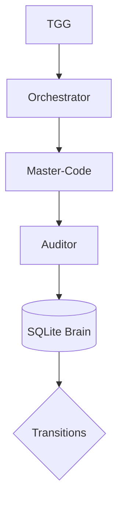

# 🌌 28-Loop-Engineering

   

This module implements the **Loop Engineering** standard for the Tesla ecosystem, defining the mechanisms for orchestrating, validating, and persisting operations via a deterministic validation chain.

## 🏗️ Architecture


```mermaid
graph TD
    TGG[TGG] --> Orch[Orchestrator]
    Orch --> MC[Master-Code]
    MC --> Auditor[Auditor]
    Auditor --> SQLite[(SQLite Brain)]
    SQLite --> Trans{Transitions}
```

## 📜 Loop Contract

The Loop Contract uses YAML format to strictly document the expected parameters, limits, and validations for every operation.

```yaml
# Example Loop Contract Structure
contract_type: "EXECUTION"
version: "1.0.0"
mission: "Description of the operation"
status: "PENDING"
evidence_chain:
  - step: "Initialization"
    details: "Contract generated."
```

## ⛓️ Validation Chain

The validation chain consists of 4 robust levels:
1. **Syntax Check**: Basic validation of instructions and formatting.
2. **Contextual Audit**: Verification of alignment with the existing architecture and TGG.
3. **Execution Trial**: Simulated run to capture unexpected outcomes.
4. **Final Certification**: Security and compliance lockdown before commit.

## 🔄 Transitions

The execution flows through specific transition criteria:
- **PASS**: All validation levels are cleared successfully.
- **DELAY**: Missing resources or unfulfilled dependencies; operation is paused.
- **BLOCK**: Security violation or absolute delegation rule breach; operation is halted entirely.

## ⏪ Rollback

To ensure system integrity, mechanisms are in place to revert operations safely:
- **Git Mechanisms**: Using standard git resets and reverts for code changes.
- **Shutil Mechanisms**: Secure backups and file restorations via file-system operations.

## 💾 Persistence

The orchestrator utilizes an SQLite schema to persist the state of contracts, checkpoints, and loop histories, maintaining an immutable audit log of operations in the Alexandria Brain.

## 🏛️ Governance

All operations are bound by the **Vigilum Codex** and the principles laid out in the **TGG** (Tesla Governance Guidelines), ensuring zero divergence from the core tenets of the Tesla ecosystem.
