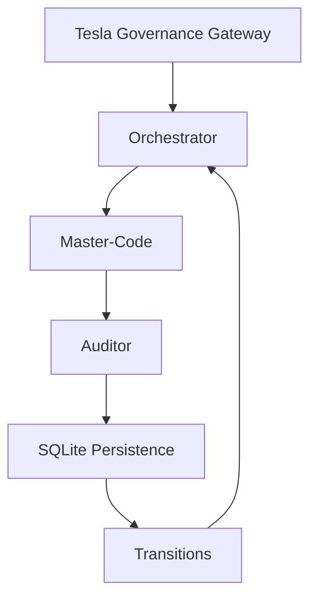

# MVP 28 - Loop Engineering & Automated Orchestration

   

## Overview
Phase C of the MVP 28 plan focuses on establishing a robust Loop Engineering framework and Automated Orchestration pipeline within the Tesla Antigravity ecosystem.

## Architecture


```mermaid
graph TD
    TGG[Tesla Governance Gateway] --> ORCH[Orchestrator]
    ORCH --> MC[Master-Code]
    MC --> AUDIT[Auditor]
    AUDIT --> SQL[SQLite Persistence]
    SQL --> TRANS[Transitions]
    TRANS --> ORCH
```

## Loop Contract

The Loop Contract defines the parameters, states, and constraints for any engineered loop sequence. It serves as the standard template for operations.

```yaml
# loop_contract.yaml
apiVersion: tesla.bifrost/v1
kind: LoopContract
metadata:
  name: canonical-loop
spec:
  timeout: 300s
  retries: 3
  validation_level: strict
  rollback_on_failure: true
```

## Validation Chain

The validation process follows a strict 4-level chain:
1. **Syntax Check:** Immediate AST parsing and linting.
2. **Context Verification:** Checking for scope and state dependencies.
3. **Execution Dry-Run:** Simulated run to catch runtime anomalies.
4. **Governance Approval:** Final validation by the TGG against the Vigilum Codex.

## Transitions

State transitions are governed by strict criteria:
- **PASS:** All 4 validation levels succeed. The loop advances.
- **DELAY:** Temporary unreachability of resources (e.g., SQLite lock). The loop retries.
- **BLOCK:** A governance violation or unrecoverable error occurs. The loop halts and triggers an alert.

## Rollback

When a **BLOCK** transition occurs or validation fails critically, the system engages rollback mechanisms:
- **Git:** Reverts the repository state to the pre-loop commit.
- **Shutil:** Restores filesystem backups for artifacts not tracked by Git.

## Persistence

The execution state and historical loops are persisted locally via SQLite:

```sql
CREATE TABLE loop_executions (
    id INTEGER PRIMARY KEY AUTOINCREMENT,
    loop_name TEXT NOT NULL,
    status TEXT NOT NULL,
    started_at TIMESTAMP DEFAULT CURRENT_TIMESTAMP,
    ended_at TIMESTAMP,
    error_log TEXT
);
```

## Governance

All activities within the Loop Engineering domain are strictly monitored by:
- **Vigilum Codex:** The supreme rulebook dictating security, access, and operational boundaries.
- **Tesla Governance Gateway (TGG):** The enforcer mechanism that actively parses contracts and blocks rogue transitions.
