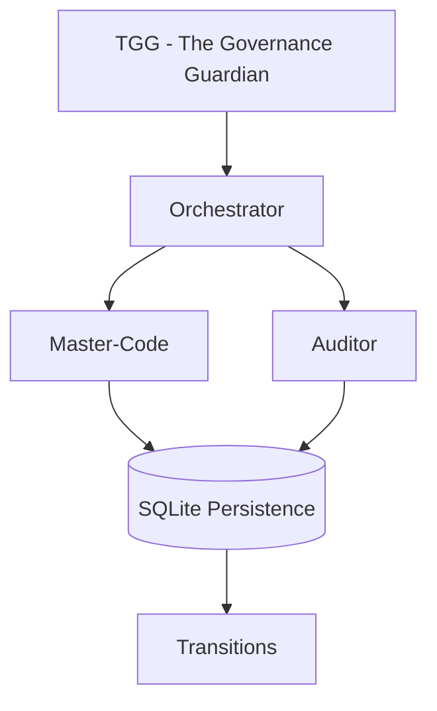

# 28 Loop Engineering

   

## Architecture


```mermaid
flowchart TD
    TGG[TGG - The Governance Guardian] --> Orch[Orchestrator]
    Orch --> MC[Master-Code]
    Orch --> Auditor[Auditor]
    MC --> SQLite[(SQLite Persistence)]
    Auditor --> SQLite
    SQLite --> Trans[Transitions]
```

## Loop Contract

The loop execution conforms to a specific YAML format mapping targets and execution constraints.

```yaml
# Example Loop Contract
version: 1.0
contract_id: "MVP-28-Loop"
targets:
  - id: "target_1"
    description: "Initial target execution"
    validation_level: 4
constraints:
  timeout: 300
  retry: 3
```

## Validation Chain

The validation chain enforces 4 distinct levels:
1. **Level 1**: Syntax & Structural Integrity
2. **Level 2**: Unit Context & Operational Logic
3. **Level 3**: Cross-dependency Constraints
4. **Level 4**: TGG Policy Compliance (Vigilum Codex)

## Transitions

Transitions dictate the progression of the loop engineering sequence based on specific criteria:
- **PASS**: All 4 validation levels succeeded. The loop proceeds to the next sequence.
- **DELAY**: Transitory errors or missing non-critical resources. Retries scheduled.
- **BLOCK**: Hard failure or TGG policy violation. Requires manual intervention or rollback.

## Rollback

Rollbacks maintain system integrity if a BLOCK condition occurs or unrecoverable failures happen.
- **Git Mechanisms**: Reverts configuration state and code artifacts using `git restore` and `git revert`.
- **Shutil Mechanisms**: Securely wipes runtime temporary directories or replaces corrupted artifact caches via Python's `shutil` operations.

## Persistence

The execution state is securely logged.

### SQLite Schema

```sql
CREATE TABLE loop_state (
    id INTEGER PRIMARY KEY AUTOINCREMENT,
    contract_id TEXT NOT NULL,
    current_target TEXT NOT NULL,
    validation_status TEXT CHECK(validation_status IN ('PASS', 'DELAY', 'BLOCK')),
    timestamp DATETIME DEFAULT CURRENT_TIMESTAMP
);

CREATE TABLE execution_logs (
    log_id INTEGER PRIMARY KEY AUTOINCREMENT,
    loop_id INTEGER,
    event TEXT,
    details TEXT,
    FOREIGN KEY(loop_id) REFERENCES loop_state(id)
);
```

## Governance

- **Vigilum Codex**: The master set of rules aligning every decision with the organization's standards.
- **TGG (The Governance Guardian)**: The enforcement entity that evaluates every transition against the Vigilum Codex to ensure zero deviations.
