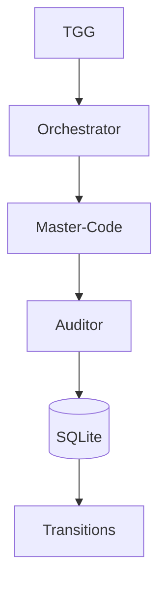

# MVP-28: Loop Engineering

   

## Architecture


```mermaid
graph TD
    TGG[TGG] --> Orch[Orchestrator]
    Orch --> MC[Master-Code]
    MC --> Auditor[Auditor]
    Auditor --> DB[(SQLite)]
    DB --> Trans[Transitions]
```

## Loop Contract
```yaml
loop_contract:
  version: "1.0"
  max_iterations: 10
  timeout_seconds: 3600
  strict_mode: true
```
*(Documented structure for execution boundaries)*

## Validation Chain
1. **Syntax Check**: Basic AST verification.
2. **Security Audit**: Ensuring no forbidden modules.
3. **Execution Test**: Dry-run with bounded limits.
4. **Result Verification**: Output format match.

## Transitions
- **PASS**: Meets all 4 levels of validation.
- **DELAY**: Recoverable error (e.g., timeout), retry scheduled.
- **BLOCK**: Critical failure (e.g., security violation), requires human intervention.

## Rollback
- **Git**: Reverts to the last known good commit on the `main` branch.
- **Shutil**: Atomic directory swaps for file-based operations.

## Persistence
```sql
CREATE TABLE loops (
    id TEXT PRIMARY KEY,
    status TEXT NOT NULL,
    iterations INTEGER,
    created_at DATETIME
);
```

## Governance
- **Vigilum Codex**: The strict set of rules governing agent permissions.
- **TGG**: The overarching authority for the entire ecosystem.
