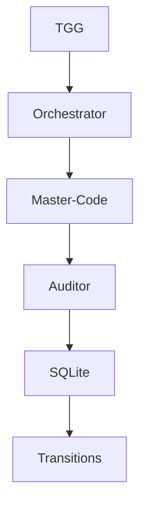

   

# MVP 28 - Loop Engineering

## Architecture


```mermaid
flowchart TD
    TGG[TGG] --> Orch[Orchestrator]
    Orch --> MC[Master-Code]
    MC --> Aud[Auditor]
    Aud --> SQ[SQLite]
    SQ --> Trans[Transitions]
```

## Loop Contract
The Loop Contract formally defines loop sequences in a standard YAML format. It contains metadata, execution rules, validation levels, and rollback procedures.

```yaml
# Example Loop Contract
metadata:
  loop_id: loop-28-alpha
  description: Phase C Loop Contract
execution:
  max_retries: 3
  timeout_seconds: 300
```

## Validation Chain
The validation chain comprises 4 levels to ensure integrity during loop execution:
1. **Level 1 (Syntax):** Basic format and structure validation.
2. **Level 2 (Static Analysis):** Linting and type checking.
3. **Level 3 (Unit):** Sub-agent isolated testing.
4. **Level 4 (Integration):** End-to-end integration and workflow validation.

## Transitions
Transitions determine the state logic after loop validation:
- **PASS:** All validation criteria are met. Proceed to the next state.
- **DELAY:** Temporary failure or missing resources. Re-queue for a later attempt.
- **BLOCK:** Critical failure or validation breakdown. Halt execution and require manual override or rollback.

## Rollback
In the event of a BLOCK transition or critical error, rollback mechanisms guarantee stability:
- **Git:** Reverts the repository to the last known stable commit.
- **Shutil:** Restores local file backups for artifacts outside version control.

## Persistence
A local SQLite schema captures the execution state, contracts, and validation results.

```sql
CREATE TABLE loop_state (
    id INTEGER PRIMARY KEY,
    loop_id TEXT NOT NULL,
    status TEXT NOT NULL,
    timestamp DATETIME DEFAULT CURRENT_TIMESTAMP
);
```

## Governance
This engineering loop adheres strictly to the **Vigilum Codex** and is supervised by **TGG** (The Great Guard). All autonomous actions must satisfy the codex policies before execution.
