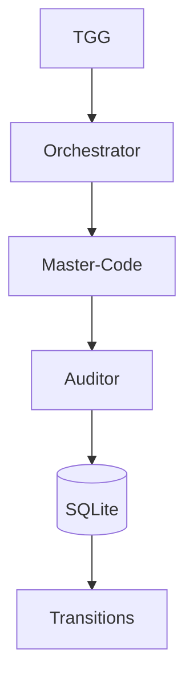

   

# 28 Loop Engineering

## Architecture

```mermaid
graph TD
    TGG[TGG] --> Orch[Orchestrator]
    Orch --> MC[Master-Code]
    MC --> Aud[Auditor]
    Aud --> DB[(SQLite)]
    DB --> Trans[Transitions]
```

## Loop Contract
```yaml
# Loop Contract Definition
loop_id: "MVP-28"
contract_type: "structural_loop"
stages:
  - init
  - execute
  - audit
  - persist
validation_strictness: "absolute"
```
(Documented)

## Validation Chain
1. Level 1: Syntax & formatting
2. Level 2: Contract adherence
3. Level 3: Execution correctness
4. Level 4: Security & Governance constraints

## Transitions
- **PASS**: All validation levels clear. Proceed to next node.
- **DELAY**: Recoverable issue (e.g., temporary lock). Wait and retry.
- **BLOCK**: Critical failure (e.g., security breach). Halt and require manual intervention.

## Rollback
- **Git**: Revert commits if changes were tracked in version control.
- **Shutil**: Restore backups from `.bak` or specific backup directories if file system changes were made outside git.

## Persistence
SQLite schema for state tracking:
```sql
CREATE TABLE loop_state (
    id INTEGER PRIMARY KEY AUTOINCREMENT,
    node_id TEXT NOT NULL,
    status TEXT NOT NULL,
    timestamp DATETIME DEFAULT CURRENT_TIMESTAMP,
    payload TEXT
);
```

## Governance
- **Vigilum Codex**: Defines the overarching ethical and operational bounds.
- **TGG**: The Tesla Guardian Grid, enforcing the Codex rules at runtime to ensure system integrity.
