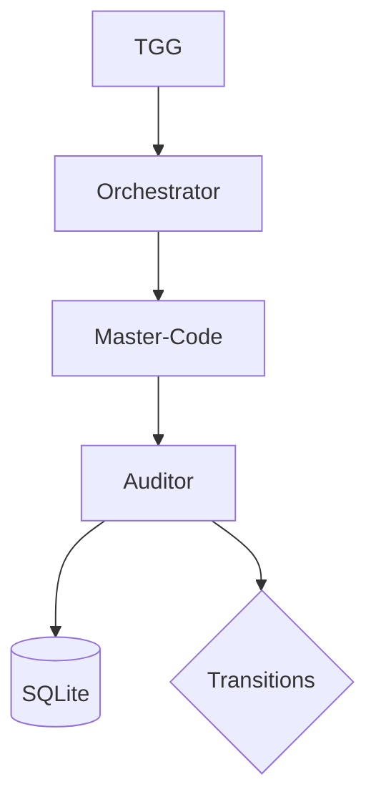

   

# MVP 28 - Loop Engineering

## Architecture

```mermaid
graph TD
    TGG[TGG] --> Orch[Orchestrator]
    Orch --> MC[Master-Code]
    MC --> Auditor[Auditor]
    Auditor --> SQL[(SQLite)]
    Auditor --> Trans{Transitions}
```

## Loop Contract
```yaml
# Loop Contract Example
contract_id: loop_eng_01
status: ACTIVE
constraints:
  timeout_ms: 5000
  max_retries: 3
dependencies:
  - id: prev_node_00
```

## Validation Chain
1. Level 1: Syntax & Static Analysis
2. Level 2: Functional Tests
3. Level 3: Integration Checks
4. Level 4: Security & Ecosystem Validation

## Transitions
- **PASS**: All validation levels clear. Proceeds to next node.
- **DELAY**: Recoverable error (e.g., timeout). Retries loop.
- **BLOCK**: Critical failure. Halts pipeline and requires manual intervention.

## Rollback
- Git mechanisms: Uses `git reset --hard` and branches for version states.
- Shutil mechanisms: Backup directories using `shutil.copytree` before state mutations.

## Persistence
- SQLite Schema:
  - `loops` (id, status, created_at, updated_at)
  - `transitions` (id, loop_id, type, timestamp, details)

## Governance
- Governed by **Vigilum Codex** and enforced by the **TGG** (Tesla Governance Gateway).
