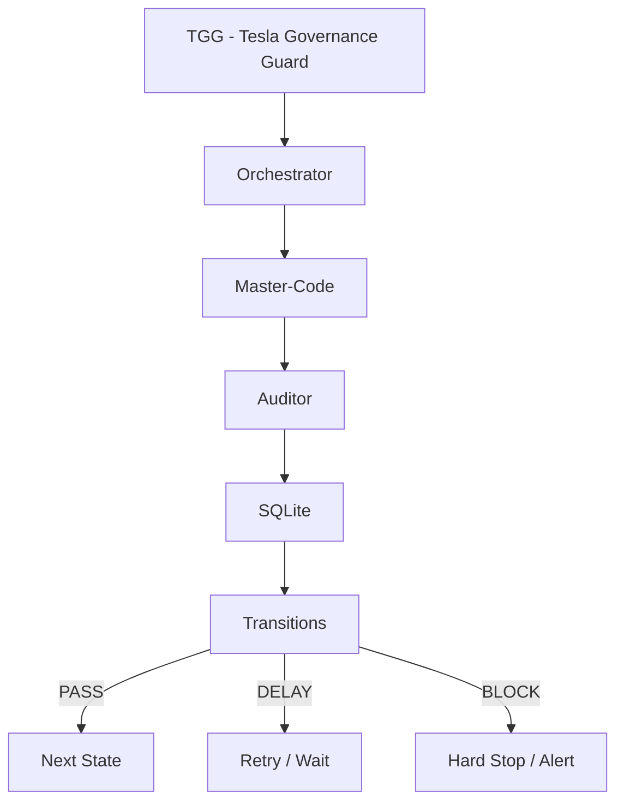

# 28-Loop-Engineering

   

## Overview
This repository contains the architecture, logic, and persistence layers for the **28-Loop-Engineering** project, part of the Tesla Antigravity ecosystem. It establishes a rigorous fail-closed validation pipeline and autonomous governance for agentic loops.

## Architecture


```mermaid
graph TD
    A[TGG - Tesla Governance Guard] --> B[Orchestrator]
    B --> C[Master-Code]
    C --> D[Auditor]
    D --> E[SQLite]
    E --> F[Transitions]
    F --> |PASS| G[Next State]
    F --> |DELAY| H[Retry / Wait]
    F --> |BLOCK| I[Hard Stop / Alert]
```

## Loop Contract

The execution of any loop is dictated by a strict YAML contract structure:

```yaml
loop_contract:
  id: string
  objective: string
  max_retries: integer
  validation_criteria:
    - rule_id: string
      description: string
      severity: string
  timeout_seconds: integer
```

## Validation Chain

The validation chain ensures that every state transition is proven before moving forward.

1. **Syntax & Schema Verification** - Ensures structural correctness of outputs.
2. **Context & Capability Matching** - Checks if the requested tools/skills are available and authorized.
3. **Execution Safety Audit** - Validates the execution against TGG policies (e.g. destructive commands).
4. **Independent Evidence Review** - Validates the proof of execution (Evidence Chain) before allowing transition.

## Transitions

Transitions dictate the progression of the state machine:
- **PASS**: All validation chain levels return a true boolean. Evidence is committed.
- **DELAY**: Soft failure (e.g., transient network issue, resource not ready). Retries according to contract.
- **BLOCK**: Hard failure. State violates safety or logical limits. Aborts loop.

## Rollback

In the event of a BLOCK transition or critical error during the cycle, rollback mechanisms are enacted:
- **Git**: Reverts atomic file modifications.
- **Shutil**: Used for localized file system restoration (quarantine backups).

## Persistence

The execution state is persisted continuously in SQLite.

**Schema:**
```sql
CREATE TABLE loops (
    loop_id TEXT PRIMARY KEY,
    status TEXT NOT NULL,
    current_state TEXT,
    created_at DATETIME DEFAULT CURRENT_TIMESTAMP,
    updated_at DATETIME
);

CREATE TABLE transitions (
    transition_id INTEGER PRIMARY KEY AUTOINCREMENT,
    loop_id TEXT,
    from_state TEXT,
    to_state TEXT,
    evidence_payload TEXT,
    FOREIGN KEY(loop_id) REFERENCES loops(loop_id)
);
```

## Governance

All activities within the loop are strictly governed by:
- **Vigilum Codex**: The overarching directive ensuring fail-closed operations and security.
- **TGG (Tesla Governance Guard)**: The active enforcement layer checking capability policies, routing, and access control.
