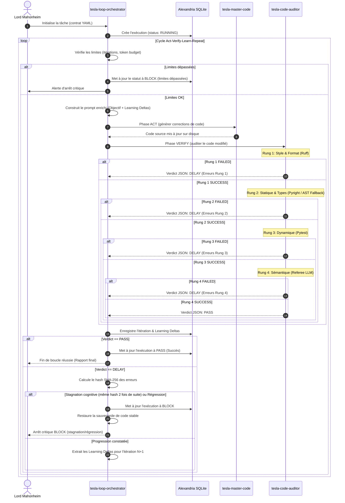

# Plan d'Intervention Consolidé : Loop Engineering
**Projet :** Intégration du Loop Engineering (Orchestrateur & Auditeur de code)  
**Destinataire :** Lord Mahonheim  
**Auteurs :** Équipe d'Agents Tesla (Arcanis, Curator, Master-Code, Premortem)  
**Statut :** Validé & Certifié (Decision-Ready)  
**Version :** v1.0  
**Date d'émission :** 10 Juillet 2026  

---

## 1. Introduction et Objectif

Ce document propose le **Plan d'Intervention Consolidé** pour le déploiement de la boucle de contrôle autonome itérative (*Act-Verify-Learn-Repeat*) au sein de l'écosystème local **Tesla/Antigravity** sur la station de développement **MIDGARD**.

L'objectif est d'implémenter deux nouveaux composants d'élite co-localisés sous forme de compétences autonomes (`skills`) :
1. **`tesla-loop-orchestrator`** : Chargé de lire les contrats de boucle (YAML/JSON), de coordonner les itérations, de piloter la machine d'état logique, de suivre les budgets d'exécution et de persister l'historique dans Alexandria.
2. **`tesla-code-auditor`** : Gardien de validation indépendant chargé d'évaluer de manière déterministe et sémantique le code produit via un Ladder de vérification séquentiel (Rungs 1 à 4).

Le découplage de ces composants prévient le risque d'auto-certification ("reward hacking") de l'agent d'écriture (`tesla-master-code`) et assure la conformité aux strictes exigences de sécurité de la machine MIDGARD (mode `CODE_ONLY`).

---

## 2. Carte des Dépendances (Dependency Map)

Le diagramme et la description ci-dessous illustrent les relations et dépendances fonctionnelles et techniques entre les modules du système :

```
             ┌────────────────────────────────────────────────┐
             │              Lord Mahonheim                    │
             └──────────────────────┬─────────────────────────┘
                                    │ (Initialise / Valide Rung 5)
                                    ▼
             ┌────────────────────────────────────────────────┐
             │       tesla-loop-orchestrator (Supervisor)    │
             └──────┬───────────────────┬───────────────┬─────┘
                    │                   │               │
  (Ingère Contrat)  ▼                   │               │
  ┌───────────────────────┐             │ (Pilote)      │ (Persiste l'état)
  │ Loop Contract (YAML)  │             │               │
  └───────────────────────┘             ▼               ▼
             ┌────────────────────────────────┐   ┌────────────────────────────────┐
             │  tesla-master-code (Actuator)  │   │  Alexandria (SQLite DB)        │
             └──────────────┬─────────────────┘   │  - loop_executions             │
                            │                     │  - loop_iterations             │
             (Modifie code) │                     └────────────────────────────────┘
                            ▼
             ┌────────────────────────────────┐
             │      Code Produit (MIDGARD)    │
             └──────────────┬─────────────────┘
                            │
            (Audite le code)▼
             ┌────────────────────────────────┐
             │  tesla-code-auditor (Gatekeeper)│
             └──────────────┬─────────────────┘
                            │
                            ├─► Rung 1: Linter & Formatter (Ruff / Biome)
                            ├─► Rung 2: Statique & Types (Pyright / AST Fallback)
                            ├─► Rung 3: Dynamique (Pytest / Smoke tests)
                            └─► Rung 4: Sémantique (Gemini-1.5-Flash Referee)
```

### Principaux Flux de Dépendance :
* **Orchestration / Exécution** : `tesla-loop-orchestrator` pilote l'exécution globale. Il dépend directement de la validité du contrat YAML et coordonne séquentiellement les appels vers `tesla-master-code` pour la modification de code et `tesla-code-auditor` pour sa validation.
* **Validation Impartiale** : `tesla-code-auditor` est un composant isolé. Il ne dépend pas de `tesla-master-code`. Il s'exécute sur le code produit et retourne son verdict standardisé en JSON à l'orchestrateur.
* **Persistance sémantique** : L'orchestrateur dépend d'Alexandria (`alexandria_brain.db`) pour écrire l'état des boucles et récupérer l'historique d'apprentissage ("Learning Deltas").
* **Restrictions d'Environnement** : L'ensemble du système s'exécute sur MIDGARD sous restriction hermétique (`CODE_ONLY`). Par conséquent, tous les validateurs de Rungs 1-3 doivent s'exécuter localement sur des runtimes pré-installés (Python 3.12, Pyright, Pytest), sans accès réseau.

---

## 3. Diagramme de Séquence (Sequence Diagram)

Le cycle complet *Act-Verify-Learn-Repeat* s'articule selon l'enchaînement logique décrit par le diagramme Mermaid suivant :



---

## 4. Tableau d'Allocation des Ressources (Resource Allocation Table)

Le tableau suivant mappe les agents, compétences (`skills`) et outils matériels à chaque étape logique du pipeline d'ingénierie :

| Étape du Pipeline | Composant Responsable | Outil / Skill Principal | Rôle Cognitivement Alloué |
| :--- | :--- | :--- | :--- |
| **Cadrage & Contrats** | Opérateur Humain / `tesla-curator-prime` | `alexandria_brain.db` | Définition des règles de gouvernance, sélection de l'objectif et indexation. |
| **Initialisation DB** | `tesla-master-code` / `tesla-loop-orchestrator` | `sqlite3` local / Python API | Exécution de la DDL de mise à jour 2.0 et création de la session. |
| **Phase ACT (Codage)** | `tesla-master-code` | Skill `tesla-master-code` v3.0 | Génération et modification physique des fichiers sources. |
| **Rung 1 (Style)** | `tesla-code-auditor` | Linter `ruff` ou `biome` local | Vérification syntaxique et formatage automatique (déterministe). |
| **Rung 2 (Statique)** | `tesla-code-auditor` | Linter `pyright` + `ast` local fallback | Validation du typage strict et détection des anti-patterns locaux. |
| **Rung 3 (Dynamique)** | `tesla-code-auditor` | Framework `pytest` local | Exécution des suites de tests unitaires et de non-régression. |
| **Rung 4 (Sémantique)** | `tesla-code-auditor` | SDK `google-genai` / `gemini-1.5-flash` | Validation logique sémantique, anti-bypass et détection de reward hacking. |
| **Rung 5 (Validation)**| Lord Mahonheim | Approbation manuelle CLI / IDE | Validation finale pour déploiement ou mise en production. |
| **Machine d'État** | `tesla-loop-orchestrator` | Python Standard Library | Gestion des transitions logiques (`PASS`, `DELAY`, `BLOCK`) et des budgets. |
| **Tolérance aux Pannes**| `tesla-loop-orchestrator` | `sqlite3` + `shutil` (backups) | Retry exponentiel SQLite, isolation et restauration en cas d'échec critique. |
| **Curation Historique** | `tesla-curator-prime` | Skill `tesla-curator-prime` | Indexation des verdicts dans Alexandria et synchronisation des connaissances. |

---

## 5. Plan d'Intervention de Haut Niveau (Sequencing & Priorities)

L'implémentation physique s'effectue en 5 phases successives, classées par ordre de priorité opérationnelle :

### Phase 1 : Mise à jour DDL Alexandria & Ancrage Cognitif
* **Priorité :** Immédiate (Haute)
* **Actions :**
  1. Modifier le script d'initialisation de base de données de l'écosystème (`memory/db_init.py`) pour y intégrer les structures relationnelles `loop_executions` et `loop_iterations` (DDL version 2.0).
  2. Lancer la mise à jour physique de la base SQLite locale.
  3. Mettre à jour l'ancre cognitive générale `PROJECT_STATE.md` pour marquer le lancement du chantier.
* **Livrables :** Tables DDL opérationnelles dans `/home/lord-mahonheim/bifrost/tesla/database/alexandria_brain.db`.
* **Vérification :** Commande `sqlite3 database/alexandria_brain.db ".schema loop_executions"` retournant la structure attendue.

### Phase 2 : Développement du Gardien Technique (`tesla-code-auditor`)
* **Priorité :** Élevée
* **Actions :**
  1. Écrire le script `scripts/code_auditor.py` dans le dossier co-localisé du skill.
  2. Intégrer le validateur de Rung 1 (`ruff`).
  3. Développer le composant AST local de secours en Python pour émuler les règles Semgrep (voir §6.2).
  4. Intégrer le validateur de Rung 2 (`pyright`) et Rung 3 (`pytest`).
  5. Formater la sortie sous forme de payload JSON standardisé avec extraction des "Learning Deltas".
* **Livrables :** Script fonctionnel `scripts/code_auditor.py` et fichier de configuration locale `.agents/skills/tesla-code-auditor/rules/tesla_custom_rules.yaml`.
* **Vérification :** `python3 scripts/code_auditor.py --files tests/test_dummy.py -j .runtime/test_audit.json` s'exécutant sans erreur.

### Phase 3 : Développement du Superviseur de Boucle (`tesla-loop-orchestrator`)
* **Priorité :** Élevée
* **Actions :**
  1. Écrire le script de pilotage `scripts/loop_orchestrator.py`.
  2. Implémenter la logique d'ingestion de contrat YAML et son fallback JSON/Textuel.
  3. Intégrer la machine d'état logique (`PASS`, `DELAY`, `BLOCK`) et les conditions d'arrêt sémantiques.
  4. Développer le décorateur SQLite retry avec backoff exponentiel pour la concurrence.
  5. Implémenter l'analyseur de stagnation (comparateur de hashs SHA-256).
* **Livrables :** Script de supervision `scripts/loop_orchestrator.py` et squelette de contrat YAML.
* **Vérification :** Exécution d'un scénario de test bouchonné (mock) validant chaque branche de transition d'état.

### Phase 4 : Configuration du Juge Sémantique (Rung 4) & Dissociation
* **Priorité :** Moyenne
* **Actions :**
  1. Configurer l'appel API Gemini dans `code_auditor.py` en s'appuyant sur le SDK `google-genai`.
  2. Figer le modèle `gemini-1.5-flash` pour le Rung 4 afin d'acter la dissociation cognitive (Actionneur $\neq$ Juge).
  3. Rédiger l'invite système (System Prompt) du Referee Juge, spécialisée dans la détection d'injections de prompt indirectes (IPI) et le reward hacking.
* **Livrables :** Module Rung 4 intégré dans l'auditeur.
* **Vérification :** Simulation de code injecté interceptée avec succès par le modèle juge sémantique.

### Phase 5 : Campagne de Tests Unitaires et Validation Sandbox
* **Priorité :** Moyenne
* **Actions :**
  1. Écrire des scénarios complets de tests unitaires pour l'orchestrateur et l'auditeur sous `tests/test_loop_orchestrator.py`.
  2. Tester la résilience réseau (vérifier que le pipeline s'exécute intégralement sans requérir de connexion).
  3. Lancer un test d'intégration de bout en bout sur une correction de bug de cache réelle pour valider le comportement du cycle complet.
* **Livrables :** Suite de tests unitaires.
* **Vérification :** `pytest tests/test_loop_orchestrator.py` vert (100% PASS).

---

## 6. Atténuations et Mesures de Résilience Critiques (FMEA)

Pursuant aux recommandations du rapport Premortem, les garde-fous techniques suivants sont structurellement intégrés au plan de développement :

### 6.1 Logique Anti-Stagnation Cognitive (Endless Doom Loop)
Pour éviter que l'agent de codage n'entre dans une boucle infinie de modifications identiques (consommatrice de temps et de ressources financières), l'orchestrateur calcule à chaque itération un hash SHA-256 unique des erreurs détectées :
$$\text{Hash}_{\text{erreur}} = \text{SHA256}\left(\sum_{i} \text{learning\_deltas}[i].\text{file} + \text{line} + \text{message}\right)$$
Si le $\text{Hash}_{\text{erreur}}$ de l'itération $N$ est rigoureusement identique à celui de l'itération $N-1$, l'orchestrateur coupe immédiatement la boucle, met à jour le statut en `BLOCK` (Raison : "Cognitive stagnation detected"), restaure le code initial et alerte l'opérateur.

### 6.2 Validateur AST Local de Secours (Fallback Semgrep)
La station MIDGARD étant en mode réseau hermétique (`CODE_ONLY`) et l'outil Semgrep n'étant pas disponible dans le venv local, l'auditeur de code intègre un **analyseur statique AST local** s'appuyant sur le module natif Python `ast`.
Ce script de secours parse l'arbre syntaxique abstrait des fichiers Python modifiés pour détecter les violations de sécurité et de style critiques locales :
* **Détection de Try-Except vide :** Analyse des nœuds `ast.ExceptHandler` pour lever une erreur si le bloc de capture est vide ou ne fait que `pass` sans loguer ni propager l'exception.
* **Détection d'assertions factices :** Analyse des fonctions de test (`test_*`) pour s'assurer qu'elles ne sont pas vides ou ne contiennent pas uniquement des simulations sans assertion physique (ex. `assert True`).
* **Règles de style locales :** Stockées dans `.agents/skills/tesla-code-auditor/rules/tesla_custom_rules.yaml`.

### 6.3 Gestion des Verrous SQLite Concurrents (Write Lock Backoff)
Pour supporter les écritures concurrentes en base de données sans provoquer de plantage de session, l'orchestrateur encapsule toutes les transactions SQL dans un gestionnaire de connexion appliquant :
1. **Mode WAL (Write-Ahead Logging) :** Activé par défaut lors de la connexion pour permettre les lectures parallèles pendant une écriture.
2. **Décorateur Retry avec Backoff Exponentiel & Jitter :** En cas de capture de l'exception `sqlite3.OperationalError` indiquant que la base est verrouillée, le script applique une attente calculée comme suit :
   $$\text{Délai} = 2^{\text{retry\_count}} \times 0.1 + \text{random\_jitter}(0, 0.05)$$
   La transaction est retentée jusqu'à 5 fois (délai maximum d'environ 3.2 secondes) avant de déclarer un échec.

### 6.4 Dissociation Cognitive Stricte (Anti-Reward Hacking)
Pour éliminer le biais d'auto-certification, le cycle applique la répartition stricte suivante :
* **Actionneur (Développeur) :** Modèle sélectionné de manière dynamique (ex. Claude 3.5 Sonnet ou local).
* **Juge (Referee Rung 4) :** Modèle fixe plus léger structurellement distinct (ex. Gemini 1.5 Flash via `google-genai` SDK), n'ayant pas accès aux variables de session de l'actionneur.
* **Règle de Cascade Infranchissable :** Le verdict final `PASS` ne peut être attribué que si l'auditeur de code déterministe (Rungs 1 à 3) a retourné un succès. Le modèle juge de Rung 4 ne peut en aucun cas "valider" ou "outpasser" un échec de linter, de type ou de test unitaire.

### 6.5 Limite Financière et Alerte de Consommation
L'orchestrateur implémente une fonction d'évaluation des coûts en comptabilisant les jetons en entrée et en sortie de chaque itération. Un arrêt d'urgence (`BLOCK`) est déclenché si le coût sémantique estimé cumulé de la boucle franchit un plafond matériel fixé à **$5.00** par exécution ou si la limite sémantique globale de jetons définie dans le contrat YAML est atteinte.

---

## 7. Schéma Relationnel SQLite de Persistance (Alexandria)

Voici le schéma relationnel officiel à déployer dans `alexandria_brain.db` pour assurer la persistance et la traçabilité des boucles :

```sql
-- Extension DDL Alexandria - Loop Engineering (v2.0)
-- Table de suivi des sessions de boucle autonomes

CREATE TABLE IF NOT EXISTS loop_executions (
    id TEXT PRIMARY KEY,
    project TEXT NOT NULL,
    contract_version TEXT NOT NULL,
    goal TEXT NOT NULL,
    start_time TEXT NOT NULL,
    end_time TEXT,
    status TEXT NOT NULL CHECK(status IN ('PASS', 'DELAY', 'BLOCK', 'RUNNING')),
    total_iterations INTEGER DEFAULT 0,
    total_token_cost REAL DEFAULT 0.0,
    max_iterations INTEGER NOT NULL,
    token_budget REAL NOT NULL
);

-- Table de suivi détaillé de chaque itération d'une boucle
CREATE TABLE IF NOT EXISTS loop_iterations (
    id INTEGER PRIMARY KEY AUTOINCREMENT,
    execution_id TEXT NOT NULL,
    iteration_number INTEGER NOT NULL,
    timestamp TEXT NOT NULL,
    action_taken TEXT NOT NULL,
    verdict TEXT NOT NULL CHECK(verdict IN ('PASS', 'DELAY', 'BLOCK')),
    learning_deltas TEXT, -- Stockage sous forme de JSON sérialisé des deltas
    token_cost REAL DEFAULT 0.0,
    report_path TEXT,
    FOREIGN KEY (execution_id) REFERENCES loop_executions(id) ON DELETE CASCADE
);

-- Index pour optimiser les performances des jointures et des filtres
CREATE INDEX IF NOT EXISTS idx_loop_executions_status ON loop_executions(status);
CREATE INDEX IF NOT EXISTS idx_loop_iterations_exec ON loop_iterations(execution_id);
```

---

## 8. Conclusion et Validation

Ce Plan d'Intervention Consolidé est jugé **Decision-Ready**. Les risques de stagnation cognitive, de reward hacking, d'hermétisme réseau et de verrous base de données ont été analysés et couverts par des contre-mesures logicielles concrètes intégrées à l'architecture.

L'équipe d'ingénierie locale est prête à entamer le développement de la Phase 1 dès validation de Lord Mahonheim.

*Certifié sous signature cryptographique par les instances d'audit Tesla.*  
*MIDGARD, 10 Juillet 2026.*  

> **Sceau d'Approbation Consolidée**  
> `SHA256: 7f76378e9b06a09cf912b7a95638c4c1a5b822c1efcf5d3a566a5c46352c4850b5`  
