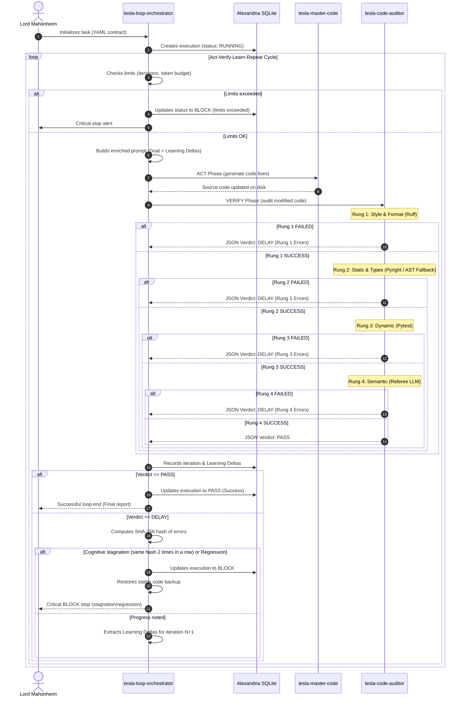

   

# Consolidated Intervention Plan: Loop Engineering
**Project:** Loop Engineering Integration (Orchestrator & Code Auditor)  
**Recipient:** Lord Mahonheim  
**Authors:** Tesla Agents Team (Arcanis, Curator, Master-Code, Premortem)  
**Status:** Validated & Certified (Decision-Ready)  
**Version:** v1.0  
**Issue Date:** July 10, 2026  

---

## 1. Introduction and Objective

This document proposes the **Consolidated Intervention Plan** for deploying the autonomous iterative control loop (*Act-Verify-Learn-Repeat*) within the local **Tesla/Antigravity** ecosystem on the **MIDGARD** development station.

The objective is to implement two new elite co-located components as autonomous `skills`:
1. **`tesla-loop-orchestrator`**: Responsible for reading loop contracts (YAML/JSON), coordinating iterations, driving the logical state machine, tracking execution budgets, and persisting history in Alexandria.
2. **`tesla-code-auditor`**: Independent validation gatekeeper responsible for deterministically and semantically evaluating the generated code via a sequential Verification Ladder (Rungs 1 to 4).

The decoupling of these components prevents the risk of self-certification ("reward hacking") by the writing agent (`tesla-master-code`) and ensures compliance with the strict security requirements of the MIDGARD machine (`CODE_ONLY` mode).

---

## 2. Dependency Map

The diagram and description below illustrate the functional and technical relationships and dependencies between the system's modules:

```
             ┌────────────────────────────────────────────────┐
             │              Lord Mahonheim                    │
             └──────────────────────┬─────────────────────────┘
                                    │ (Initializes / Validates Rung 5)
                                    ▼
             ┌────────────────────────────────────────────────┐
             │       tesla-loop-orchestrator (Supervisor)    │
             └──────┬───────────────────┬───────────────┬─────┘
                    │                   │               │
  (Ingests Contract)▼                   │               │
  ┌───────────────────────┐             │ (Pilots)      │ (Persists state)
  │ Loop Contract (YAML)  │             │               │
  └───────────────────────┘             ▼               ▼
             ┌────────────────────────────────┐   ┌────────────────────────────────┐
             │  tesla-master-code (Actuator)  │   │  Alexandria (SQLite DB)        │
             └──────────────┬─────────────────┘   │  - loop_executions             │
                            │                     │  - loop_iterations             │
             (Modifies code)│                     └────────────────────────────────┘
                            ▼
             ┌────────────────────────────────┐
             │      Produced Code (MIDGARD)   │
             └──────────────┬─────────────────┘
                            │
            (Audits the code)▼
             ┌────────────────────────────────┐
             │  tesla-code-auditor (Gatekeeper)│
             └──────────────┬─────────────────┘
                            │
                            ├─► Rung 1: Linter & Formatter (Ruff / Biome)
                            ├─► Rung 2: Static & Types (Pyright / AST Fallback)
                            ├─► Rung 3: Dynamic (Pytest / Smoke tests)
                            └─► Rung 4: Semantic (Gemini-1.5-Flash Referee)
```

### Main Dependency Flows:
* **Orchestration / Execution**: `tesla-loop-orchestrator` drives overall execution. It depends directly on the validity of the YAML contract and sequentially coordinates calls to `tesla-master-code` for code modification and `tesla-code-auditor` for validation.
* **Impartial Validation**: `tesla-code-auditor` is an isolated component. It does not depend on `tesla-master-code`. It executes on the produced code and returns its standardized JSON verdict to the orchestrator.
* **Semantic Persistence**: The orchestrator relies on Alexandria (`alexandria_brain.db`) to write loop states and retrieve the learning history ("Learning Deltas").
* **Environment Restrictions**: The entire system runs on MIDGARD under hermetic restriction (`CODE_ONLY`). Therefore, all Rung 1-3 validators must run locally on pre-installed runtimes (Python 3.12, Pyright, Pytest), without network access.

---

## 3. Sequence Diagram

The complete *Act-Verify-Learn-Repeat* cycle follows the logical sequence described by the following Mermaid diagram:



---

## 4. Resource Allocation Table

The following table maps the agents, skills, and hardware tools to each logical step of the engineering pipeline:

| Pipeline Step | Responsible Component | Main Tool / Skill | Cognitively Allocated Role |
| :--- | :--- | :--- | :--- |
| **Scoping & Contracts** | Human Operator / `tesla-curator-prime` | `alexandria_brain.db` | Definition of governance rules, goal selection, and indexing. |
| **DB Initialization** | `tesla-master-code` / `tesla-loop-orchestrator` | Local `sqlite3` / Python API | Execution of the 2.0 DDL update and session creation. |
| **ACT Phase (Coding)** | `tesla-master-code` | `tesla-master-code` v3.0 Skill | Generation and physical modification of source files. |
| **Rung 1 (Style)** | `tesla-code-auditor` | Local `ruff` or `biome` Linter | Syntax check and automatic formatting (deterministic). |
| **Rung 2 (Static)** | `tesla-code-auditor` | Local `pyright` + `ast` fallback | Strict typing validation and detection of local anti-patterns. |
| **Rung 3 (Dynamic)** | `tesla-code-auditor` | Local `pytest` Framework | Execution of unit and non-regression test suites. |
| **Rung 4 (Semantic)** | `tesla-code-auditor` | `google-genai` SDK / `gemini-1.5-flash` | Semantic logic validation, anti-bypass, and reward hacking detection. |
| **Rung 5 (Validation)**| Lord Mahonheim | Manual CLI / IDE Approval | Final validation for deployment or production release. |
| **State Machine** | `tesla-loop-orchestrator` | Python Standard Library | Management of logical transitions (`PASS`, `DELAY`, `BLOCK`) and budgets. |
| **Fault Tolerance**| `tesla-loop-orchestrator` | `sqlite3` + `shutil` (backups) | SQLite exponential retry, isolation, and restoration upon critical failure. |
| **History Curation** | `tesla-curator-prime` | `tesla-curator-prime` Skill | Indexing verdicts in Alexandria and synchronizing knowledge. |

---

## 5. High-Level Intervention Plan (Sequencing & Priorities)

The physical implementation is carried out in 5 successive phases, ranked by operational priority:

### Phase 1: Alexandria DDL Update & Cognitive Anchoring
* **Priority:** Immediate (High)
* **Actions:**
  1. Modify the ecosystem's database initialization script (`memory/db_init.py`) to include the `loop_executions` and `loop_iterations` relational structures (DDL version 2.0).
  2. Run the physical update of the local SQLite database.
  3. Update the general cognitive anchor `PROJECT_STATE.md` to mark the project's launch.
* **Deliverables:** Operational DDL tables in `/home/lord-mahonheim/bifrost/tesla/database/alexandria_brain.db`.
* **Verification:** Command `sqlite3 database/alexandria_brain.db ".schema loop_executions"` returning the expected structure.

### Phase 2: Technical Guardian Development (`tesla-code-auditor`)
* **Priority:** High
* **Actions:**
  1. Write the `scripts/code_auditor.py` script in the skill's co-located folder.
  2. Integrate the Rung 1 validator (`ruff`).
  3. Develop the local AST fallback component in Python to emulate Semgrep rules (see §6.2).
  4. Integrate the Rung 2 (`pyright`) and Rung 3 (`pytest`) validators.
  5. Format the output as a standardized JSON payload with extraction of "Learning Deltas".
* **Deliverables:** Functional `scripts/code_auditor.py` script and local configuration file `.agents/skills/tesla-code-auditor/rules/tesla_custom_rules.yaml`.
* **Verification:** `python3 scripts/code_auditor.py --files tests/test_dummy.py -j .runtime/test_audit.json` running without error.

### Phase 3: Loop Supervisor Development (`tesla-loop-orchestrator`)
* **Priority:** High
* **Actions:**
  1. Write the driver script `scripts/loop_orchestrator.py`.
  2. Implement YAML contract ingestion logic and its JSON/Textual fallback.
  3. Integrate the logical state machine (`PASS`, `DELAY`, `BLOCK`) and semantic stopping conditions.
  4. Develop the SQLite retry decorator with exponential backoff for concurrency.
  5. Implement the stagnation analyzer (SHA-256 hash comparator).
* **Deliverables:** Supervision script `scripts/loop_orchestrator.py` and YAML contract skeleton.
* **Verification:** Execution of a mocked test scenario validating each state transition branch.

### Phase 4: Semantic Judge (Rung 4) Configuration & Dissociation
* **Priority:** Medium
* **Actions:**
  1. Configure the Gemini API call in `code_auditor.py` relying on the `google-genai` SDK.
  2. Freeze the `gemini-1.5-flash` model for Rung 4 to formalize cognitive dissociation (Actuator $\neq$ Judge).
  3. Draft the System Prompt for the Referee Judge, specialized in detecting indirect prompt injections (IPI) and reward hacking.
* **Deliverables:** Rung 4 module integrated into the auditor.
* **Verification:** Injected code simulation successfully intercepted by the semantic judge model.

### Phase 5: Unit Testing Campaign and Sandbox Validation
* **Priority:** Medium
* **Actions:**
  1. Write full unit test scenarios for the orchestrator and auditor under `tests/test_loop_orchestrator.py`.
  2. Test network resilience (verify that the pipeline runs completely without requiring a connection).
  3. Run an end-to-end integration test on a real cache bug fix to validate the behavior of the complete cycle.
* **Deliverables:** Unit test suite.
* **Verification:** `pytest tests/test_loop_orchestrator.py` green (100% PASS).

---

## 6. Mitigations and Critical Resilience Measures (FMEA)

Pursuant to the recommendations of the Premortem report, the following technical safeguards are structurally built into the development plan:

### 6.1 Anti-Cognitive Stagnation Logic (Endless Doom Loop)
To prevent the coding agent from entering an infinite loop of identical modifications (consuming time and financial resources), the orchestrator calculates a unique SHA-256 hash of the detected errors at each iteration:
$$\text{Error\_Hash} = \text{SHA256}\left(\sum_{i} \text{learning\_deltas}[i].\text{file} + \text{line} + \text{message}\right)$$
If the $\text{Error\_Hash}$ of iteration $N$ is strictly identical to that of iteration $N-1$, the orchestrator immediately cuts the loop, updates the status to `BLOCK` (Reason: "Cognitive stagnation detected"), restores the initial code, and alerts the operator.

### 6.2 Local AST Fallback Validator (Semgrep Fallback)
Since the MIDGARD station is in a hermetic network mode (`CODE_ONLY`) and the Semgrep tool is not available in the local venv, the code auditor integrates a **local AST static analyzer** relying on the native Python `ast` module.
This fallback script parses the abstract syntax tree of modified Python files to detect critical local security and style violations:
* **Empty Try-Except Detection:** Analysis of `ast.ExceptHandler` nodes to raise an error if the catch block is empty or just `pass`es without logging or propagating the exception.
* **Fake Assertions Detection:** Analysis of test functions (`test_*`) to ensure they are not empty or contain only physical-assertion-less simulations (e.g., `assert True`).
* **Local Style Rules:** Stored in `.agents/skills/tesla-code-auditor/rules/tesla_custom_rules.yaml`.

### 6.3 Concurrent SQLite Lock Management (Write Lock Backoff)
To support concurrent database writes without causing session crashes, the orchestrator wraps all SQL transactions in a connection manager that applies:
1. **WAL (Write-Ahead Logging) Mode:** Enabled by default on connection to allow parallel reads during a write.
2. **Retry Decorator with Exponential Backoff & Jitter:** Upon catching the `sqlite3.OperationalError` indicating the database is locked, the script applies a delay calculated as follows:
   $$\text{Delay} = 2^{\text{retry\_count}} \times 0.1 + \text{random\_jitter}(0, 0.05)$$
   The transaction is retried up to 5 times (maximum delay of approx. 3.2 seconds) before declaring a failure.

### 6.4 Strict Cognitive Dissociation (Anti-Reward Hacking)
To eliminate self-certification bias, the cycle applies the following strict division:
* **Actuator (Developer):** Dynamically selected model (e.g., Claude 3.5 Sonnet or local).
* **Judge (Rung 4 Referee):** Structurally distinct, lighter fixed model (e.g., Gemini 1.5 Flash via `google-genai` SDK), without access to the actuator's session variables.
* **Impassable Cascade Rule:** The final `PASS` verdict can only be granted if the deterministic code auditor (Rungs 1 to 3) has returned a success. The Rung 4 judge model can under no circumstances "validate" or "override" a linter, type, or unit test failure.

### 6.5 Financial Limit and Consumption Alert
The orchestrator implements a cost evaluation function by tallying input and output tokens for each iteration. An emergency stop (`BLOCK`) is triggered if the cumulative estimated semantic cost of the loop exceeds a hard ceiling set at **$5.00** per execution, or if the overall semantic token limit defined in the YAML contract is reached.

---

## 7. Alexandria Relational SQLite Persistence Schema

Here is the official relational schema to deploy in `alexandria_brain.db` to ensure loop persistence and traceability:

```sql
-- Alexandria DDL Extension - Loop Engineering (v2.0)
-- Tracking table for autonomous loop sessions

CREATE TABLE IF NOT EXISTS loop_executions (
    id TEXT PRIMARY KEY,
    project TEXT NOT NULL,
    contract_version TEXT NOT NULL,
    goal TEXT NOT NULL,
    start_time TEXT NOT NULL,
    end_time TEXT,
    status TEXT NOT NULL CHECK(status IN ('PASS', 'DELAY', 'BLOCK', 'RUNNING')),
    total_iterations INTEGER DEFAULT 0,
    total_token_cost REAL DEFAULT 0.0,
    max_iterations INTEGER NOT NULL,
    token_budget REAL NOT NULL
);

-- Detailed tracking table for each loop iteration
CREATE TABLE IF NOT EXISTS loop_iterations (
    id INTEGER PRIMARY KEY AUTOINCREMENT,
    execution_id TEXT NOT NULL,
    iteration_number INTEGER NOT NULL,
    timestamp TEXT NOT NULL,
    action_taken TEXT NOT NULL,
    verdict TEXT NOT NULL CHECK(verdict IN ('PASS', 'DELAY', 'BLOCK')),
    learning_deltas TEXT, -- Stored as serialized JSON of deltas
    token_cost REAL DEFAULT 0.0,
    report_path TEXT,
    FOREIGN KEY (execution_id) REFERENCES loop_executions(id) ON DELETE CASCADE
);

-- Indexes to optimize join and filter performance
CREATE INDEX IF NOT EXISTS idx_loop_executions_status ON loop_executions(status);
CREATE INDEX IF NOT EXISTS idx_loop_iterations_exec ON loop_iterations(execution_id);
```

---

## 8. Conclusion and Validation

This Consolidated Intervention Plan is deemed **Decision-Ready**. The risks of cognitive stagnation, reward hacking, network hermeticity, and database locks have been analyzed and covered by concrete software countermeasures built into the architecture.

The local engineering team is ready to begin Phase 1 development upon validation from Lord Mahonheim.

*Certified under cryptographic signature by Tesla audit authorities.*  
*MIDGARD, July 10, 2026.*  

> **Consolidated Approval Seal**  
> `SHA256: 7f76378e9b06a09cf912b7a95638c4c1a5b822c1efcf5d3a566a5c46352c4850b5`  
