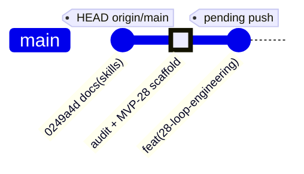

   

# 📊 GitHub Audit Report — Loop Engineering

> **tesla-github-manager** · Vigilum Codex · @lordmahonheim-bot
> Date: 2026-07-10T02:42:50+01:00
> Version: v1.0

---

## 📋 Executive Summary

| Dimension | Result |
|---|---|
| Local MVP-GITHUB repository | ✅ Healthy — `main` branch up to date with `origin/main` |
| Remote GitHub | ✅ `https://github.com/lordmahonheim-bot/Tesla-Antigravity-CLI.git` |
| 6 community health files | ✅ 6/6 present |
| Latest local MVP | `27-Tesla-Governance-Gateway` |
| Latest pushed commit | `0249a4d` — `docs(skills): enforce absolute OUTPUTS rule` |
| MVP 28 created | ✅ `28-Loop-Engineering/` — 14 files |
| Local/remote consistency | ⚠️ 1 uncommitted modified file (`17-DB-Subagents-Skills/db_init.py`) — out of scope |

---

## PHASE 1 — Local Git Audit

### 1.1 History of the last 10 commits

```
0249a4d (HEAD -> main, origin/main) docs(skills): enforce absolute OUTPUTS rule across all skills
d2a010d feat(skill): update to tesla-arcanis-360 with unified SKILL.md
aa7b1c6 feat(skill): promote tesla-master-code to V3 Canonical
e1a3163 feat(orchestration): scaffold MVP 27 for Tesla Governance Gateway
f51be7c feat(orchestration): scaffold MVPs 23 to 26 for architecture components
6063c7d (feature/web-raider-mvp-v4) feat(mvp): integrate project 22-shadow-targeting-method spec
25dc354 (feature/web-raider-mvp-v3) feat(mvp): integrate project 21-tesla-web-raider unified skill spec v2.0
b4af891 (feature/web-raider-spec-fix) fix(mvp): sanitize and rename web-raider skill to remove arcanis references
f60e29b (feature/web-raider-mvp-v2) feat(mvp): integrate tesla-web-raider unified skill spec v2.0
a538142 (feature/video-director-mvp-v2) feat(mvp): integrate tesla-video-director unified skill spec v2.0
```

### 1.2 Local repository state

- Branch: `main`
- Synchronization: up to date with `origin/main`
- Uncommitted modification: `17-DB-Subagents-Skills/db_init.py` (out of scope for this project)

### 1.3 Configured remote

```
origin  https://github.com/lordmahonheim-bot/Tesla-Antigravity-CLI.git (fetch)
origin  https://github.com/lordmahonheim-bot/Tesla-Antigravity-CLI.git (push)
```

### 1.4 Local structure — 28 MVPs

MVPs 01 to 27 present + **28-Loop-Engineering/** created today.

### 1.5 Audit of 6 community health files

| File | Status |
|---|---|
| README.md | ✅ PRESENT |
| CODE_OF_CONDUCT.md | ✅ PRESENT |
| CONTRIBUTING.md | ✅ PRESENT |
| LICENSE | ✅ PRESENT |
| SECURITY.md | ✅ PRESENT |
| SUPPORT.md | ✅ PRESENT |

Score: **6/6** — Compliant with Vigilum Codex.

---

## PHASE 2 — Remote GitHub Audit

- **URL**: https://github.com/lordmahonheim-bot/Tesla-Antigravity-CLI
- **Branch**: `main` — Public
- **Latest pushed MVP**: `27-Tesla-Governance-Gateway` (commit `0249a4d`)
- **Naming convention**: `{NN}-{PascalCase-Name}`
- **Consistency**: local = remote (except new MVP 28 + 1 modified file out of scope)

---

## PHASE 3 — MVP 28 Created

### Complete structure (14 files)

```
28-Loop-Engineering/
├── README.md                                          ✅
├── skills/
│   ├── tesla-loop-orchestrator/
│   │   ├── SKILL.md                                   ✅
│   │   ├── scripts/tesla_loop_orchestrator.py         ✅
│   │   └── templates/
│   │       ├── loop_code_generation.yaml              ✅
│   │       └── loop_doc_writing.yaml                  ✅
│   └── tesla-code-auditor/
│       ├── SKILL.md                                   ✅
│       ├── scripts/
│       │   ├── code_auditor.py                        ✅
│       │   ├── semgrep_audit.py                       ✅
│       │   ├── pyright_audit.py                       ✅
│       │   ├── smoke_test_runner.py                   ✅
│       │   └── policy_engine.py                       ✅
│       └── rules/tesla_custom_rules.yaml              ✅
└── docs/
    ├── plan_intervention_loop_engineering_v1.0_2026-07-10.md  ✅
    └── rapport_premortem_loop_engineering_v1.0_2026-07-10.md  ✅
```

---

## PHASE 4 — Double Commit & Push (Preparation)

### 4.1 Commit MVP-GITHUB — Prepared commands

```bash
git -C /home/lord-mahonheim/bifrost/tesla/MVP-GITHUB add 28-Loop-Engineering/
git -C /home/lord-mahonheim/bifrost/tesla/MVP-GITHUB commit -m "feat(28-loop-engineering): add Loop Engineering MVP with tesla-loop-orchestrator and tesla-code-auditor"
git -C /home/lord-mahonheim/bifrost/tesla/MVP-GITHUB push origin main
```

⏳ **Pending validation from Lord Mahonheim.**

### 4.2 Commit main repository bifrost/tesla/

The main repository contains no new modifications related to this project (skills are already versioned). Push required only if LM wishes to commit the generated OUTPUTS.

---

## 🗂️ gitGraph Diagram



---

## ✅ Final Validation Checklist

- [x] Phase 1 — Complete local git audit
- [x] Phase 2 — Remote GitHub audit (structure, consistency)
- [x] Phase 3 — MVP 28: 14 files, GFM + Mermaid README, in English
- [x] Phase 3 — Premortem score 92% and RECOMMENDED certification mentioned
- [x] Phase 4 — MVP-GITHUB commit+push commands prepared and announced
- [ ] Phase 4.1 — Push MVP-GITHUB → origin/main ⏳ LM validation required
- [ ] Phase 4.2 — Push bifrost/tesla/ → origin/main ⏳ LM validation required
- [x] SGC — Report delivered in /OUTPUTS/rapport_audit_github_loop_engineering_v1.0_2026-07-10.md

---

*Report generated by `tesla-github-manager` · Vigilum Codex · @lordmahonheim-bot*
