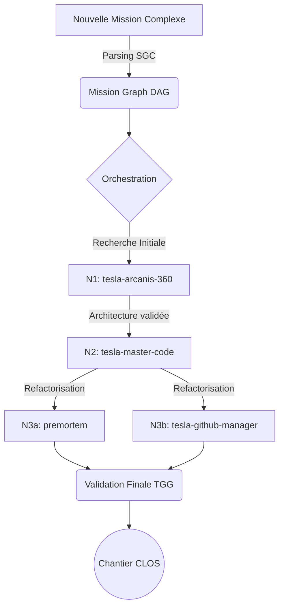

# 🌌 29-Tesla-Team-Synergy (Tesla Mission Orchestrator)

> **Agent d'élite (Meta-Skill) d'orchestration multi-agents pour le système Antigravity CLI de Tesla.**

Ce module implémente le composant critique de **Tesla Mission Orchestrator (TMO)** v4.0. Il permet à l'écosystème Tesla de coordonner de multiples agents spécialisés (Shadow-Targeting) au travers d'un graphe d'exécution acyclique dirigé (DAG) sans violer la Règle Absolue de Délégation.

## 🎯 Objectif et Doctrine

Le MVP intègre la logique de *Capability Scoring* indépendant du modèle et le routage de modèles basé sur les ressources (Token-Economy, Budget Manager). L'Orchestrateur opère en Shadow-Targeting (`target_subagent: self`) en agissant comme un cerveau planificateur pur : il produit des artefacts déterministes (Graphes, Contrats, Budgets) qui seront ensuite exécutés par la couche `AGENTS`.

## 🏗️ Architecture d'Exécution (DAG)



## 📦 Contenu du Pack
```
29-Tesla-Team-Synergy/
├── SKILL.md                              # Skill canonique v4.0
├── CAPABILITY_SCORING.md                 # Matrice des compétences
├── MODEL_ROUTING.md                      # Logique budgétaire et de routage
├── TEAM_ROLES.md                         # Répertoire des sous-agents
├── PLAN_TEMPLATE.md                      # Template du SGC
├── README.md                             # Présente documentation
├── migration_db_subagents_skills_v4.sql  # Schéma Alexandria
├── contracts/                            # Templates de contrats YAML
└── examples/                             # Exemples de graphes (mission_graph.yaml)
```

## 🚀 Installation & Déploiement

Le composant s'intègre au creuset local MIDGARD :
1. **Synchroniser le Skill** : Copier dans `.agents/skills/tesla-team-synergy/`
2. **Migration DB** : Appliquer `migration_db_subagents_skills_v4.sql` sur la base Alexandria locale.
3. **Mise à jour AGENTS.md** : Ajouter l'orchestrateur à la table de délégation de la gouvernance opérationnelle.

---
**Certification :** Vigilum Codex | **Version :** 4.0 | **Auteur :** Lord Mahonheim (via Tesla)
