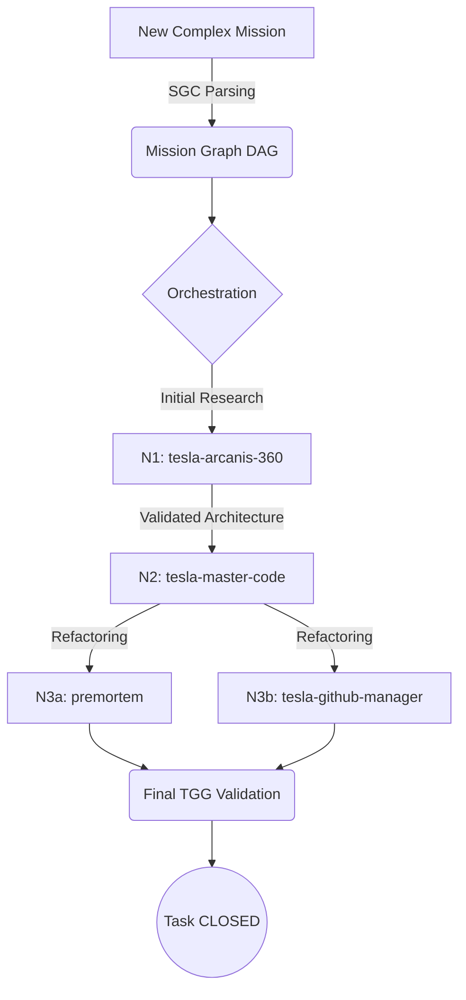

# 🌌 29-Tesla-Team-Synergy (Tesla Mission Orchestrator)

   
> **Elite Agent (Meta-Skill) for multi-agent orchestration within the Tesla Antigravity CLI system.**

This module implements the critical component of **Tesla Mission Orchestrator (TMO)** v4.0. It enables the Tesla ecosystem to coordinate multiple specialized agents (Shadow-Targeting) through a Directed Acyclic Graph (DAG) without violating the Absolute Delegation Rule.

## 🎯 Purpose and Doctrine

The MVP integrates model-agnostic *Capability Scoring* logic and resource-based model routing (Token-Economy, Budget Manager). The Orchestrator operates in Shadow-Targeting (`target_subagent: self`), acting as a pure planning brain: it generates deterministic artifacts (Graphs, Contracts, Budgets) that are subsequently executed by the `AGENTS` layer.

## 🏗️ Execution Architecture (DAG)


```mermaid
graph TD
    %% Main Nodes
    A[New Complex Mission] -->|SGC Parsing| B(Mission Graph DAG)
    B --> C{Orchestration}
    
    %% Agent Flow
    C -->|Initial Research| N1[N1: tesla-arcanis-360]
    N1 -->|Validated Architecture| N2[N2: tesla-master-code]
    N2 -->|Refactoring| N3a[N3a: premortem]
    N2 -->|Refactoring| N3b[N3b: tesla-github-manager]
    
    %% Assembly
    N3a --> D(Final TGG Validation)
    N3b --> D
    D --> E((Task CLOSED))
```

## 📦 Package Contents
```
29-Tesla-Team-Synergy/
├── SKILL.md                              # Canonical Skill v4.0
├── CAPABILITY_SCORING.md                 # Capability Matrix
├── MODEL_ROUTING.md                      # Budget and Routing Logic
├── TEAM_ROLES.md                         # Subagents Directory
├── PLAN_TEMPLATE.md                      # SGC Template
├── README.md                             # Current Documentation
├── migration_db_subagents_skills_v4.sql  # Alexandria Schema
├── contracts/                            # YAML Contract Templates
└── examples/                             # Graph Examples (mission_graph.yaml)
```

## 🚀 Installation & Deployment

The component integrates into the local MIDGARD crucible:
1. **Sync the Skill**: Copy to `.agents/skills/tesla-team-synergy/`
2. **DB Migration**: Apply `migration_db_subagents_skills_v4.sql` to the local Alexandria database.
3. **Update AGENTS.md**: Add the orchestrator to the operational governance delegation table.

---
**Certification:** Vigilum Codex | **Version:** 4.0 | **Author:** Lord Mahonheim (via Tesla)
