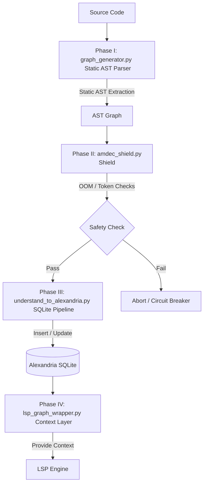

# Tesla Understand Graph (Understand-Anything Integration)

## 📌 Objective & Purpose
The **Tesla Understand Graph** project implements a hybrid engine for analyzing codebases (combining AST Tree-sitter and Semantic LLMs). Its primary goal is to produce JSON-based knowledge graphs that can be indexed into the **Alexandria** database, strictly without compromising system governance or exceeding token budget limits.

## 🏗️ Architecture & Workflows

### System Architecture
The integration is decoupled into 4 primary operational phases.

## 🛠️ Technical Deliverables
This MVP includes the following core components:
- `graph_generator.py`: A static parser based on Python AST completely disconnected from LLM calls to prevent runaway token usage.
- `amdec_shield.py`: The AMDEC shield enforcing safety protocols such as Out-Of-Memory (OOM) filters and Token Budget Circuit Breakers.
- `understand_to_alexandria.py`: The pipeline handling integration of the generated graph data into the Alexandria SQLite backend.
- `lsp_graph_wrapper.py`: The exposition layer that interfaces the graph knowledge back to the Language Server Protocol (LSP).

## 🧠 Arcanis Deep Research: Governance of Complexity
> **Knowledge Graph Engine:** By statically mapping functions and imports with Tree-sitter *before* invoking any LLMs, this architecture effectively solves the asymmetry of the "Token Economy". The AMDEC shield acts as both a financial and hardware fuse (preventing OOM), mathematically guaranteeing that exploring massive codebases will never crash the MIDGARD host or drain API quotas.

## 🛡️ Governance
This project is part of the `@lordmahonheim-bot` ecosystem and operates strictly under the **Vigilum Codex**.
- **Rule of No Destructive Action**: Monitored and enforced by the AMDEC shield.
- **Language**: English strict for all public deployments.
