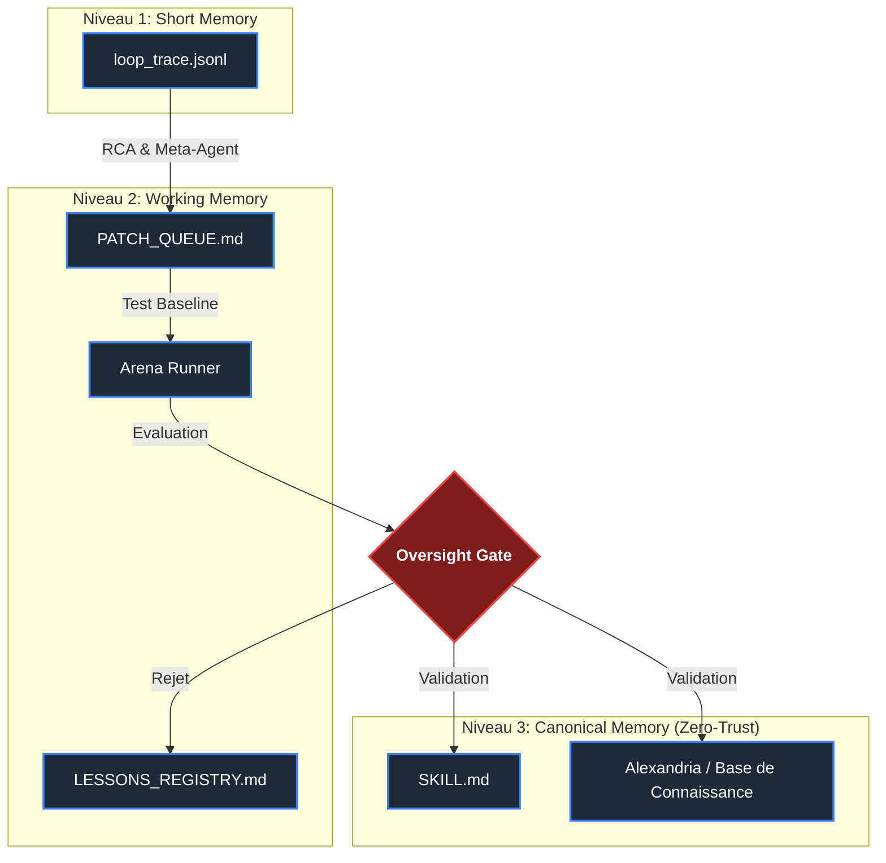

# 🌌 SIA-TESLA-H (Self-Improving Harness)

Ce dépôt contient le MVP de l'intégration **SIA-TESLA-H**, le système d'amélioration continue du *Harness* (prompts, workflows, outils) pour l'écosystème `@lordmahonheim-bot`. Ce MVP implémente une architecture Zero-Trust stricte visant à prévenir toute dégradation systémique (Semantic Bloat, hallucinations, boucle infinie) grâce à des garde-fous mécaniques.

---

## 🎯 Objectifs du MVP

- **Automatiser l'amélioration continue** du Harness de l'agent (Self-Healing & Meta-Optimization).
- **Protéger le système** via une politique "Zéro Persistance Sans Gate".
- **Garantir l'observabilité** de chaque itération grâce à une télémétrie rigoureuse.
- **Maintenir un budget token frugal** par des règles de *Garbage Collection*.

---

## 🏗 Architecture Zero-Trust à 3 Niveaux

Le système de mémoire et d'apprentissage repose sur une ségrégation rigoureuse des espaces d'information.



---

## 🛡 L'Oversight Gate : Workflow d'Évaluation

Tout patch destiné à modifier le système doit franchir le **Tesla Governance Gateway (TGG)**, évalué par un algorithme Multi-Signal.

```mermaid
sequenceDiagram
    participant MA as Mission Agent
    participant RCA as Root Cause Analyzer
    participant OPT as Optimizer
    participant ARENA as Arena Runner
    participant GATE as Oversight Gate
    participant CM as Canonical Memory

    MA->>RCA: loop_trace.jsonl (Incident)
    RCA->>OPT: root_cause_report.json
    OPT->>ARENA: patch_proposal.json (Harness)
    ARENA->>GATE: arena_report.json (Score)
    
    alt Score >= 85 (No Bloat / Red Flags)
        GATE->>CM: Promote Patch (Validated)
    else Score 70-84
        GATE-->>GATE: Human/Auditor Review
    else Score < 70 or Security Violation
        GATE->>OPT: Reject / Rollback
    end
```

---

## 📜 Doctrine et Contraintes Piliers

1. **Harness-Only Garanti** : Interdiction absolue de modifier les poids du LLM. Seuls les *prompts* et configurations sont corrigés.
2. **Anti-Semantic Bloat** : Taille maximale d'un `SKILL.md` limitée à 8k tokens ou 150 lignes. Tout ajout nécessite un refactoring compressif.
3. **Zéro Auto-Persistance** : Aucun agent ne peut modifier la *Canonical Memory* sans franchir l'Oversight Gate.
4. **Token-Frugalité** : Budget strictement traqué, avec des *circuit-breakers* si le taux de burn post-patch augmente anormalement.

---

*Déployé et géré par `tesla-github-manager` pour Lord Mahonheim.*
