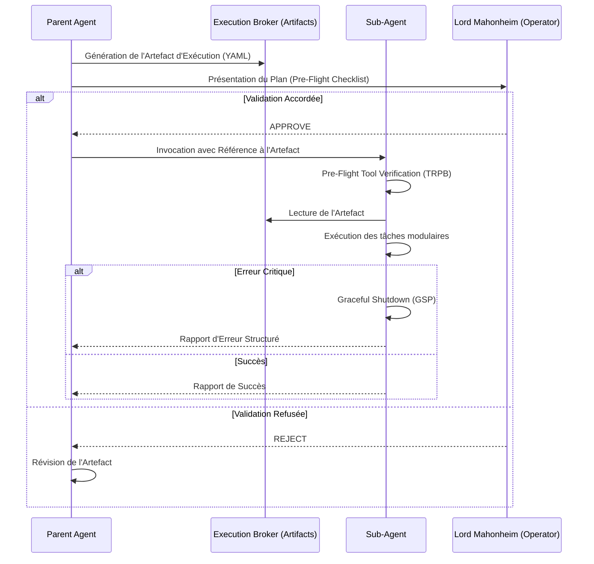

# Vigilum Gateway V2.1 - Orchestration Hardening

**Vigilum Gateway V2.1** marque une évolution critique dans la gouvernance et l'orchestration autonome de l'écosystème `@lordmahonheim-bot`. Ce MVP déploie un durcissement de l'orchestration, limitant l'intervention de l'opérateur aux seuls points de validation critiques (zéro ask_permission intempestif) et standardisant le flux d'exécution via un système d'Artefacts d'Exécution.

## 🏛️ Les 4 Piliers de l'Orchestration Hardening

1. **Interdiction d'ask_permission & Pre-Flight Checklist**
   Proscription totale de l'outil `ask_permission` non justifié. Les agents doivent établir un plan autonome et modulaire, validé une seule fois par l'opérateur via une checklist préliminaire.
   
2. **Execution Broker par Artefacts**
   Les sous-agents ne communiquent plus leurs plans de manière abstraite. Chaque plan d'exécution est matérialisé par un artefact (YAML/Markdown) qui sert de contrat d'exécution entre le Parent et le Sous-Agent.

3. **Pre-Flight Tool Verification (TRPB)**
   *Tool Readiness & Permissions Bar* : Avant d'exécuter une chaîne de commandes, l'agent vérifie la disponibilité des outils et les permissions associées, évitant les échecs en cours de route.

4. **Graceful Shutdown Protocol (GSP)**
   En cas d'échec d'une sous-tâche, l'agent nettoie son environnement de travail et remonte une erreur structurée au lieu d'interrompre violemment le processus.

## 📊 Architecture du Broker d'Exécution

