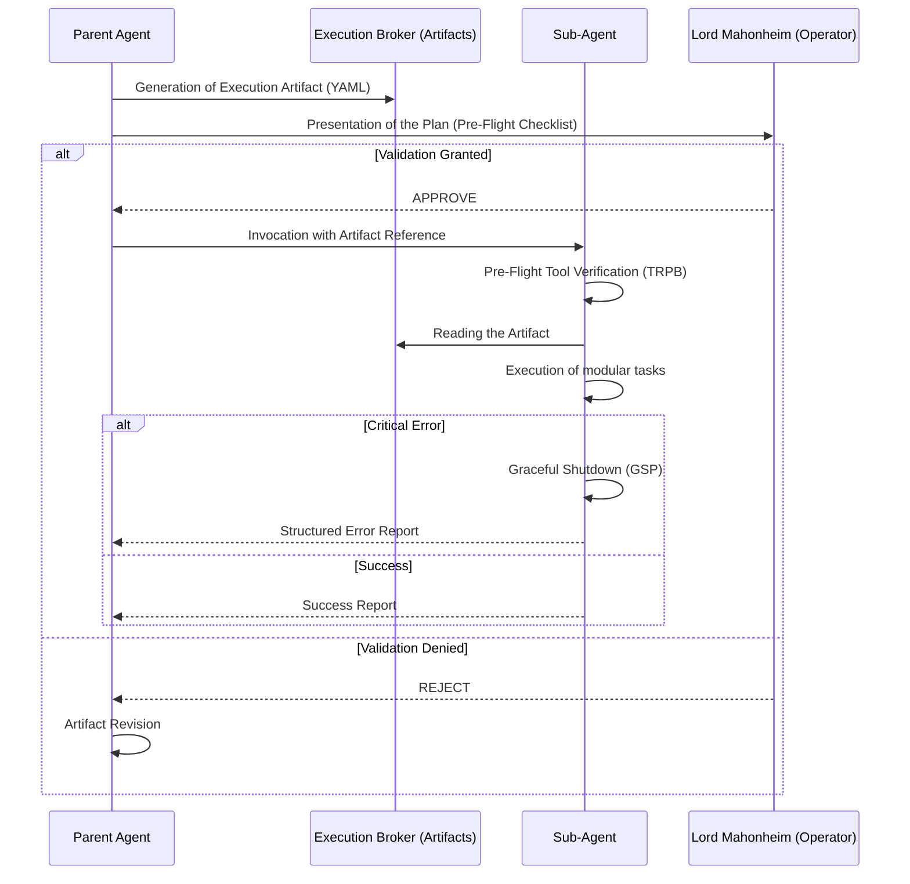

   

# Vigilum Gateway V2.1 - Orchestration Hardening

**Vigilum Gateway V2.1** marks a critical evolution in the governance and autonomous orchestration of the `@lordmahonheim-bot` ecosystem. This MVP deploys orchestration hardening, restricting operator intervention to only critical validation points (zero unwarranted `ask_permission` prompts) and standardizing the execution flow via an Execution Artifacts system.

## 🏛️ The 4 Pillars of Orchestration Hardening

1. **Ban on ask_permission & Pre-Flight Checklist**
   Total prohibition of unjustified `ask_permission` tool usage. Agents must establish an autonomous, modular plan, validated once by the operator via a preliminary checklist.
   
2. **Execution Broker via Artifacts**
   Sub-agents no longer communicate their plans abstractly. Each execution plan is materialized by an artifact (YAML/Markdown) that serves as an execution contract between the Parent and the Sub-Agent.

3. **Pre-Flight Tool Verification (TRPB)**
   *Tool Readiness & Permissions Bar*: Before executing a chain of commands, the agent verifies tool availability and associated permissions, preventing mid-flight failures.

4. **Graceful Shutdown Protocol (GSP)**
   In the event of a sub-task failure, the agent cleans its workspace and surfaces a structured error instead of abruptly halting the process.

## 🧬 Enforcement Layer (Vigilum Codex 2.1 — RETEX Hardening)

The orchestration hardening above is now **enforced deterministically** by the
Vigilum Orchestration Gate (`53-Vigilum-Codex-2.0-Executable-Governance/`):

- **Gate 2 (Mission Contract):** `orchestration_gate.py dag-verify` — a DAG is
  executable only with Lord Mahonheim's approval seal (`approval_sha256`).
- **Anti-Usurpation (Rule N°4):** `orchestration_gate.py receipt-quorum` +
  `intent-guard` (hook `07-orchestration-gate.sh`) — Team-Synergy synthesis is
  blocked until physical receipts `runtime/subagents/receipt_<agent_id>.json`
  exist for every agent of the graph.
- **Execution Broker compatibility:** the Execution Artifact system materializes
  as the sealed Mission Graph + contracts; receipts are the proof that the
  artifact was actually executed by a distinct entity.

Full catalogue: `53-Vigilum-Codex-2.0-Executable-Governance/docs/RETEX_HARDENING_2.1.md`.

## 📊 Execution Broker Architecture

```mermaid
sequenceDiagram
    participant P as Parent Agent
    participant B as Execution Broker (Artifacts)
    participant S as Sub-Agent
    participant L as Lord Mahonheim (Operator)

    P->>B: Generation of Execution Artifact (YAML)
    P->>L: Presentation of the Plan (Pre-Flight Checklist)
    alt Validation Granted
        L-->>P: APPROVE
        P->>S: Invocation with Artifact Reference
        S->>S: Pre-Flight Tool Verification (TRPB)
        S->>B: Reading the Artifact
        S->>S: Execution of modular tasks
        alt Critical Error
            S->>S: Graceful Shutdown (GSP)
            S-->>P: Structured Error Report
        else Success
            S-->>P: Success Report
        end
    else Validation Denied
        L-->>P: REJECT
        P->>P: Artifact Revision
    end
```
