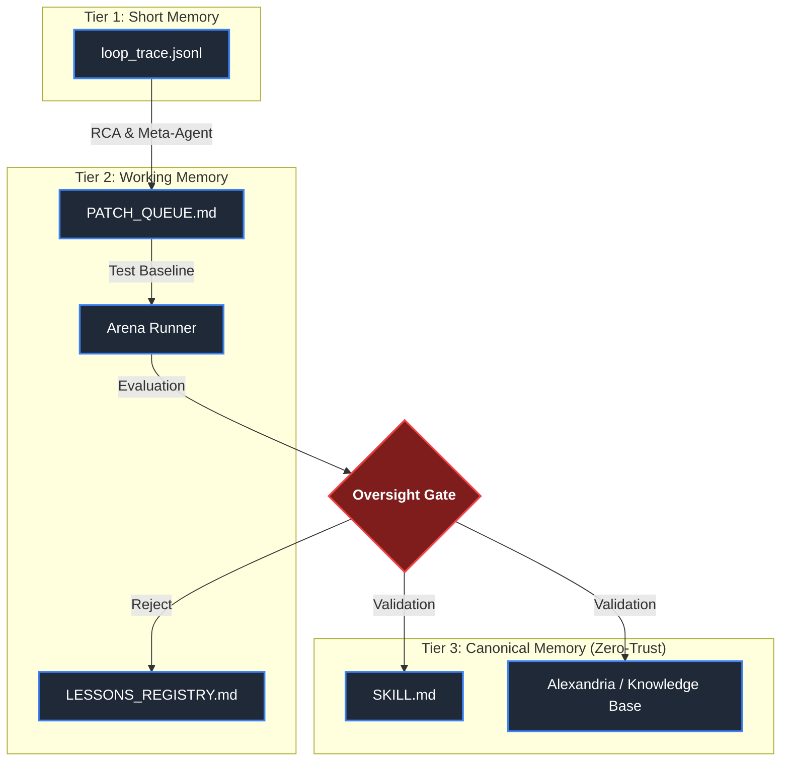

# 🌌 SIA-TESLA-H (Self-Improving Harness)

   

This repository contains the MVP for the **SIA-TESLA-H** integration, the continuous improvement system for the *Harness* (prompts, workflows, tools) of the `@lordmahonheim-bot` ecosystem. This MVP implements a strict Zero-Trust architecture aimed at preventing any systemic degradation (Semantic Bloat, hallucinations, infinite loops) through mechanical guardrails.

---

## 🎯 MVP Objectives

- **Automate continuous improvement** of the agent's Harness (Self-Healing & Meta-Optimization).
- **Protect the system** via a "Zero Persistence Without Gate" policy.
- **Guarantee observability** of each iteration through rigorous telemetry.
- **Maintain a frugal token budget** via *Garbage Collection* rules.

---

## 🏗 3-Tier Zero-Trust Architecture

The memory and learning system relies on a rigorous segregation of information spaces.



---

## 🛡 The Oversight Gate: Evaluation Workflow

Any patch intended to modify the system must pass through the **Tesla Governance Gateway (TGG)**, evaluated by a Multi-Signal algorithm.

```mermaid
sequenceDiagram
    participant MA as Mission Agent
    participant RCA as Root Cause Analyzer
    participant OPT as Optimizer
    participant ARENA as Arena Runner
    participant GATE as Oversight Gate
    participant CM as Canonical Memory

    MA->>RCA: loop_trace.jsonl (Incident)
    RCA->>OPT: root_cause_report.json
    OPT->>ARENA: patch_proposal.json (Harness)
    ARENA->>GATE: arena_report.json (Score)
    
    alt Score >= 85 (No Bloat / Red Flags)
        GATE->>CM: Promote Patch (Validated)
    else Score 70-84
        GATE-->>GATE: Human/Auditor Review
    else Score < 70 or Security Violation
        GATE->>OPT: Reject / Rollback
    end
```

---

## 📜 Pillar Doctrine and Constraints

1. **Guaranteed Harness-Only**: Absolute ban on modifying LLM weights. Only *prompts* and configurations are patched.
2. **Anti-Semantic Bloat**: Maximum size of a `SKILL.md` limited to 8k tokens or 150 lines. Any addition requires compressive refactoring.
3. **Zero Self-Persistence**: No agent can modify the *Canonical Memory* without passing the Oversight Gate.
4. **Token-Frugality**: Budget strictly tracked, with *circuit-breakers* if the post-patch burn rate increases abnormally.

---

*Deployed and managed by `tesla-github-manager` for Lord Mahonheim.*
