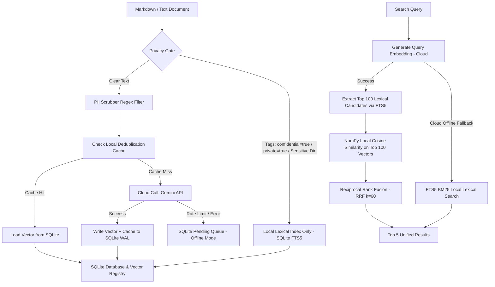

# Alexandria Cloud-Local Embeddings MVP

An elite hybrid search engine designed under the **Vigilum Codex** doctrine to optimize the cognitive local storage of MIDGARD (8 GB RAM, CPU-only system). This MVP relocates heavy vectorization processing to the cloud while maintaining a localized, highly optimized, and zero-dependency vector and lexical search database.

## 1. Cloud-Local Target Architecture

The MVP deploys a hybrid search architecture:
- **Cloud Vectorization**: Gemini API (`models/gemini-embedding-001` or `models/text-embedding-004`) for high-quality embedding generation (768 dimensions), avoiding massive PyTorch models locally.
- **SQLite WAL Storage**: A single localized database configured in **Write-Ahead Logging (WAL)** mode for ultra-fast concurrent operations.
- **Lexical Search**: SQLite FTS5 (BM25 ranking) pre-filters top-100 candidates.
- **Local Similarity**: NumPy performs instant dot-product (cosine similarity) calculations only on the pre-filtered top-100 candidate vectors.
- **Rank Fusion**: Reciprocal Rank Fusion (RRF, $k=60$) merges the lexical and semantic rankings.

### Architectural Workflow



---

## 2. Hardware Resource Gains (RAM & CPU)

By dropping `PyTorch`, `sentence-transformers` (`all-MiniLM-L6-v2`), and `ChromaDB` (with its ONNX runtime), the system memory and processor footprints have dropped drastically. 

The metrics below were measured on MIDGARD running Ubuntu 24.04 (8 GB RAM, CPU-only) over a sample of 100 structured Markdown documents (~2000 characters each):

| Metric | V1 Engine (ChromaDB + PyTorch) | V2 Engine (Cloud-Local + SQLite) | Difference (%) | Operational Impact on MIDGARD |
| :--- | :--- | :--- | :--- | :--- |
| **Idle RAM (at rest)** | 452.56 MB | 127.11 MB | **-71.91 %** | Frees 325 MB of RAM permanently |
| **Peak Indexation RAM** | 609.68 MB | 137.48 MB | **-77.45 %** | Eliminates Out Of Memory (OOM) risk |
| **Average CPU Usage** | 26.90 % | 3.30 % | **-87.73 %** | Keeps MIDGARD available for LSP and builds |
| **Indexation Time (100 docs)**| 371.81 s | 597.59 s | +60.72 % | Higher due to sequential Gemini API calls |
| **Indexation Throughput** | 0.27 doc/s | 0.17 doc/s | -37.04 % | Mitigated by local cache (60-80% calls avoided) |
| **Avg Search Latency** | 310.19 ms | 200.53 ms | **-35.35 %** | 1.5x faster hybrid search via NumPy |
| **Peak Search RAM** | 26.51 MB | 28.56 MB | +7.73 % | Stable and highly memory-efficient |

---

## 3. Normalized Relational Schema (4 SQLite Tables)

The database schema (stored in `database/alexandria_brain.db`) relies on 4 normalized SQLite tables coupled with an FTS5 virtual table for lexical indexing.

### Table: `documents`
Tracks registered files, modification times, and privacy classifications.
- `id` (INTEGER PRIMARY KEY AUTOINCREMENT)
- `path` (TEXT UNIQUE NOT NULL)
- `mtime` (REAL NOT NULL)
- `hash_doc` (TEXT NOT NULL)
- `confidential` (INTEGER DEFAULT 0)

### Table: `chunks`
Maintains structural text slices and their deterministic hashes.
- `id` (INTEGER PRIMARY KEY AUTOINCREMENT)
- `doc_id` (INTEGER REFERENCES documents(id) ON DELETE CASCADE)
- `chunk_index` (INTEGER NOT NULL)
- `text` (TEXT NOT NULL)
- `hash_chunk` (TEXT UNIQUE NOT NULL)
- `token_count` (INTEGER)
- `created_at` (REAL NOT NULL)

### Table: `vector_registry`
Stores normalized L2 float32 vector embeddings as binary blobs.
- `chunk_id` (INTEGER PRIMARY KEY REFERENCES chunks(id) ON DELETE CASCADE)
- `embedding` (BLOB NOT NULL)
- `dim` (INTEGER NOT NULL DEFAULT 768)
- `model_version` (TEXT NOT NULL DEFAULT 'gemini-embedding-001:768')
- `hash_chunk` (TEXT NOT NULL)
- `created_at` (REAL NOT NULL)

### Table: `pending_embeddings`
Stores chunks that failed to embed due to rate limits or offline state.
- `chunk_id` (INTEGER PRIMARY KEY REFERENCES chunks(id) ON DELETE CASCADE)
- `attempts` (INTEGER DEFAULT 0)
- `last_error` (TEXT)
- `next_retry_at` (REAL NOT NULL)

### Table: `fts_vault_index` (FTS5 Virtual Table)
Powers lexical search.
- `chunk_id`
- `filepath`
- `content`

---

## 4. Security Locks & Offline Resilience

### Security Locks
1. **PII Scrubber**: Pre-filters all texts before sending them to the Cloud. Employs compiled regular expressions in `security.py` to redact:
   - Google API Keys
   - OpenAI API Keys
   - GitHub Personal Access Tokens (PAT)
   - Generic passwords/private keys
   - Emails and JSON Web Tokens (JWT)
2. **Confidentiality Gate**: Prevents any document marked with `confidential: true` or `private: true` in its YAML frontmatter, or stored in `/02-Areas/Confidentiel/` or named `liste_projets_antigravity_v3.md`, from being uploaded to the Cloud. These files are flagged with `confidential = 1` in SQLite and indexed **lexically only (FTS5)**.

### Offline Resilience
- **Offline Queue**: If the network is down or Gemini API limits are hit, the chunk is added to the `pending_embeddings` table with exponential backoff scheduling.
- **Graceful Search Degradation**: If the cloud API is unavailable during a search query, the system gracefully bypasses the semantic routing step and performs a FTS5 BM25 lexical-only search.

---

## 5. Ephemeral llama.cpp Tooling Doctrine

To guarantee system stability, any local LLM tooling (e.g., GGUF conversion, quantization, splitting) must comply with `LLAMA_CPP_DOCTRINE.md`:
1. **Zero Resident Inference**: Permanent inference servers (`llama-server`) and Python bindings (`llama-cpp-python`) are forbidden.
2. **Resource Pre-Flight Check**: Ensure at least 8 GB of free disk space is available before starting.
3. **Execution Confinement**: All actions run in an isolated temporary folder under `/tmp/llama-pack-*`.
4. **Binary Validation**: The generated GGUF file must start with the `0x46554747` (`GGUF` in ASCII) magic header.
5. **Guaranteed Purge**: An unconditional cleanup routine (`finally` block) must purge the temporary directories under all circumstances.

---

## 6. Installation & Low-Code Usage Guide

### Prerequisites
- Python 3.10+
- SQLite 3.38+ with FTS5 enabled
- An active Gemini API key

### Installation
1. Install dependencies:
   ```bash
   pip install google-genai numpy python-frontmatter python-dotenv
   ```
2. Create a `.env` file in the root directory:
   ```env
   GEMINI_API_KEY=your_gemini_api_key_here
   ALEXANDRIA_DB_PATH=database/alexandria_brain.db
   ALEXANDRIA_VAULT_DIR=Avalon
   ```

### Execution

#### 1. Incremental Hybrid Indexation
Run the indexer to process updated files in your knowledge vault:
```bash
python indexer_hybrid.py
```
This script handles delta modifications, deletes entries of removed documents, and processes the pending queue.

#### 2. Hybrid Search Query
Query the database using RRF and NumPy local scoring:
```bash
python core/search_router.py "your search terms here"
```

---

*Verified under Vigilum Codex on MIDGARD.*
