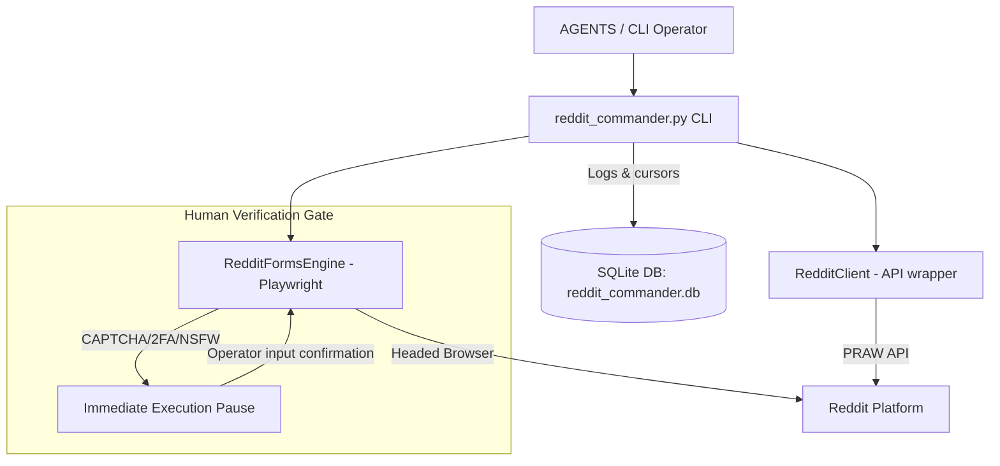

# Tesla Reddit Commander (MVP)

A secure, autonomous, and controlled Reddit automation tool designed under the **Vigilum Codex** governance layer. It enables Lord Mahonheim (`Glittering_Use_5519`) to pilot Reddit operations safely, protecting credentials and avoiding ban risks through dual-brik architecture: official API (PRAW) for robust, safe reading/writing, and headed browser automation (Playwright) for interactive form assistance with a **Human Verification Gate**.

## 1. System Architecture

The following diagram illustrates the interaction between components:



### Key Pillars:
1. **API Client (PRAW)**: Standard, low-overhead read and write operations.
2. **Forms Engine (Playwright)**: Headed visible browser assistance. Pauses instantly when security challenges are detected.
3. **SQLite Tracking Database**: Maintains a local state of watched subreddits and an immutable ledger of actions (`reddit_ledger`) to ensure semantic idempotence.
4. **Strict Safe Mode**: Automated karma upvotes/downvotes and private messaging are strictly blocked to comply with the Vigilum Codex.

---

## 2. Getting Started & Authentication

### Installation
Ensure you have the required packages installed in your environment:
```bash
pip install praw playwright python-dotenv
playwright install chromium
```

### Environment Variables
Configure your credentials in a `.env` file at the root of the project. **Never commit the `.env` file containing actual secrets.**

```ini
# Reddit Application API Credentials
REDDIT_CLIENT_ID=your_client_id_here
REDDIT_CLIENT_SECRET=your_client_secret_here
REDDIT_USER_AGENT=tesla-reddit-commander:v1.0 (by /u/Glittering_Use_5519)
REDDIT_USERNAME=Glittering_Use_5519
REDDIT_PASSWORD=your_reddit_password_here

# Safe Mode (Prevents automated mutation if set to true)
REDDIT_SAFE_MODE=true
```

To create a Reddit API application, navigate to [Reddit App Preferences](https://www.reddit.com/prefs/apps) and create a script application.

---

## 3. CLI Usage Guide

You can run the unified CLI interface `reddit_commander.py` with the following commands:

### Initialize Database
```bash
python reddit_commander.py init-db
```

### Watch & Scrape Subreddits
Incremental tracking of subreddits to fetch new posts since the last cursor check.
```bash
# Add a subreddit to watchlist
python reddit_commander.py add-watch python

# Run incremental watch scan (saves Markdown digest into Inbox)
python reddit_commander.py watch
```

### Search Subreddit (Read-Only)
```bash
python reddit_commander.py research python --limit 10
```

### Publish Post (Controlled Mutation)
Publishes a new text submission. Safe Mode must be set to `false` in `.env` for actual publication, and it verifies content hash against SQLite ledger to block accidental duplicates.
```bash
python reddit_commander.py publish test "Automated Title" "Body content of the post."
```

### Engage / Comment Reply
```bash
python reddit_commander.py engage t3_parentpostid "Body of comment reply."
```

### Form Autofill Assistant (Playwright)
Autofills complex post or comment forms in a headed Chromium window, automatically pausing if a CAPTCHA or 2FA challenge is encountered.
```bash
python reddit_commander.py form --post --subreddit test --title "Draft Title" --body "Draft Body"
```

### View Audit Ledger
```bash
python reddit_commander.py audit --limit 10
```
