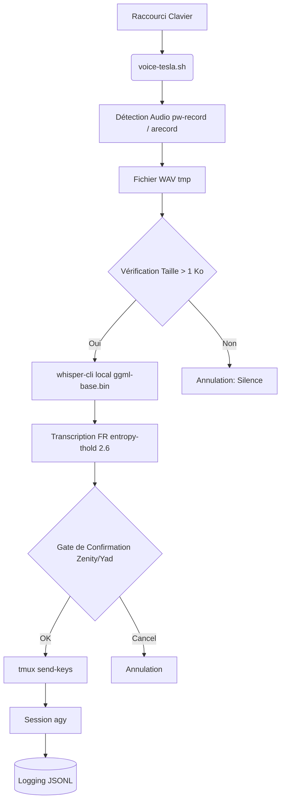

# VOICE-TESLA

> Pipeline vocal PTT (Push-To-Talk) local, offline et sécurisé pour Antigravity CLI via Whisper.cpp et tmux.

## Prérequis et Installation Rapide

### Prérequis
- Système d'exploitation Linux (Wayland ou X11).
- **PipeWire** (`pw-record`) ou ALSA (`arecord`) ou SoX (`rec`) pour la capture audio.
- **tmux** pour l'injection des commandes vers la session CLI cible.
- **whisper.cpp** compilé localement (`whisper-cli`) et modèle GGML (ex: `ggml-base.bin`).

### Installation
1. Copiez les scripts dans un emplacement de votre `PATH` (ex: `~/.local/bin/`).
2. Renseignez la variable `WHISPER_DIR` dans le script `voice-tesla.sh` pour pointer vers votre installation de `whisper.cpp`.
3. Assurez-vous de posséder les droits d'exécution :
   ```bash
   chmod +x voice-tesla.sh voice-health-check.sh voice-tesla-install.sh
   ```
4. Attribuez un raccourci clavier global (ex: `Super+V`) au script `voice-tesla.sh` via votre gestionnaire de fenêtres (i3, Sway, GNOME, etc.).

## Usage et Exemples

1. Lancez une session Antigravity dans tmux (nommée `agy` par défaut) :
   ```bash
   tmux new-session -s agy 'agy'
   ```
2. Pressez votre raccourci clavier global pour lancer l'enregistrement vocal. Parlez distinctement (durée conseillée : 3 à 8 secondes).
3. Relâchez / laissez le timeout terminer l'enregistrement.
4. Une interface Zenity/yad apparaîtra pour valider la transcription. Vous pouvez modifier la commande, l'accepter (`OK`) ou l'annuler.
5. Une fois validée, la commande est directement injectée dans votre session `agy`.

### Santé du système
Utilisez le script de vérification de l'environnement pour vous assurer que les dépendances sont réunies :
```bash
./voice-health-check.sh
```

## Architecture & Design Decisions

### Schéma de Fonctionnement


### Design Decisions
- **Confinement Zéro Cloud** : La transcription s'effectue à 100% en local via `whisper.cpp`, garantissant aucune exfiltration réseau des interactions vocales.
- **Gate de Confirmation** : Les actions irréversibles sont bloquées par une étape de validation formelle. La transcription est affichée et éditable avant injection dans `tmux`.
- **Anti-Hallucination** : L'utilisation de `--entropy-thold 2.6` avec `whisper-cli` limite grandement la génération de texte intempestive en cas de bruits de fond ou silences prolongés.
- **Support Agnostique Wayland/X11** : L'injection via `tmux` s'affranchit des complexités de `xdotool` sous Wayland.

## Contribution & Gouvernance

Référez-vous aux fichiers `CONTRIBUTING.md` et `CODE_OF_CONDUCT.md` du dépôt pour comprendre nos normes. Pour VOICE-TESLA, tout ajout doit respecter :
- Le maintien de l'isolation locale stricte.
- Le cycle "Zéro Secret" et la robustesse du pipeline (pas de race conditions).
- L'audit continu par les processus d'intégration continue de l'écosystème Tesla.
