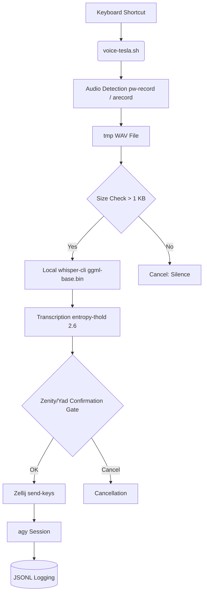

# VOICE-TESLA

> Local, offline, and secure PTT (Push-To-Talk) voice pipeline for Antigravity CLI via Whisper.cpp and Zellij.

## Prerequisites and Quick Installation

### Prerequisites
- Linux operating system (Wayland or X11).
- **PipeWire** (`pw-record`), ALSA (`arecord`), or SoX (`rec`) for audio capture.
- **Zellij** to inject commands into the target CLI session.
- **whisper.cpp** compiled locally (`whisper-cli`) and a GGML model (e.g., `ggml-base.bin`).

### Installation
1. Copy the scripts to a location in your `PATH` (e.g., `~/.local/bin/`).
2. Set the `WHISPER_DIR` variable in the `voice-tesla.sh` script to point to your `whisper.cpp` installation.
3. Ensure you have execution rights:
   ```bash
   chmod +x voice-tesla.sh voice-health-check.sh voice-tesla-install.sh
   ```
4. Assign a global keyboard shortcut (e.g., `Super+V`) to the `voice-tesla.sh` script via your window manager (i3, Sway, GNOME, etc.).

## Usage and Examples

1. Launch an Antigravity session in Zellij (named `agy` by default):
   ```bash
   Zellij new-session -s agy 'agy'
   ```
2. Press your global keyboard shortcut to start the voice recording. Speak clearly (recommended duration: 3 to 8 seconds).
3. Release / let the timeout finish the recording.
4. A Zenity/yad interface will appear to validate the transcription. You can edit the command, accept it (`OK`), or cancel it.
5. Once validated, the command is directly injected into your `agy` session.

### System Health
Use the environment check script to ensure all dependencies are met:
```bash
./voice-health-check.sh
```

## Architecture & Design Decisions

### Workflow Diagram


### Design Decisions
- **Zero Cloud Confinement**: Transcription is performed 100% locally via `whisper.cpp`, guaranteeing no network exfiltration of voice interactions.
- **Confirmation Gate**: Irreversible actions are blocked by a formal validation step. The transcription is displayed and editable before injection into `Zellij`.
- **Anti-Hallucination**: Using `--entropy-thold 2.6` with `whisper-cli` greatly reduces unwanted text generation during background noise or prolonged silences.
- **Agnostic Wayland/X11 Support**: Injection via `Zellij` bypasses the complexities of `xdotool` on Wayland.

## Contribution & Governance

Refer to the repository's `CONTRIBUTING.md` and `CODE_OF_CONDUCT.md` files to understand our standards. For VOICE-TESLA, any addition must respect:
- Maintenance of strict local isolation.
- The "Zero Secret" cycle and pipeline robustness (no race conditions).
- Continuous auditing by the Tesla ecosystem's continuous integration processes.
