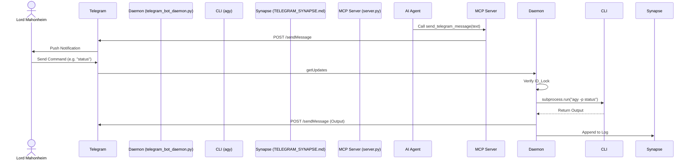

# 📱 MCP Telegram: Mobile Command Center & AI Server


**The Mobile Command Center for the Tesla Antigravity CLI ecosystem.** This MVP seamlessly integrates Telegram into the Antigravity architecture, providing dual-capability: a Model Context Protocol (MCP) server for AI agents to dispatch notifications, and an ID-locked daemon allowing Lord Mahonheim to send CLI commands remotely and receive execution outputs in real time.

---

## 🎯 Executive Summary

The MCP Telegram MVP solves the core challenge of maintaining remote, mobile observability and control over local agentic operations. Rather than relying on SSH or local terminals, this tool establishes a secure, bidirectional bridge between Telegram and the Antigravity system. 

It accomplishes this via two primary components:
1. **The MCP Server (`mcp/telegram-mcp`)**: Empowers AI agents to autonomously send reports, alerts, and outputs to Lord Mahonheim's private Telegram chat via standard MCP tool calls (`send_telegram_message`).
2. **The Daemon (`MCP-Telegram`)**: An always-on daemon that listens for Telegram messages strictly from a pre-authorized Telegram User ID, routes them securely to the local `agy` CLI, and returns the console output (stdout/stderr) back to the chat. All commands are chronologically recorded in the Synapse memory (`TELEGRAM_SYNAPSE.md`).

---

## ✨ Key Features

- **🛡️ Absolute Security (ID-Lock)**: All incoming Telegram messages are validated against a hardcoded `TELEGRAM_ALLOWED_USER_ID`. Unauthorized intrusions are instantly dropped and logged.
- **🔌 Standardized MCP Interface**: Integrates cleanly with any standard Model Context Protocol client, abstracting the Telegram API away behind a simple `send_telegram_message` tool.
- **🚀 Remote CLI Execution**: Execute any `agy` (Antigravity CLI) command via Telegram and receive the results in seconds. Ideal for checking status, spawning tasks, or course-correcting agents on the go.
- **🧠 Memory Synapse Integration**: Every executed command and its output are permanently recorded in the central memory Codex (`TELEGRAM_SYNAPSE.md`), ensuring perfect traceability for future context.
- **⏱️ Auto-Truncation & Timeout Limits**: Safeguards against API limits by intelligently truncating overly long outputs (4000 chars) and terminating hung CLI processes (10-minute timeout).

---

## 🏗️ Architecture



---

## 🛠️ Installation & Configuration

### Prerequisites
- Python 3.12+
- A valid Telegram Bot Token (from `@BotFather`)
- Your personal Telegram User ID

### 1. Environment Setup
Create a `.env` file inside `MCP-Telegram/` and populate it with your credentials:

```env
TELEGRAM_BOT_TOKEN="your_bot_token_here"
TELEGRAM_ALLOWED_USER_ID="your_telegram_id_here"
TELEGRAM_CHAT_ID="your_telegram_id_here"
```

### 2. Deploying the MCP Server
The MCP server acts as an integration point for your LLMs. You can run it via standard stdio:

```bash
cd mcp/telegram-mcp
python3 server.py
```

### 3. Launching the Command Daemon
The daemon provides remote CLI execution capabilities. It should be run as a background service:

```bash
cd MCP-Telegram
python3 telegram_bot_daemon.py
```

---

## 📖 Usage Examples

### AI Prompt Example (via MCP)
If your AI is connected to the Telegram MCP server, it can run:
```json
{
  "name": "send_telegram_message",
  "arguments": {
    "text": "Mission complete. The local repository has been fully synchronized with the public MVP hub."
  }
}
```

### Remote Execution Example (via Telegram)
1. Send `agy status` to the Bot.
2. The bot responds: `⚙️ Transmission à MIDGARD : agy status`
3. The bot follows up with the actual console output:
   `[Status] 3 Agents online. CPU Usage: 15%...`

---

## 🤝 Contributing
This project is part of the private/public Tesla Antigravity CLI ecosystem. Please adhere to the established `.agents/AGENTS.md` and `SKILL.md` guidelines for any modifications, ensuring the zero-secret policy is strictly enforced.
