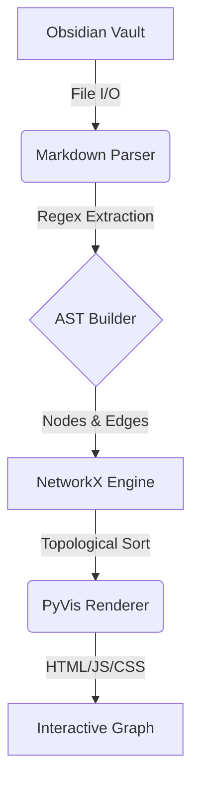

# 38 Obsidian Relational Graph

   

A high-performance relational graph generator and ETL pipeline for Obsidian vaults, engineered to map complex interconnected notes through topological analysis of bi-directional `[[]]` wiki-links.

## Prerequisites & Quick Install

Designed for advanced data manipulation. Requires a standard Obsidian Vault and Python ecosystem.

- **Python**: `3.12+`
- **Dependencies**: `networkx`, `pyvis`, `markdown2`
- **Target**: Local Obsidian Vault directory

```bash
git clone https://github.com/lordmahonheim-bot/Tesla-Antigravity-CLI.git
cd Tesla-Antigravity-CLI/MVP-GITHUB/38-Obsidian-Graph-Relationnel
python3 -m venv .venv
source .venv/bin/activate
pip install -r requirements.txt
```

## Usage & Examples

Execute the core ETL pipeline on your local Obsidian vault to generate an interactive HTML topological graph.

```bash
# Standard topological extraction
python core/etl_pipeline.py \
  --vault-path /path/to/vault \
  --output ./dist/graph.html

# Advanced extraction with node-weight filtering (removes orphans)
python core/etl_pipeline.py \
  --vault-path /path/to/vault \
  --output ./dist/graph.html \
  --min-degree 2 \
  --exclude-tags "#draft,#archive"
```

## Architecture & Design Decisions

The system implements a robust Extract, Transform, Load (ETL) architecture to convert raw Markdown into a traversable mathematical graph. 

- **Extraction**: Parses `.md` files using regex to identify `[[]]` back-links and `#tags`.
- **Transformation**: Normalizes node names, computes node degrees, and builds a directed acyclic graph (DAG) representation via `networkx`.
- **Load**: Serializes the `networkx` model into JSON format and renders it through a `pyvis` (D3.js-based) physics simulation.



## Security & Resilience

- **Anti-Crash Protocol**: Implements recursive depth limits and symlink resolution blocks to prevent infinite loops during directory traversal.
- **Data Integrity**: Operates in strictly read-only mode (`chmod 400` logic equivalent) against the Obsidian Vault. No modifications are ever written back to the source `.md` files.
- **Resource Management**: Large vault processing is chunked via lazy generators to maintain memory footprints below 512MB, preventing OOM kills on standard hardware.
- **Compliance**: Audited against OpenSSF guidelines for robust path traversal prevention.

## Contribution & Governance

Strict adherence to the Vigilum Codex is required.

- **Commits**: Must follow Conventional Commits format.
- **CI/CD**: All pull requests must pass static analysis (`flake8`, `mypy`) and `networkx` integrity unit tests.
- **Workflow**: No direct pushes to `main`. Open an issue and link it to your PR. See `CONTRIBUTING.md` for full constraints.
