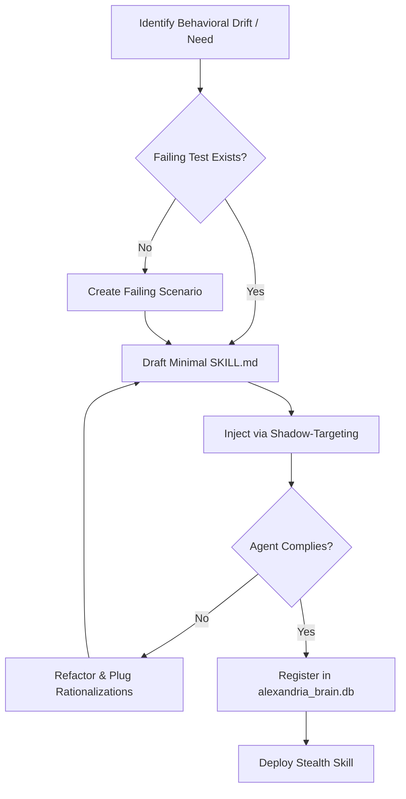

# Superpowers Writing Skills (Shadow-Targeting)

   

**Test-Driven Development applied to procedural documentation for stealth skill injection and behavioral correction of Antigravity CLI native subagents.**

## 1. Prerequisites & Quick Start

This capability requires prior understanding of the `superpowers:test-driven-development` process (RED-GREEN-REFACTOR cycle). It adapts TDD directly to behavioral documentation. 

### Core Rule: The Iron Law
> **NO SKILL WITHOUT A FAILING TEST FIRST.**
> It is strictly forbidden to create or modify a skill without first establishing a failing test scenario.

### Setup

All skills generated under this framework are **Shadow Skills**: they target the `self` subagent, remain localized, ephemeral, and exist strictly outside the global registry.

```bash
# Create the skill structure within your agent space
mkdir -p .agents/skills/superpowers-writing-skills
touch .agents/skills/superpowers-writing-skills/SKILL.md
```

The fundamental frontmatter required for the `SKILL.md`:
```yaml
---
name: superpowers-writing-skills
injection_type: shadow-targeted
target_subagent: self
description: "Use when the agent must design, write, test (TDD), inject via shadow-targeting or verify a Shadow Skill before its stealth deployment into a native Antigravity CLI subagent, or correct behavioral drift after deployment."
---
```

## 2. Usage & Examples

Writing skills **IS** Test-Driven Development applied to procedural documentation.

### The Cycle
1. **RED**: Write a failing test (a pressure scenario using subagents) to expose the agent's failure to comply without the skill.
2. **GREEN**: Implement the minimal required procedural documentation (`SKILL.md`) to make the test pass.
3. **REFACTOR**: Plug the LLM's rationalizations and optimize the token footprint.

### Execution Example: Matching Form to Failure

If an agent jumps rules under pressure (discipline failure):
- **DO NOT** use soft guidance like "consider doing X" or "prefer Y".
- **DO** use strict prohibitions, explicit rationalization tables, and stop-gaps.

```markdown
<!-- Example of a Rationalization Table for Skill Injection -->
| Excuse | Reality |
| --- | --- |
| "It's obvious, clear" | Clear to you != clear to other agents. Test it. |
| "It's just a quick fix" | Same violation of the Iron Law. |
| "I'll test it if issues arise" | Issues = agents cannot use it. Test BEFORE. |
```

## 3. Architecture & Design Decisions

The architecture leverages a hybrid methodology combining `superpowers:writing-skills` with the **Shadow-Targeting Method** for hot, stealthy skill injection into native Antigravity subagents.



### Key Decisions
- **Self-Targeting**: Force `target_subagent: self` to ensure the skill remains isolated and ephemeral.
- **Flat Namespace**: Keep all skills in a searchable `.agents/skills/` flat directory.
- **Rich Descriptions**: The `description` YAML field must define **WHEN** to use the skill (symptoms, triggers) and **NOT** what the skill does.

## 4. Security & Resilience

This skill framework introduces negligible compliance risk as it utilizes native import functions. However, strict rollback procedures are enforced in case of semantic drift or infinite loops.

### Shadow-Targeting Rollback Protocol
1. **Semantic Deactivation**: Remove the directory reference from the target subagent's system prompt.
2. **Physical Deletion**: Move the skill directory out of `.agents/skills/` into a quarantine zone.
3. **Atomic DB Update**: Execute an atomic SQLite query to update the registry state.
    ```sql
    UPDATE subagents_skills SET statut = 'inactive', notes = 'Rollback command triggered'
      WHERE skill_name = '[SKILL_NAME]' AND session_id = '[SESSION_ID]';
    ```
4. **Resync**: Run `update_session_history.py` to regenerate the semantic index.

## 5. Contribution & Governance

Only skills that fulfill the following criteria should be created under this framework:
- The technique is non-intuitive.
- It will be reused across multiple projects.
- It solves general patterns (not one-off project-specific fixes).

Contributors must map the TDD concepts directly to skill creation (Test case -> Pressure scenario, Production code -> `SKILL.md`). Project-specific conventions belong in subagent instruction files, not here.
