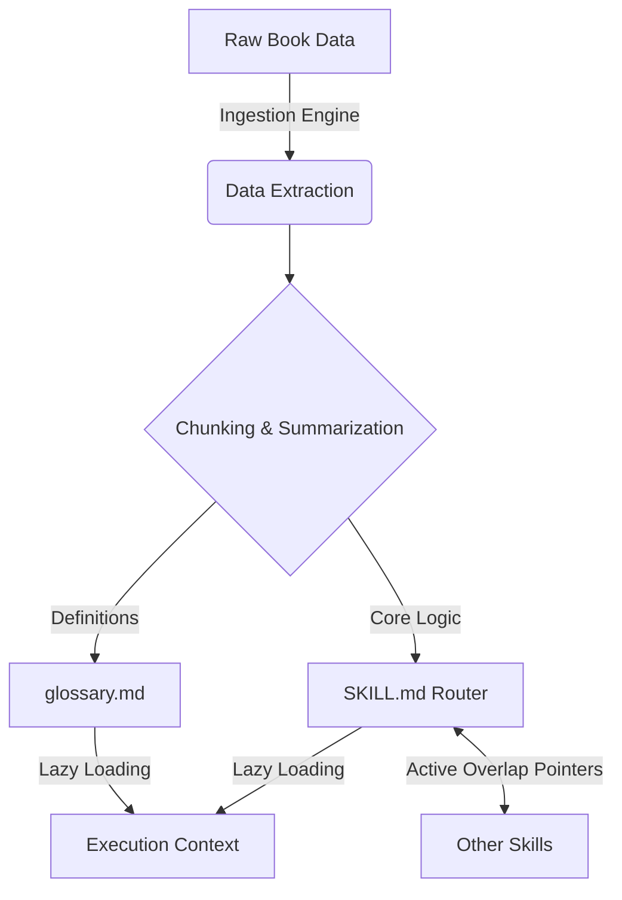

# Book-to-Skill: Superpowers Meta-Skill Evolution

   

A major architectural evolution of the `superpowers:writing-skills` meta-skill designed to algorithmically digest dense literature, extract actionable knowledge, and automatically generate deployable skills for the Tesla-Antigravity ecosystem.

## 1. Prerequisites & Quick Install

### Prerequisites
- Python 3.12+
- `Tesla-Antigravity-CLI` core engine active
- Valid `MCP` connections configured (`obsidian-avalon`, `github`)

### Quick Install
Deploy the Book-to-Skill module directly via the Antigravity CLI:

```bash
tesla-cli skill install book-to-skill --override-superpowers
```

Ensure your target directory is mapped correctly for the `SKILL.md` router initialization.

## 2. Usage & Examples

### Basic Book Ingestion
To parse a markdown or PDF book and generate the baseline skill structure:

```bash
tesla-cli run book-to-skill --input /path/to/book.pdf --output /path/to/skill_dir/
```

### Expected Output
The system will generate a highly optimized `SKILL.md`, a `glossary.md`, and interconnecting overlap pointers within the target directory.

```text
Processing... [████████████████████] 100%
Success: Generated 1 SKILL.md and 1 glossary.md.
Active Overlap Pointers configured: 14 nodes.
```

## 3. Architecture & Design Decisions

The Book-to-Skill architecture is engineered for absolute density, zero-fluff extraction, and strict module isolation.

### Technical Constraints & Paradigms
- **800-Line Ceiling**: To prevent token overflow and ensure crisp execution context, no generated `SKILL.md` or auxiliary file may exceed 800 lines. The system automatically paginates or cross-references content beyond this limit.
- **SKILL.md Router**: Acts as the central nervous system. It does not store all data but routes the execution engine to specific sub-modules or `glossary.md` files.
- **Active Overlap Pointers**: Ensures that multiple generated skills can communicate and share context without duplicating logic. If Skill A and Skill B share a concept, they reference a common active pointer.
- **Lazy Loading Shielding**: Data is loaded strictly on-demand. The router only loads the specific instructions required for the current sub-task, protecting the context window from contamination.

### System Topology



## 4. Security & Resilience

- **Token Overflow Protection**: The 800-line ceiling is enforced strictly. Exceeding this limit triggers an automatic segmentation fault gracefully handled by the paginator.
- **Lazy Loading Shielding**: Prevents memory leaks and context poisoning by loading only the necessary nodes into active memory.
- **OpenSSF Compliance**: All generated outputs comply with standard security policies, ensuring no arbitrary execution blocks are improperly formatted or exposed.

## 5. Contribution & Governance

Contributions to this MVP must adhere strictly to the **Vigilum Codex**.

- All pull requests must include a `--dry-run` log.
- Do not bypass the 800-line ceiling.
- Ensure all Active Overlap Pointers resolve correctly before requesting a review.
- Direct push is forbidden without explicit authorization from Lord Mahonheim.
