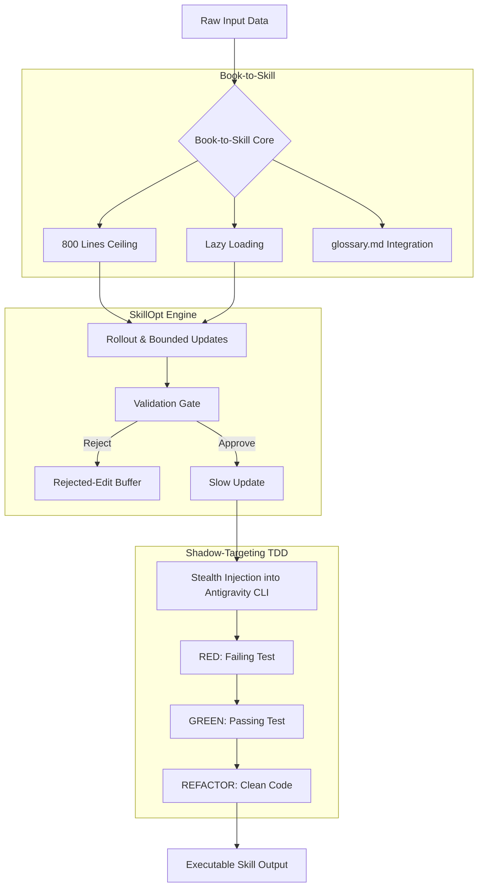

# Book-To-Skill: Tesla Writing Skills

   

**A high-performance hybrid architecture framework for converting massive textual knowledge into executable agent skills via SkillOpt, Book-to-Skill optimization, and Shadow-Targeting TDD.**

## 1. Prerequisites & Quick Start

### Requirements
- Antigravity CLI Environment (`@lordmahonheim-bot` ecosystem)
- Python 3.12+
- Git

### Installation
Clone and symlink the skill to your Antigravity skills directory:
```bash
cd /home/lord-mahonheim/bifrost/tesla/MVP-GITHUB/40-Book-To-Skill-Tesla-Writing-Skills
ln -s $(pwd) ~/.gemini/config/plugins/tesla-skills/skills/book-to-skill
```

## 2. Usage & Examples

To invoke the skill within the Antigravity CLI, ensure your plugin is loaded and execute a context-aware query.

```bash
# Example: Inject a book chunk and generate a skill blueprint
antigravity run --skill book-to-skill --input "path/to/book_chunk.md" --mode generate
```

### Typical Workflow
1. **Feed Context**: Supply raw text data (capped at 800 lines).
2. **Optimize**: The SkillOpt engine distills the content using text-space optimization.
3. **Validate**: The Shadow-Targeting TDD framework automatically runs RED-GREEN-REFACTOR cycles without disrupting the main CLI state.

## 3. Architecture & Design Decisions

The system leverages a tripartite hybrid architecture to ensure maximum context density without exceeding token limits.

### Mermaid Topology



### Components
- **SkillOpt**: Executive optimization in textual space. Implements Rollout, Bounded Updates, a strict Validation Gate, a Rejected-Edit Buffer, and Slow Update protocols.
- **Book-to-Skill**: Designed to handle massive text by enforcing an 800-line ceiling per context window, implementing Lazy Loading, and utilizing a centralized `glossary.md` to maintain definitional consistency.
- **Shadow-Targeting TDD**: A continuous RED-GREEN-REFACTOR loop that operates via stealth injection directly into the Antigravity CLI, allowing tests to run in parallel without blocking main workflows.

## 4. Security & Resilience

- **Anti-Crash Protocols**: Any failure in the Shadow-Targeting loop triggers an immediate fallback to the Rejected-Edit Buffer. Main branch state remains untainted.
- **OpenSSF Compliance**: Strict validation gates ensure no unverified code execution occurs during the Book-to-Skill conversion process.
- **Execution Limits**: Hardcapped at 800 lines of processing to prevent context exhaustion and OOM (Out Of Memory) errors within the LLM.

## 5. Contribution & Governance

All contributions must adhere to the **Vigilum Codex**.

1. **Strict Pull Requests**: No direct commits to `main` (unless authorized by Lord Mahonheim).
2. **Conventional Commits**: Use `<type>(<scope>): <description>` format.
3. **No Fluff**: Keep documentation and code dense and factual.
4. **Testing**: All new features must pass Shadow-Targeting TDD validation gates.
