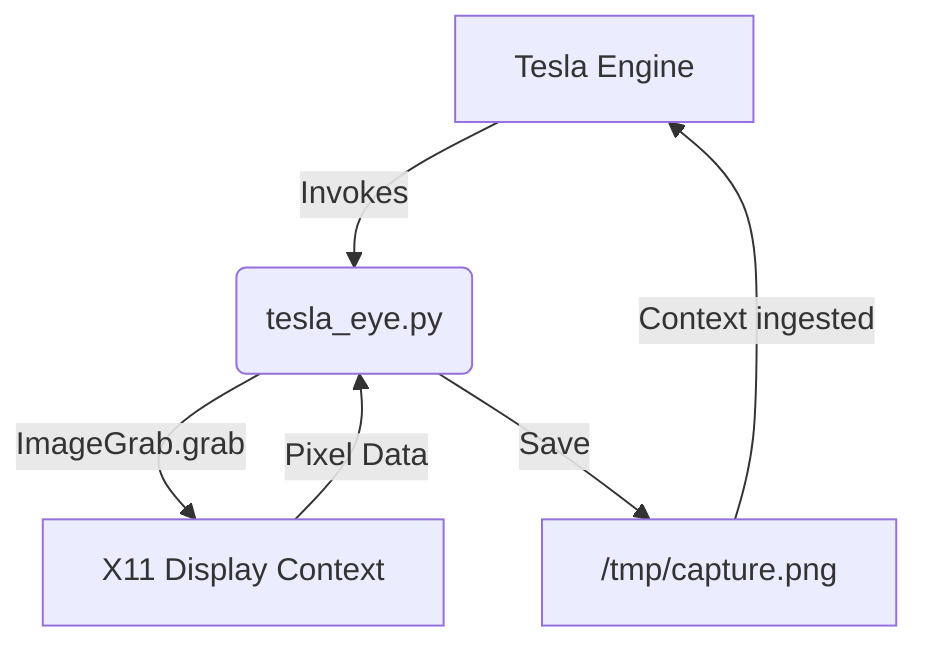

# Tesla-Eye

   

**Tesla-Eye provides a primary sensory visual organ for the Tesla engine by capturing X11 display screenshots on demand using Pillow (PIL).**

## 1. Prerequisites & Quick Installation

Tesla-Eye requires Python 3.12+ and the `Pillow` library to interface with the X11 display environment.

```bash
# Install dependencies
pip install Pillow

# Make the utility executable
chmod +x tesla_eye.py
```

## 2. Usage & Examples

Trigger the sensory organ to capture the current graphical context. When blocked on visual validation or needing context from the host OS, execute:

```bash
# Default capture (saves to /tmp with timestamp)
./tesla_eye.py

# Specify explicit output path
./tesla_eye.py /path/to/custom_capture.png
```

**Expected Output:**
```text
SUCCESS: Visual capture acquired -> /tmp/tesla_eye_capture_20260724_063800.png
```

## 3. Architecture & Design Decisions

The design prioritizes zero-friction integration with the core Tesla engine. By utilizing `ImageGrab.grab()` natively through Pillow, we avoid branching out into shell subprocesses for tools like `scrot` or `gnome-screenshot` when possible, minimizing external binary dependencies.



## 4. Security & Resilience

- **Crash-Free Execution**: The script wraps the capture process in a strict `try/except` block, ensuring that a missing display or X11 permission issue returns a structured error to `stdout`/`stderr` instead of silently crashing the agent loop.
- **Path Confinement**: By default, data is dumped in `/tmp` to prevent persistent disk bloat and ensure fast I/O.
- **X11 Dependency**: The tool strictly assumes a running X server (`$DISPLAY` must be accessible).

## 5. Contribution & Governance

Any modifications to this component must be validated by Lord Mahonheim. Pull requests must adhere to the **Vigilum Codex**. The core dependency on `Pillow` must not be replaced without architectural review, as it guarantees cross-compatibility and ecosystem standard adherence.
