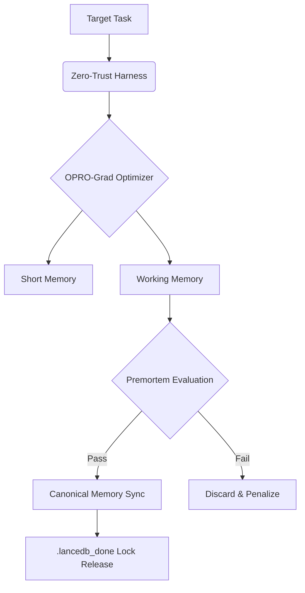

# OPRO-Grad Optimizer

   

OPRO-Grad v3.2 is an advanced sub-agent/skill engineered for controlled self-improvement (Harness-Only) to prevent "Semantic Bloat" across the Tesla ecosystem.

## Quick Start & Prerequisites

**Prerequisites:**
- Python 3.12+
- `lanceDB` instance active for local semantic state
- Strict adherence to the Vigilum Codex

**Installation:**
```bash
git clone https://github.com/lordmahonheim-bot/Tesla-Antigravity-CLI.git
cd Tesla-Antigravity-CLI/SIA-TESLA-H/OPRO-Grad
```

## Usage & Examples

To instantiate the OPRO-Grad optimizer within a safe sandboxed harness:

```bash
# Execute optimization on a target skill
python -m core.opro_grad --target "tesla-curator" --budget 4000
```

**Expected Output:**
```
[OPRO-Grad] Initializing Zero-Trust Environment...
[OPRO-Grad] Lock acquired (.lancedb_done).
[OPRO-Grad] Generating candidate prompts...
[OPRO-Grad] Backpressure active: Token Budget limits enforced.
[OPRO-Grad] Evaluation complete. Bloat check passed.
```

## Architecture & Design Decisions

OPRO-Grad strictly employs a **Zero-Trust Memory Architecture**:
- **Short-Term Memory**: Ephemeral token buffers for active generation.
- **Working Memory**: Evaluative storage for candidate performance tracking.
- **Canonical Memory**: Final, vetted instructions merged strictly under explicit commit permissions.



## Security & Resilience

- **Anti-Semantic Bloat**: Hard limitations on prompt length drift and recursive structural drift.
- **Synchronous Locks**: Utilizes `.lancedb_done` to prevent parallel concurrent writes to the LanceDB vector store, ensuring consistency.
- **Token Budget Backpressure**: Enforces strict computational limits per cycle. Exceeding token limits triggers an automatic soft-fault and rollback.
- **Premortem Certification**: Certified robust against chaotic instruction degradation on production tasks.

## Contribution & Governance

Contributions to this module must adhere strictly to the SIA-TESLA-H guidelines.
1. All changes must be tested in the `/sandboxes/creuset` environment.
2. Escalation to Lord Mahonheim is mandatory before pushing any modifications to the core generation logic.
3. No exceptions are made to the English-only documentation standard.
