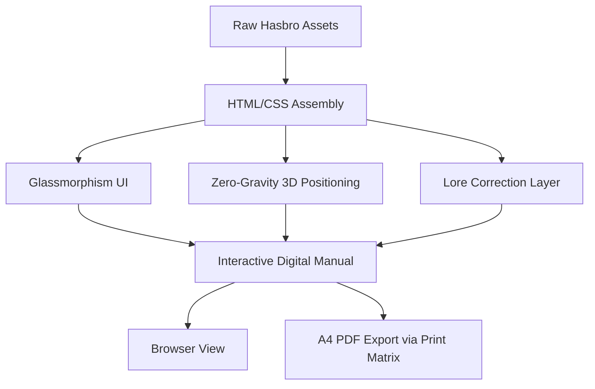

# Cluedo 2023 F6420 — Premium Interactive Manual MVP

   

   

**A high-fidelity, interactive HTML/CSS digital manual and A4-ready PDF rendering for Hasbro's Cluedo 2023 (F6420).**

## 1. Quick Start

Open `manuel_cluedo_clean.html` in any modern web browser to view the interactive manual. The `Cluedo - Manuel Intéractif.pdf` provides an A4 print-ready version with identical visual fidelity. No installation or build steps are required to view the content.

📥 **[Download the Official Hasbro Manual (PDF)](Manuel-Cluedo-VF.pdf)**: This file contains the complete rulebook for the game (2023 edition F6420).

## 2. Usage & Output

- **HTML Viewing**: Simply double-click the `manuel_cluedo_clean.html` file.
- **PDF Export/Print**: Open the HTML file in Chrome/Edge, and use `Ctrl+P`. The CSS matrix strictly aligns pages to A4 specifications without margins.

## 3. Architecture & Premium UI Design

The project employs advanced front-end techniques to deliver a "Premium" aesthetic, correcting the original Hasbro canonical lore inconsistencies.

- **Glassmorphism**: Backdrop filters and translucent backgrounds give depth to the cards and modal interfaces.
- **A4 Print CSS Matrix**: Deep CSS `@media print` rules enforce millimeter-perfect dimensions, breaking sections perfectly across A4 pages without content clipping.
- **Zero-Gravity 3D Physics**: Elements use absolute positioning and CSS transforms (rotations, scales) to simulate a dynamic, gravity-less 3D environment for cards and game pieces on the board.

### Workflow & Structure

## 4. Security & Resilience

- **Self-Contained**: The HTML file contains no external scripts that could cause network or execution vulnerabilities. All styling is self-contained or uses secure CDN fonts.
- **Zero JavaScript**: The core presentation layer operates securely without executing arbitrary code, mitigating XSS risks entirely.

## 5. Contribution & Governance

All changes to the presentation layer or print matrix must be validated through visual regression testing and A4 PDF export trials. Direct modifications to the lore must cross-reference Hasbro's official 2023 (F6420) errata.
