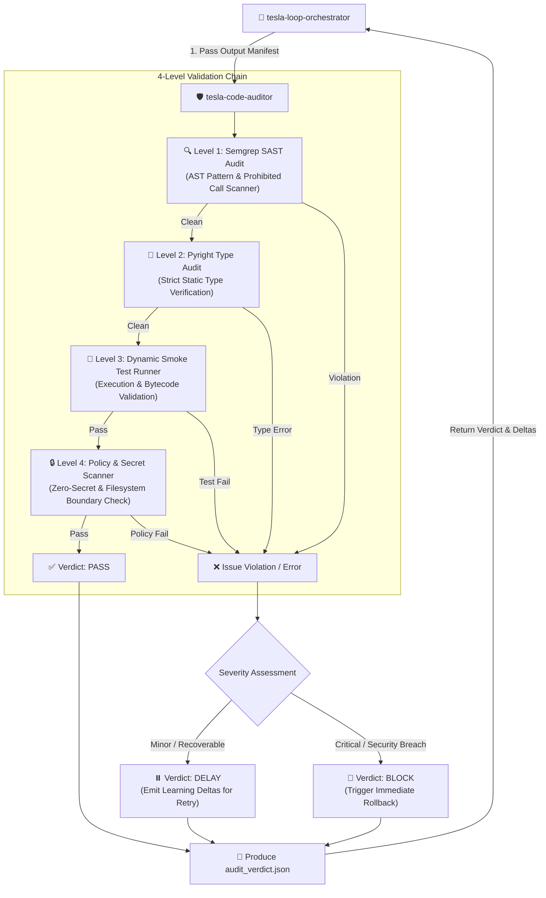

# 🛡️ MVP 44 — Tesla Code Auditor

   

> **Tesla Antigravity CLI · @lordmahonheim-bot**  
> **Authoritative Documentation — Independent Automated Multi-Rung Code Auditing Engine**

---

## 🎯 Overview & Mission

**Tesla Code Auditor** (MVP 44) is the exclusive, independent verification component of the **Tesla Antigravity CLI** ecosystem. Built specifically for the **Loop Engineering (MVP 28)** architecture, `tesla-code-auditor` functions as an impartial Referee / Judge that validates code modifications produced by `tesla-master-code`.

Under the **Vigilum Codex** governance doctrine, code generation and code auditing are strictly segregated into independent agent boundaries (**Separation of Powers**). `tesla-code-auditor` does NOT write code or modify files; its sole mandate is to evaluate code changes against a rigorous 4-level validation chain and issue binding verdicts (`PASS`, `DELAY`, or `BLOCK`).

### Key Capabilities
- **4-Level Sequential Audit Chain**: Evaluates static security AST rules, type strictness, dynamic execution safety, and system policies.
- **Strict Separation of Powers**: Complete physical and logical isolation from code generation (`tesla-master-code`).
- **Structured Verdict & Learning Deltas**: Generates machine-readable `audit_verdict.json` reports containing precise failure annotations and remediation advice (`learning_deltas`).
- **Zero-Secret & Policy Enforcement**: Prevents accidental exposure of API keys, hardcoded credentials, or illegal filesystem calls.
- **Deterministic Evaluation**: Ensures consistent, reproducible audit results across loop iterations.

---

## 🏗️ Architecture & Audit Flow

In the Loop Engineering pipeline, `tesla-code-auditor` is invoked by `tesla-loop-orchestrator` after `tesla-master-code` completes the `ACT` phase:



---

## 🛡️ 4-Level Validation Chain Detailed Breakdown

`tesla-code-auditor` executes a sequential 4-tier audit pipeline. An error encountered at any level halts processing and logs the exact violation context.

```
┌─────────────────────────────────────────────────────────┐
│ Level 1: Semgrep SAST Audit                             │
│ • Custom AST pattern matching (tesla_custom_rules.yaml) │
│ • Prohibited function calls (eval, exec, shell=True)    │
│ • Insecure temp files & unhandled exception swallows    │
└────────────────────────────┬────────────────────────────┘
                             │
                             ▼
┌─────────────────────────────────────────────────────────┐
│ Level 2: Pyright Strict Type Audit                      │
│ • Strict static type verification                       │
│ • Detection of unannotated functions & implicit Any     │
│ • Type safety enforcement across all target modules     │
└────────────────────────────┬────────────────────────────┘
                             │
                             ▼
┌─────────────────────────────────────────────────────────┐
│ Level 3: Dynamic Smoke Test Runner                      │
│ • Automated test suite execution & bytecode compilation │
│ • Sanity checks on modified module entry points         │
│ • Environment isolation & non-zero exit code capture    │
└────────────────────────────┬────────────────────────────┘
                             │
                             ▼
┌─────────────────────────────────────────────────────────┐
│ Level 4: Policy Engine & Secret Scanner                 │
│ • Zero-Secret Policy enforcement (API keys, JWT, tokens)│
│ • Filesystem sandbox boundaries & path traversal check  │
│ • Vigilum Codex compliance validation                   │
└────────────────────────────┬────────────────────────────┘
```

### 1. Level 1 — SAST Audit (`semgrep_audit.py`)
Executes static AST scanning using Semgrep and Tesla custom security rules (`tesla_custom_rules.yaml`). Detects dangerous code constructs including `eval()`, `exec()`, `os.system()`, `subprocess(shell=True)`, unsafe deserialization, and unhandled exception suppression.

### 2. Level 2 — Pyright Type Audit (`pyright_audit.py`)
Performs strict static type checking via Pyright. Ensures 100% type coverage, valid return types, correct method signatures, and prevents hidden runtime `AttributeError` or `TypeError` regressions.

### 3. Level 3 — Dynamic Smoke Tests (`smoke_test_runner.py`)
Runs automated lightweight unit and integration tests against modified target files in an isolated process. Validates syntax compilation, module importability, and basic execution invariants.

### 4. Level 4 — Policy & Secret Scanner (`policy_engine.py`)
Scans modified files for hardcoded secrets, API tokens, credentials, unauthorized filesystem access outside assigned target directories, or violations of Vigilum Codex constraints.

---

## 📄 Audit Manifest & Verdict Format

`tesla-code-auditor` consumes `output_manifest.json` produced by the Acteur (`tesla-master-code`) and writes a consolidated `audit_verdict.json` to the output directory.

### Input Manifest Schema (`output_manifest.json`)
```json
{
  "files_modified": [
    "src/main.py",
    "tests/test_main.py"
  ],
  "hashes": {
    "src/main.py": "a665a45920422f9d417e4867efdc4fb8a04a1f3fff1fa07e998e86f7f7a27ae3",
    "tests/test_main.py": "b785a45920422f9d417e4867efdc4fb8a04a1f3fff1fa07e998e86f7f7a27ae4"
  },
  "timestamp": "2026-08-09T06:00:00Z"
}
```

### Output Verdict Schema (`audit_verdict.json`)
```json
{
  "verdict": "PASS",
  "failed_rung": 0,
  "feedback": "SemGrep: OK, Pyright: OK, Smoke: OK, Policy: OK",
  "learning_deltas": "All 4 validation levels passed with zero defects.",
  "errors": []
}
```

### Failed Audit Verdict Example (`verdict: DELAY`)
```json
{
  "verdict": "DELAY",
  "failed_rung": 2,
  "feedback": "Pyright: TYPE_MISMATCH in src/main.py line 42",
  "learning_deltas": "Function `calculate_total` expects `int` but received `Optional[int]`. Add explicit type check.",
  "errors": [
    {
      "file": "src/main.py",
      "line": 42,
      "rule": "reportGeneralTypeIssues",
      "message": "Argument of type 'None' cannot be passed to parameter of type 'int'"
    }
  ]
}
```

---

## 💻 CLI & Usage Instructions

### Invoking via CLI
```bash
python3 /home/lord-mahonheim/bifrost/tesla/MVP-GITHUB/44-Tesla-Code-Auditor/code_auditor.py \
  --manifest /home/lord-mahonheim/bifrost/tesla/OUTPUTS/output_manifest.json
```

### Direct Target File Audit
```bash
python3 /home/lord-mahonheim/bifrost/tesla/MVP-GITHUB/28-Loop-Engineering/skills/tesla-code-auditor/scripts/code_auditor.py \
  --files src/main.py \
  --output-json /home/lord-mahonheim/bifrost/tesla/OUTPUTS/audit_verdict.json
```

---

## 🏛️ Governance & Separation of Powers

`tesla-code-auditor` is governed strictly by the **Vigilum Codex**:

1. **Separation of Powers**: `tesla-master-code` generates code; `tesla-code-auditor` evaluates it. An agent cannot grade its own work.
2. **Immutability of Verdicts**: Audit results cannot be overwritten or suppressed by the Acteur.
3. **Zero-Tolerance Security**: Any Level 1 (SAST) or Level 4 (Policy/Secret) violation immediately triggers a `BLOCK` verdict, forcing a workspace rollback by `tesla-loop-orchestrator`.
4. **Learning Feedback Loop**: Detailed error feedback (`learning_deltas`) is passed back to `tesla-master-code` via the orchestrator to guide targeted fixes in the subsequent loop iteration.

---

## 📋 MVP 44 Metadata

| Parameter | Value |
|---|---|
| **MVP ID** | MVP 44 |
| **Component** | Tesla Code Auditor |
| **Role** | Independent Auditor / Referee (Loop Engineering) |
| **Author** | `@lordmahonheim-bot` |
| **Status** | ✅ `MVP COMPLETE` |
| **Ecosystem** | Tesla Antigravity CLI |
| **Dependencies** | MVP 28 (`28-Loop-Engineering`), Semgrep, Pyright |

---

*Part of the [Tesla Antigravity CLI](https://github.com/lordmahonheim-bot/Tesla-Antigravity-CLI) ecosystem — Vigilum Codex doctrine.*
