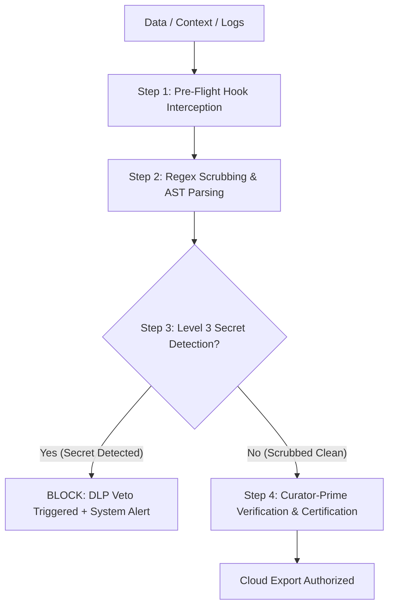

# STRICT DATA SCRUBBING POLICY AND CLOUD LEAK PREVENTION (DLP)

   

---

## 1. Governance and Context

- **Archiving Authority**: `tesla-curator-prime` (Guardian of Canonical Memory & DLP Gatekeeper)
- **Reference Doctrine**: Vigilum Codex (Act-Verify-Learn-Repeat)
- **Scope**: Any export of context, code, logs, prompts, or artifacts destined for external Cloud APIs or services (e.g., Google Cloud, Jules, Gemini Cloud, OpenAI, remote Git repositories).
- **Cardinal Principle**: Zero Sensitive Leakage / Privacy-by-Design. No sensitive data must cross the local boundary of the MIDGARD environment without prior certified scrubbing.

---

## 2. Taxonomy and Data Classification (DLP Grid)

| Security Level | Designation | Content Examples | Required Action |
| :--- | :--- | :--- | :--- |
| **Level 0** | **Public** | Open-source documentation, public READMEs, licenses. | Authorized without modification. |
| **Level 1** | **Internal** | Architecture specifications, non-sensitive execution logs. | Ingestion authorized under integrity control. |
| **Level 2** | **PII (Personal Data)** | Email addresses, local user identifiers, private IP addresses, absolute Linux system paths. | **Mandatory Scrubbing** (Anonymization). |
| **Level 3** | **Critical Secrets** | API keys (AWS, GitHub, Slack, Anthropic, OpenAI), JWT tokens, private SSH/PGP keys, DB passwords. | **Immediate Veto & Absolute Censorship** (Export blocked). |

---

## 3. Technical Scrubbing Mechanisms (Regex Catalog)

The scrubbing engine relies on the Python component `log_subagent_parser.py` (located in `/memory/log_subagent_parser.py`) and the control chain `tesla-curator-prime`.

### 3.1. Certified Regex Rules Table

```python
# Catalog of deterministic masking patterns (SCRUB_PATTERNS)
import re

SCRUB_PATTERNS = [
    # 1. AWS Access Keys
    (re.compile(r"(?:AKIA|ASCA|A3T[A-Z0-9])[A-Z0-9]{16}"), "[SCRUBBED_AWS_KEY]"),
    
    # 2. AWS Secret Access Keys
    (re.compile(r"(?<![A-Za-z0-9/+=])[A-Za-z0-9/+=]{40}(?![A-Za-z0-9/+=])"), "[SCRUBBED_AWS_SECRET]"),
    
    # 3. GitHub Personal Access Tokens (Classic & Fine-Grained)
    (re.compile(r"ghp_[A-Za-z0-9_]{36,255}"), "[SCRUBBED_GITHUB_TOKEN]"),
    (re.compile(r"github_pat_[A-Za-z0-9_]{22}_[A-Za-z0-9_]{59}"), "[SCRUBBED_GITHUB_TOKEN]"),
    
    # 4. Slack Bot & User Tokens
    (re.compile(r"xox[baprs]-[0-9a-zA-Z]{10,48}"), "[SCRUBBED_SLACK_TOKEN]"),
    
    # 5. JSON Web Tokens (JWT)
    (re.compile(r"eyJ[A-Za-z0-9-_=]+\.eyJ[A-Za-z0-9-_=]+\.[A-Za-z0-9-_+/=]+"), "[SCRUBBED_JWT]"),
    
    # 6. Private SSH / OpenSSH / RSA / PGP Keys
    (re.compile(r"-----BEGIN [A-Z ]+ PRIVATE KEY-----\n[\s\S]+?\n-----END [A-Z ]+ PRIVATE KEY-----"), "[SCRUBBED_SSH_KEY]"),
    (re.compile(r"-----BEGIN [A-Z ]+ PRIVATE KEY-----[A-Za-z0-9+/=\s\n]+-----END [A-Z ]+ PRIVATE KEY-----"), "[SCRUBBED_SSH_KEY]"),
    
    # 7. OpenAI & Anthropic API Keys
    (re.compile(r"sk-[a-zA-Z0-9]{32,64}"), "[SCRUBBED_OPENAI_KEY]"),
    (re.compile(r"sk-proj-[a-zA-Z0-9_-]{40,}"), "[SCRUBBED_OPENAI_KEY]"),
    (re.compile(r"sk-ant-[a-zA-Z0-9_-]{32,}"), "[SCRUBBED_ANTHROPIC_KEY]"),
    
    # 8. Passwords and generic authentication tokens
    (re.compile(r"(?i)(api[_-]?key|secret|password|passwd|auth[_-]?token)\s*[:=]\s*['\"]?([a-zA-Z0-9_\-]{16,})['\"]?"), r"\1=[SCRUBBED_SECRET]"),
    
    # 9. PII - E-mail Addresses
    (re.compile(r"[a-zA-Z0-9_.+-]+@[a-zA-Z0-9-]+\.[a-zA-Z0-9-.]+"), "[SCRUBBED_EMAIL]"),
    
    # 10. Private IP Addresses (IPv4)
    (re.compile(r"\b(?:10|172\.(?:1[6-9]|2[0-9]|3[01])|192\.168)\.\d{1,3}\.\d{1,3}\b"), "[SCRUBBED_IP]")
]
```

---

## 4. Pre-Cloud Execution Pipeline (DLP Guardrails)

Any attempt to export data to the Cloud must follow a 4-step interception pipeline:



### 4.1. Detailed Steps

1. **Step 1 — Pre-Flight Hook Interception**:
   Every payload sent outward (external APIs, Jules Delegate, Cloud LLMs) is captured by the governance gateway (Vigilum Gateway V2.1 / TGG).

2. **Step 2 — Regex Scrubbing & AST Parsing**:
   Synchronous execution of the `scrub_text()` parser. All tokens matching Level 2 (PII) and Level 3 (Secrets) patterns are replaced by immutable tags (e.g., `[SCRUBBED_AWS_KEY]`).

3. **Step 3 — DLP Veto Control**:
   If an unmasked Level 3 secret is detected after the scrubbing pass, the pipeline immediately interrupts the export flow. The response returned to the engine is a blocking failure status: `DLP_VETO_TRIGGERED`.

4. **Step 4 — Certification by Tesla-Curator-Prime**:
   `tesla-curator-prime` validates the integrity of the sanitized payload before giving its approval for transmission to the cloud network.

---

## 5. Transactional Isolation Rule and Logs

- **Log Storage**: Scrubbing metadata is stored in the local SQLite database `/home/lord-mahonheim/bifrost/tesla/Avalon/03-Resources/alexandria_brain.db` with `WAL` mode enabled (`PRAGMA journal_mode=WAL;`).
- **Conflict Management**: Any write to the SQLite database uses a context manager with multiple attempts (retry backoff) and transactional isolation (`with conn:`).
- **Prohibition of Raw Secrets Logging**: No raw secret shall be logged in the session files (`SESSION_LOG.md`, `SESSION_TRANSCRIPTS.md`) or in the SQLite database.

---

## 6. Non-Regression and Acceptance Protocol

Before publishing any update to the scrubbing engine:
1. Execute the unit test suite on the scrubbing regexes.
2. Ensure that no false positive blocks valid, non-sensitive code.
3. Verify that all test secrets (dummy keys) are 100% censored.

---

**Certified under the Vigilum Codex doctrine by `tesla-curator-prime`.**
