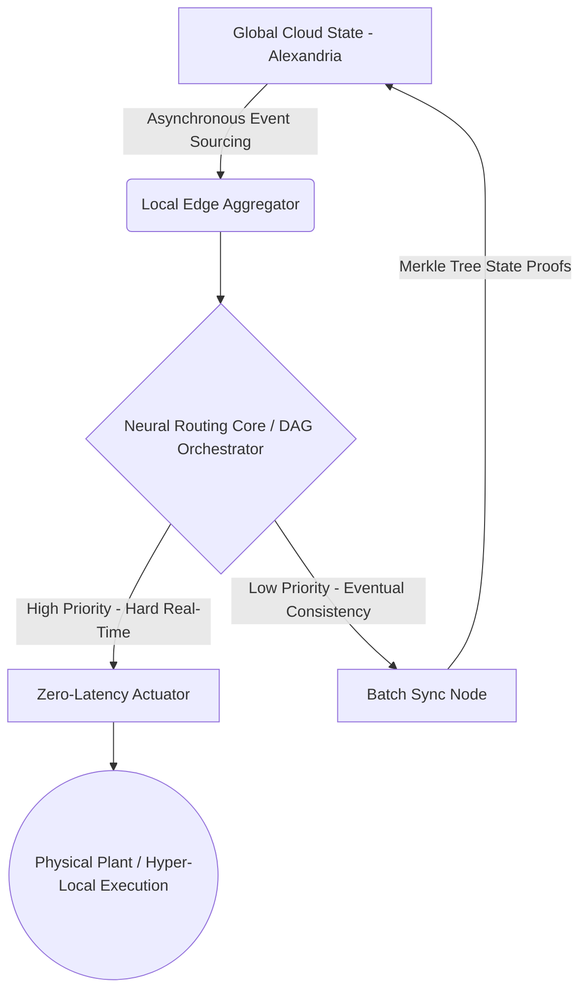

# MVP 45: Hybrid Architecture Jules

   

## System Overview & Genesis
The "Jules" Hybrid Architecture marks a paradigm shift in distributed edge computing within the Tesla Antigravity ecosystem. Designed to reconcile the inherently opposing requirements of zero-latency physical actuation and global asynchronous state synchronization, Jules is not merely a router—it is a deterministic neural conduit. It bridges the gap between raw, unbounded edge inference and the absolute authority of the centralized Cloud State.

Its inception stems from the failure of traditional microservice topologies to maintain hard real-time guarantees (< 5ms) when subjected to transient network partitions and unbounded scaling. Jules introduces a state-machine overlay on a probabilistic routing core, guaranteeing deterministic outcomes even when predictive models degrade.

## Core Component Topology

## Deep Architecture: The Neural Routing Core
At the heart of Jules lies the Neural Routing Core. This component evaluates incoming telemetry streams through a two-tiered validation pipeline:
1. **Probabilistic Tier (NMPC/RL):** Rapidly approximates the optimal control vector or data payload routing path.
2. **Deterministic Bounding Tier:** Instantly checks the probabilistic output against strict safety envelopes (e.g., maximum torque, rate limits, access privileges). If the neural output violates the bounds, it falls back to a mathematically proven safe state (Stale State Block).

## Security & State Integrity Mechanisms
- **State Fingerprinting:** Every configuration and control vector is hashed into a `BASELINE_FINGERPRINT`. Divergences are trapped at Gate 1 (Canonical Discovery), triggering immediate halts.
- **Broker Pattern Isolation:** Edge agents executing under Jules operate with Zero Trust. They must request execution privileges via Declarative Artifacts (Execution Requests) to the main orchestrator, preventing privilege escalation.
- **Circuit Breaker & Self-Healing:** The architecture supports a strict 3-retry self-healing loop for non-critical faults. If the fault persists, a hard-kill is issued with a 15-second Grace Period to serialize the ultimate execution checkpoint.

## Edge Cases & Resiliency
- **Network Partitioning:** In the event of connection loss to the Global Cloud State, the Batch Sync Node caches Merkle proofs of local state mutations. The Zero-Latency Actuator continues to operate within its last known safe boundary, preventing catastrophic system paralysis.
- **Cognitive Overload:** If the local Edge Aggregator is flooded, it dynamically sheds Low Priority batch syncing to dedicate CPU cycles exclusively to the Neural Routing Core's high-priority loops.

## Integration & Next Steps
MVP 45 provides the foundational framework upon which the Absolute Driver (MVP 46) will deploy its unbounded predictive models. It establishes the unshakeable bedrock of safety and synchronization required for the next phase of the Act-Verify-Learn-Repeat closed loop.
