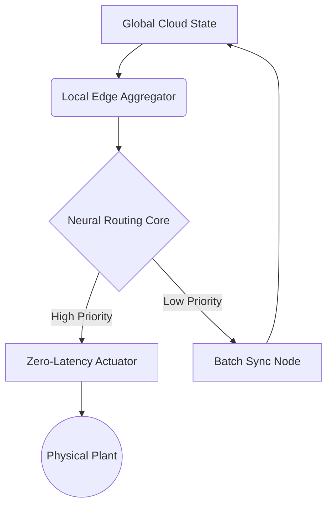

# MVP 45: Hybrid Architecture Jules

   

## System Overview
This module dictates the core hybrid node architecture combining edge inference with centralized global synchronization, codenamed "Jules". It enforces zero-latency actuation in highly dynamic topologies.

## Core Component Topology

## Technical Specification
The Jules architecture implements a deterministic state machine overlaid on a probabilistic neural router. 
Latency guarantees: < 5ms for High Priority loops.
