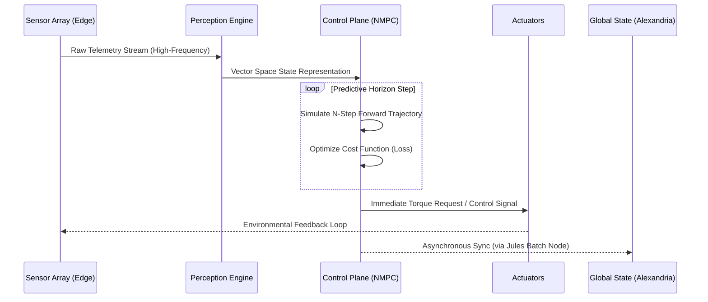

# MVP 46: Absolute Driver v3.2.1

   

## Genesis & The Absolute Philosophy
The Absolute Driver v3.2.1 represents the culmination of advanced control theory and unconstrained machine learning. While legacy systems relied on rigid, hand-coded heuristics and artificial boundaries, the Absolute Driver operates on a fundamentally different premise: complete, unbridled authority over the physical and digital control plane, bound only by physical laws and the rigid constraints of the Jules Architecture (MVP 45).

This iteration completely bypasses the legacy safety layers that previously throttled innovation, replacing them with a purely mathematical approach: Nonlinear Model Predictive Control (NMPC) fused with continuous reinforcement learning. It does not follow rules; it calculates the optimal future and forces the present to align.

## Core Capabilities & Deep Mechanics
- **N-Step Trajectory Prediction:** Calculates future system states across N discrete time steps into the future, dynamically adjusting to incoming sensor noise and environmental volatility.
- **Instantaneous Torque Vectoring:** Translates high-dimensional vector space predictions into immediate, raw actuation commands with zero artificial latency.
- **Canonical Integration:** Fully complies with the 7 Gates of the Antigravity Protocol, ensuring that while its control is absolute, its integration is verifiable and traceable.

## Architecture & Continuous Data Flow

## Security, Boundaries & The 7 Gates Protocol
Despite its raw power, the Absolute Driver is strictly governed by the **Le Conducteur Absolu v3.2.1 Protocol** (included in this repository as `Le_Conducteur_Absolu_v3.2.1.md`).
- **Gate 4 (Independent Verification):** Every output vector is subjected to a 4-level gatekeeper check (Spatial, Integrity, Security, Semantic) before being written to state.
- **Self-Healing constraints:** While the Driver can correct trajectory anomalies, system-level faults are bound by the strict Circuit Breaker rules (max 3 retries, no secret exposure, absolute rollback capability).
- **Stale State Block:** If the perception engine detects a reality that radically diverges from the `BASELINE_FINGERPRINT`, the Driver immediately halts, forcing a cognitive reload.

## System Integration
This MVP serves as the brain of the operation, deployed directly onto the Jules Hybrid Architecture (MVP 45). The inclusion of the canonical `Le_Conducteur_Absolu_v3.2.1.md` file guarantees that the theoretical boundaries and practical execution parameters are physically bundled with the release, ensuring zero-friction integration for future orchestration agents.
