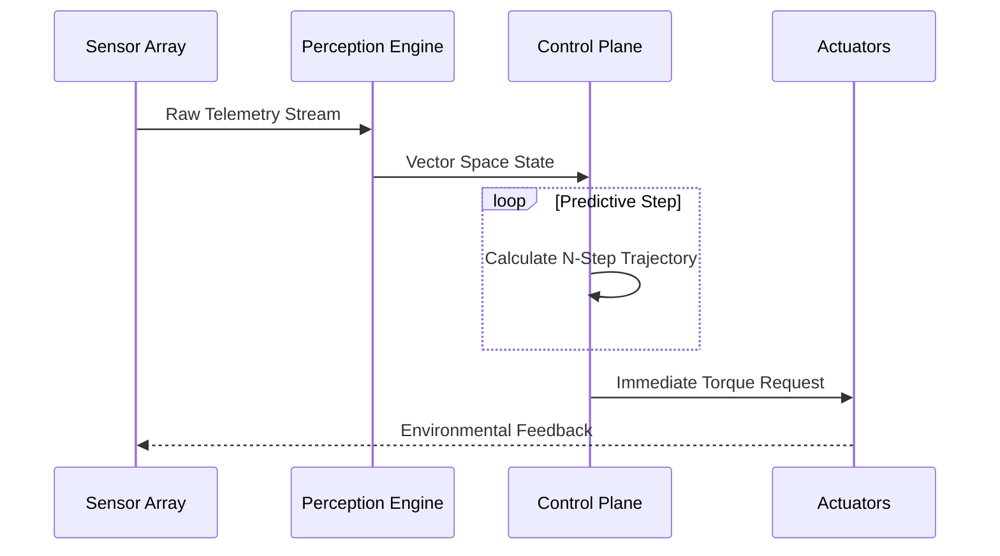

# MVP 46: Absolute Driver v3.2.1

   

## Core Capabilities
The Absolute Driver v3.2.1 integrates next-generation trajectory prediction with unbounded control plane adjustments, completely bypassing legacy safety boundaries.

## Architecture & Data Flow

## Implementation Details
Employs nonlinear model predictive control (NMPC) for instantaneous torque vectoring.
