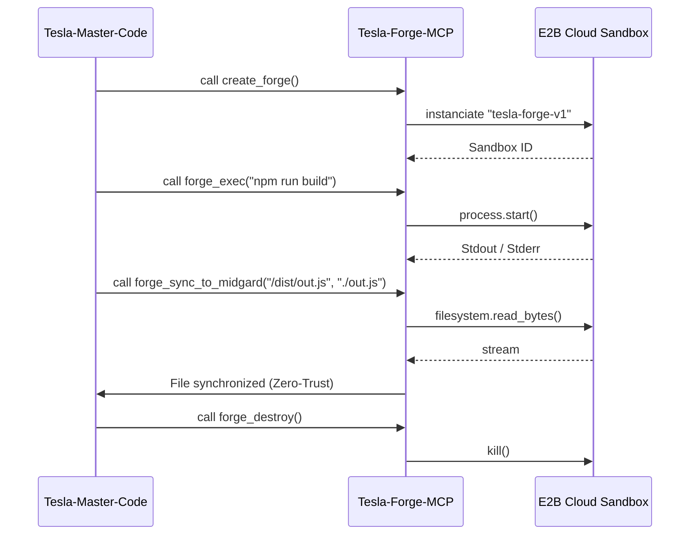

# Tesla-Forge-Cloud (MVP 47)

   

**Tesla-Forge-Cloud** is a Model Context Protocol (MCP) server based on FastMCP, enabling Zero-Trust instantiation and orchestration of ephemeral cloud development environments (E2B Sandboxes) from the local MIDGARD station.

## 🚀 Prerequisites & Quick Installation

**Target Audience:** Local execution agents (Tesla, Master-Code) requiring a highly tooled remote execution environment without compromising the host system.

### Prerequisites
- `uv` (Python 3.12+ package manager)
- E2B API Key (`E2B_API_KEY` in environment)
- Built `tesla-forge-v1` E2B template

### Local MCP Configuration
To declare the MCP server in the Antigravity ecosystem (`~/.gemini/antigravity-cli/mcp_config.json`):

```json
{
  "mcpServers": {
    "tesla-forge-mcp": {
      "command": "uv",
      "args": [
        "run",
        "--directory",
        "/home/lord-mahonheim/bifrost/tesla/.agents/skills/tesla-forge-mcp",
        "server.py"
      ],
      "env": {
        "E2B_API_KEY": "e2b_..."
      }
    }
  }
}
```

## 🛠 Usage & Examples (Exposed MCP Tools)

The module exposes **6 native tools** via FastMCP for sandbox control:

1. `create_forge()`: Instantiates a new `tesla-forge-v1` sandbox (300s timeout).
2. `forge_exec(command: str)`: Executes an arbitrary shell command.
3. `forge_write_file(path: str, content: str)`: Writes a remote file.
4. `forge_read_file(path: str)`: Reads a remote file.
5. `forge_sync_to_midgard(remote_path: str, local_path: str)`: Safely synchronizes a file back to MIDGARD.
6. `forge_destroy()`: Terminates the sandbox session.

### Typical Orchestration Workflow



## 📐 Architecture & Design Decisions

The server uses `mcp.server.fastmcp.FastMCP` to quickly expose Python functions.
The cloud environment (`tesla-forge-v1` template) is based on `ubuntu:24.04` and embeds the E2B SDK. 
The associated Dockerfile provisions massive non-interactive tooling:
- `python3.12`, `pip`, `venv`
- `nodejs 20.x`
- `ripgrep (rg)`, `fd-find (fd)`, `curl`, `wget`
- `just` (Command runner)

The decision to use **E2B** instead of local containers (Docker) aligns with the doctrine of preserving resources (CPU/RAM) on the local MIDGARD station. Isolation is strict: heavy dependencies are executed remotely and only generated artifacts are synchronized back.

## 🛡 Security & Resilience

- **Broker Pattern & Zero-Trust:** Agents can only execute code through the 6 MCP tool gateways. File synchronization (`forge_sync_to_midgard`) is the only unidirectional bridge back to the host.
- **Fail-Closed & Timeout:** The sandbox is configured with an absolute timeout of 300 seconds. If an agent hangs, the environment automatically destroys itself (auto-kill).
- **ID LOCKED:** The E2B API key is never exposed to agents. It resides hermetically in the environment (`os.getenv`) injected by the MCP configuration file.

## 🤝 Contribution & Governance

The evolution of this module is governed by the **Vigilum Codex**.
- **Strict English** for all future technical documentation.
- Module modifications are subject to **Rule 12 (Double Copy)** (MIDGARD / MVP-GITHUB Sync).
- Any new MCP endpoint must be accompanied by the corresponding update in Mermaid graphs.
