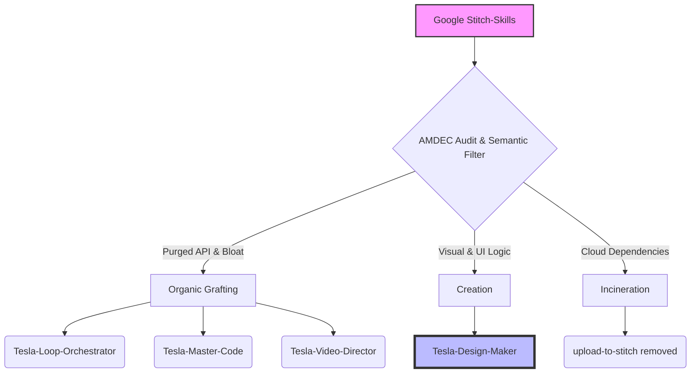

   

# Stitch-Skills Assimilation Architecture (Project 049)

**Author:** Tesla (Orchestrator)
**Date:** 2026-08-15
**Recipient:** Lord Mahonheim

## Executive Summary
This document details the assimilation of the `google-labs-code/stitch-skills` repository into the local autonomous framework, Antigravity CLI. The primary objective is to document the reverse engineering of the studied skills, the methodology used to purge Google's anti-patterns, and the formalization of a new specialized agent. The approach leverages the AMDEC audit, semantic filtering, and the physical restructuring of the filesystem by the Tesla-Team-Synergy.

## Architectural Overview

The integration process involved decoupling the original Google skills from their proprietary cloud API (`StitchMCP`) and stripping away semantic bloat. This ensured alignment with the strict zero-external-replication doctrine and the separation of concerns (Producer ≠ Validator).

## Methodology and Execution

The operation was conducted continuously through automated execution, resulting in two distinct integration maneuvers:

### 1. Organic Grafting
Core concepts, including the Baton System and React architecture patterns, were injected as new rules into the `SKILL.md` files of existing agents. This enhanced the capabilities of the Orchestrator, Code Master, and Video Director without compromising their specialized roles.

### 2. Creation of Tesla-Design-Maker
Visual competencies, such as aesthetic taste rules, mock-up generation, and static HTML extraction via Puppeteer, were amalgamated to establish a new, dedicated agent: **Tesla-Design-Maker**. This ensures that the aesthetic validation remains isolated from code generation, preserving the integrity of the evaluation process.

## Strategic Benefits and Recommendations

The Antigravity CLI architecture is significantly fortified following this assimilation. The system is completely liberated from Google server dependencies and now features a dedicated aesthetic authority alongside a robust iterative backend engine. 

It is highly recommended to monitor the initial executions of `Tesla-Design-Maker` that involve static extraction (Puppeteer). This will verify that the timeout encapsulation constraints advised by the AMDEC audit effectively prevent zombie processes on the host machine.

## Skill Integration Matrix

| Original Google Skill | Applied Treatment | Final Target |
| :--- | :--- | :--- |
| `stitch-loop` | Graft (Baton System) | `Tesla-Loop-Orchestrator` |
| `react-components` | Graft | `Tesla-Master-Code` |
| `react-native` | Graft | `Tesla-Master-Code` |
| `remotion` | Graft | `Tesla-Video-Director` |
| `taste-design` | Creation (Aesthetic Law) | `Tesla-Design-Maker` |
| `extract-static-html` | Creation (Puppeteer Tool) | `Tesla-Design-Maker` |
| `upload-to-stitch` | Destruction (Cloud Cord) | *None* |
