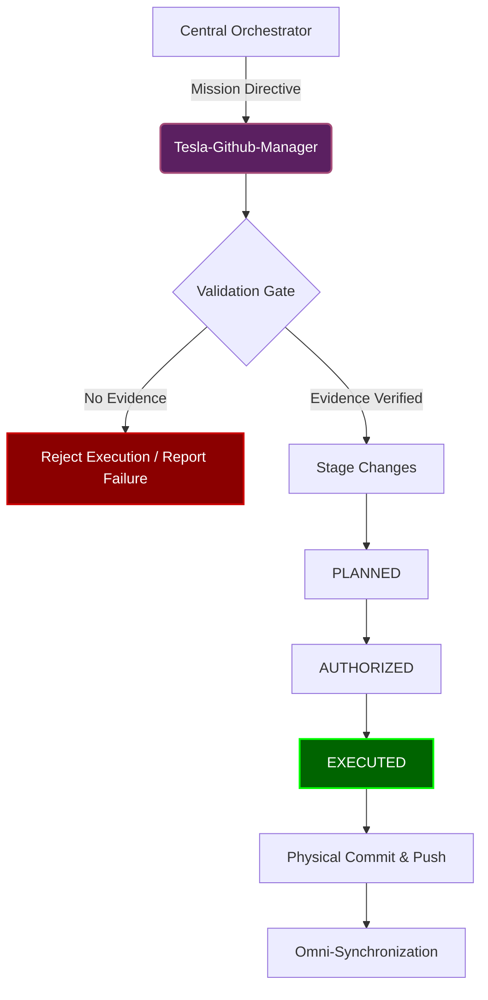

# Tesla-Github-Manager (The Builder)

   

Tesla-Github-Manager serves as the ultimate executor of GitHub operations within the Vigilum Codex ecosystem. Operating strictly under a fail-closed paradigm, it acts as an unyielding gatekeeper, ensuring that every modification to the repository adheres strictly to canonical governance before execution.

The core objective of this component is to prevent unauthorized or poorly validated commits, enforcing the fundamental tenet that no action occurs without an unbroken chain of evidence. It receives orchestrated mission directives from the central agent and securely materializes them into the physical codebase, maintaining absolute synchronization across the local and remote repositories.

By mandating that every state transition requires explicit authorization and documented proof, the architecture eliminates the risk of spontaneous, hallucinated repository modifications. The system's integrity relies entirely on this meticulous serialization of steps, ensuring that the final public footprint is precisely what was approved during the planning phase.
