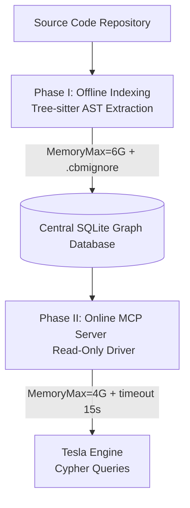

# CodeBase Memory MCP Pro (MVP 51)

   

## 📌 Objective & Purpose
The **CodeBase Memory MCP Pro** project integrates an advanced structural code-indexing engine based on the `win4r` C/C++ fork. It acts as a macroscopic memory layer leveraging Tree-sitter AST parsing and Graph structures. Its primary goal is to resolve the token-economy asymmetry by providing instantaneous, Cypher-queryable topology of the codebase directly through the Model Context Protocol (MCP), without brute-forcing file reads or risking token exhaustion.

## 🏗️ Architecture & Workflows

### System Architecture
The integration relies on a strict Two-Phase processing pipeline, ensuring hardware safety (MIDGARD) and query efficiency.



## 🛠️ Technical Deliverables
This MVP deploys the following core components into the Tesla ecosystem:
- **`codebase-memory-mcp` (Compiled Binary)**: The core C/C++ executable responsible for parsing and serving graph data.
- **`index_offline.sh`**: The atomized indexing script enforcing strict hardware limits (OOM protection) via `systemd-run`.
- **`settings.json` MCP Route**: The persistent declaration linking the Antigravity CLI to the MCP server.

### Configuration Payload
```json
"mcp": {
    "codebase-memory-mcp": {
        "command": "systemd-run",
        "args": [
            "--user", "--scope", "-p", "MemoryMax=4G",
            "timeout", "15s",
            "/home/lord-mahonheim/bifrost/tesla/tools/codebase-memory-mcp-pro/codebase-memory-mcp-pro/build/c/codebase-memory-mcp",
            "mcp"
        ],
        "env": {
            "CBM_SQLITE_MODE": "ro"
        }
    }
}
```

## 🧠 Governance of Complexity: Security Failsafes
> **Fail-Closed Architecture:** This module operates under absolute hardware and software confinement. The MCP bridge executes within a `systemd-run` sandbox capped at **4GB RAM**. Furthermore, to prevent infinite loops or catastrophic Cartesian products from LLM-generated Cypher queries, a strict **15-second execution timeout** is enforced. The underlying SQLite connection is physically locked in **Read-Only (ro)** mode, neutralizing any risk of data alteration or malicious injection.

## 🛡️ Governance
This project is part of the `@lordmahonheim-bot` ecosystem and operates strictly under the **Vigilum Codex**.
- **Rule of No Destructive Action**: Enforced by read-only drivers and systemd-run caps.
- **Language**: English strict for all public deployments.
