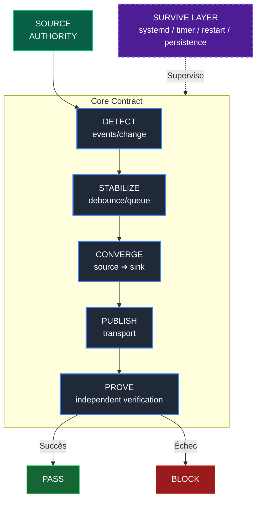

# ASDP v1.0 — Reference Architecture
**Statut :** CANONICAL
**Date :** 2026-08-25
**Doctrine :** Vigilum Codex — NO PROOF, NO PARITY, NO PUBLISH

---

## CONTEXTE ET PROVENANCE
Ce document est la synthèse finale extraite (Phases 6 et 8 du pipeline d'ingénierie inverse) des sources suivantes :
1. *Baseline Locale* : `OUTPUTS/Assimilation_Mirroring_Temps_Reel.md`
2. *Proposition A* : `DataBase/Tesla-Mirroring-Unidirectionnel/Tesla-Mirroring-ASSIMILATION-COGNITIVE/By-ChatGPT.md`
3. *Proposition B* : `DataBase/Tesla-Mirroring-Unidirectionnel/Tesla-Mirroring-ASSIMILATION-COGNITIVE/By-RENA.txt`

L'implémentation de référence physique est le démon de synchronisation `TESLA-MIRRORING v5`. Le présent document élève cette implémentation au rang de patron architectural générique (ASDP - Asynchronous Synchronization Daemon Pattern).

---

## I. INVARIANTS ARCHITECTURAUX (ASDP)

La solidité du patron repose sur la préservation inconditionnelle de ces invariants (fusion sans perte des règles sources) :

1. **Souveraineté de la Source (Source Sovereignty)** : Le master local a toujours raison. Toute altération du Sink qui n'est pas produite par le mécanisme autorisé de réplication est considérée comme une dérive et doit être traitée selon la politique de souveraineté de la Source (Overwrite, Block, Alert, Quarantine).
2. **Unidirectionnalité (Unidirectionality)** : Le flux de données est strictement `Source → Sink`.
3. **Publication-sur-état (Durable Local State)** : Un commit local représente une vérité durable ; le push n'est qu'une opération de transport. On committe sur événement, on publie sur état.
4. **Preuve Déterministe (NO PROOF, NO PASS)** : L'existence de l'état ne se présume pas, elle se prouve via un check déterministe (hash, manifest, version).
5. **Vérification Indépendante (Independent Verification)** : `Producer ≠ Validator`. L'acteur qui publie l'état ne constitue pas, à lui seul, la preuve de cet état.
6. **Convergence Éventuelle et Idempotence** : Des déclenchements multiples ou concurrents doivent converger vers le même état cible déterminé par la Source, sous réserve que la Source soit stable et que les mécanismes de réplication et de transport puissent finalement s'exécuter.
7. **Single Writer (Rayon de souffle borné)** : Exclusion mutuelle garantissant l'absence de race conditions. Le périmètre d'action est restreint aux stricts chemins surveillés.
8. **Réversibilité Totale** : Possibilité de débrancher l'architecture sans aucune séquelle pour la Source (qui reste intacte).
9. **Fail Closed** : `UNKNOWN → NOT PASS → BLOCK`. En cas d'ambiguïté (accès réseau, état distant inconnu), le processus s'interrompt pour protéger l'intégrité. (Note: La contention de verrou implique WAIT/RETRY, pas un statut UNKNOWN).
10. **Réconciliation Périodique (Periodic Reconciliation)** : Double filet de sécurité asynchrone garantissant la convergence face aux failles du réactif.

---

## II. CINÉMATIQUE CONTRACTUELLE (CORE CONTRACT)

L'architecture ASDP se décompose en un Core Contract strict de 5 fonctions, supervisé par une couche de résilience :

### Le Contrat Abstrait et son Implémentation de Référence (v5)

*   **DETECT() & STABILIZE()**
    *   *Concept :* Capturer le changement et absorber la rafale (anti-bruit).
    *   *Règle (R-N3) - Canal de contrôle distinct :* Tout flux consommé par un mécanisme de lecture doit rester exclusivement dédié aux données attendues. Les logs/diagnostics sont dirigés vers un canal parallèle.
    *   *Paramètres Canoniques v5 :* `DEBOUNCE=5` secondes figé.
*   **CONVERGE()**
    *   *Concept :* Rendre le Sink conforme à l'état autoritaire de la Source (via rsync, API PUT, snapshot).
    *   *Stratégie de convergence du réplicat Git v5 :* `fetch` → `merge --ff-only` → `rebase` → `reset --hard` (uniquement en **dernier recours** pour forcer l'écrasement).
*   **PUBLISH()**
    *   *Concept :* Expédition asynchrone et résiliente sur le réseau.
    *   *Règle (R-N4) - Publication sur état :* On committe sur événement ; on publie **uniquement si une avance de commits non publiés subsiste** (référence : `git rev-list --count origin/<branche>..HEAD > 0`). La condition de publication porte sur l'état local durable, **jamais** sur la présence d'un delta de travail non committé.
    *   *Paramètres Canoniques v5 :* Backoff progressif borné (`2 5 15 60 300`s).
*   **PROVE()**
    *   *Concept :* Validation indépendante de la parité.
    *   *Règle (R-N5) - Comparabilité Stricte :* `Expected == Observed` exige des représentations littéralement comparables (neutralisation des échappements lors du contrôle).

### Couche de Résilience Système
*   **SURVIVE()**
    *   *Concept :* Résilience du processus métier déportée sur le superviseur de l'OS (`systemd`, restart, timer, linger). Le moteur métier ignore comment il survit.

---

## III. AUDIT DE SÉCURITÉ (AMDEC)

| Mode de Défaillance | Risque | Sévérité | Mitigation Intégrée (ASDP) |
| :--- | :--- | :--- | :--- |
| Concurrence Watcher / Timer | Corruption d'état | Haute | Mutex système (`flock -w 180 9`, Wait/Retry) |
| Rafale I/O | Surcharge CPU | Moyenne | `STABILIZE()` via horodatage séquentiel (`read -t 1` + delta 5s) |
| Coupure Réseau prolongée | Désynchronisation | Haute | `PUBLISH()` basé sur l'état (commits existants) ; backoff progressif borné |
| Divergence distante | Échec du push | Moyenne | `CONVERGE()` via forçage asymétrique de la source locale |
| Faux positifs de vérification | Alerte permanente | Moyenne | Neutralisation sémantique (ex: `core.quotepath=false`) |

---
*Fin du document d'architecture ASDP v1.0.*
