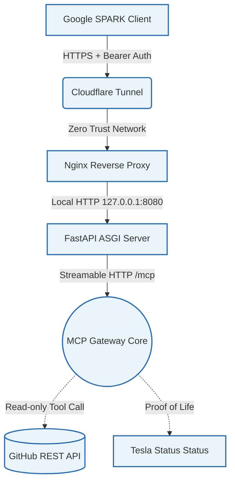

   

# MVP 58: Tesla SPARK MCP Gateway

## 1. Diagnostic: The Gateway Imperative

The integration of local machine intelligence environments (Midgard) with external orchestration platforms (Google SPARK) requires a strictly governed communication channel. Exposing local endpoints directly poses severe security risks, while traditional polling mechanisms introduce unacceptable latency. 

The **Tesla SPARK MCP Gateway** establishes a secure, streamable End-to-End (E2E) tunnel acting as a Model Context Protocol (MCP) Gateway. It strictly adheres to the Vigilum Codex 2.0 standards, ensuring that external interactions remain heavily authenticated, constrained by least privilege, and impervious to proxy spoofing or DNS rebinding attacks.

## 2. Action: Architectural Implementation

The gateway is built upon a modern asynchronous stack leveraging FastAPI and the official Model Context Protocol (`mcp`) SDK. It abandons deprecated SSE endpoints in favor of streamable HTTP transport (MCP 2025-03-26 specification) strictly bound to `/mcp`.

### 2.1 Core Components

*   **FastAPI & Uvicorn**: High-performance asynchronous ASGI server serving the streamable HTTP app.
*   **Zero Trust Tunneling**: Ingress is strictly managed via Cloudflare Tunnel (Zero Trust), mapping external HTTPS traffic to a local Nginx reverse proxy, avoiding any public exposure of local ports.
*   **DNS Rebinding Protection**: Active `TransportSecuritySettings` enforcing strict host and origin allowlists (`127.0.0.1`, `localhost`, and the designated `TUNNEL_HOST`).
*   **Bearer Auth Middleware**: Custom Starlette middleware enforcing `Authorization: Bearer <TOKEN>` for any remote connections, ensuring only authenticated payloads reach the MCP core.
*   **GitHub REST API Pat Integration**: Embedded read-only tools (`github_read_file`, `github_list_directory`) operating under strict Personal Access Token (PAT) constraints for safe external data ingestion.

### 2.2 System Topology



## 3. Proof: Validation & Security Constraints

The implementation actively enforces the following security boundaries:

1.  **Fail-Closed Auth**: The `BearerAuthMiddleware` rejects any request lacking the precise pre-shared token, unless explicitly configured for local loopback development (where `TOKEN` is omitted).
2.  **No Extraneous Endpoints**: The application exposes exactly `/mcp`. Fake OAuth or DCR endpoints are completely omitted to reduce the attack surface.
3.  **Read-Only Operations**: GitHub interactions via `github_read_file` and `github_list_directory` are strictly non-mutating operations.

### Usage Example

Running the gateway directly:
```bash
python 58-Tesla-Spark-MCP-Gateway.py
```

Or via Uvicorn for production-grade serving:
```bash
uvicorn 58-Tesla-Spark-MCP-Gateway:app --host 127.0.0.1 --port 8080
```

### Deliverables
- `58-Tesla-Spark-MCP-Gateway.py`: The reference gateway implementation.
- `SPARK_MCP_Gateway_Integration_Report.md`: Integration & Negative Tests Audit.
