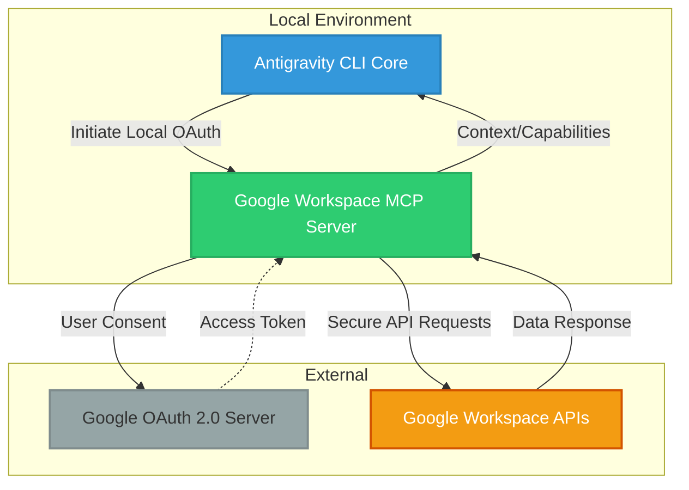

# Antigravity Workspace MCP (59-Antigravity-Workspace-MCP)

## Objective
To securely integrate `taylorwilsdon/google_workspace_mcp` into the Antigravity CLI to provide access to Google Workspace services (such as Gmail, Docs, Drive) using a local OAuth flow. This integration strictly follows the Sovereign Shield doctrine by ensuring all OAuth tokens remain local, and no webhooks or external API endpoints are exposed. The primary goal is to empower Antigravity CLI agents with Workspace capabilities without compromising security or sovereignty.

## Architecture Graph

## Deliverables
1. **Google Workspace MCP Server Configuration**: Complete setup of the `taylorwilsdon/google_workspace_mcp` server configured for local execution.
2. **OAuth Credentials Management**: Secure, local storage and retrieval mechanism for OAuth 2.0 tokens without exposing secrets.
3. **Integration Documentation**: Clear guidelines on how the Antigravity CLI interacts with Workspace tools via the MCP protocol.
4. **Final Integration Report**: Verification of the local integration, confirming operational status without security breaches.

## Governance
This integration falls under the **Sovereign Shield Doctrine**. 
- **No Webhooks**: The system must operate solely via local pulling or internal MCP communication.
- **Local Credential Storage**: All OAuth tokens and client secrets must be kept strictly local and never pushed to any remote repository.
- **Zero Exposed Ports**: The local OAuth redirect must only be active during the authentication phase and immediately shut down to avoid port exposure.
- **Agent Permission Boundaries**: Workspace MCP tools must be scoped properly to prevent unintended destruction of user data in Google Workspace.
